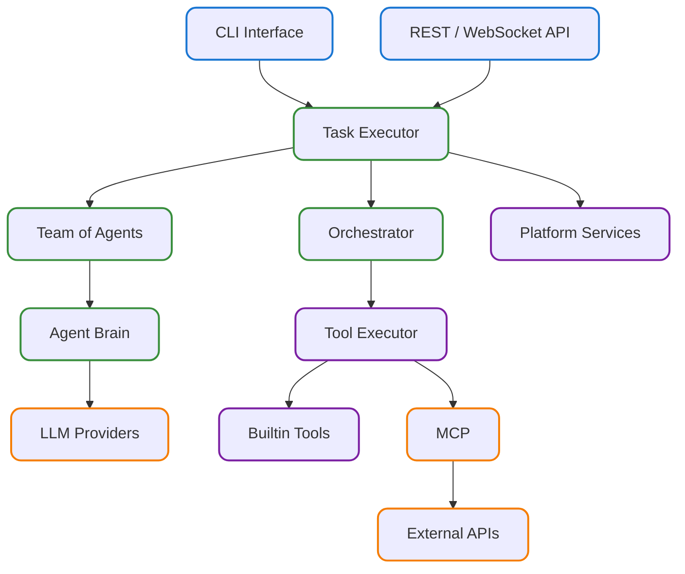

<div align="center">
  
  <h1 align="center">AgentX</h1>
</div>

<p align="center">
  <b>An open-source framework for building autonomous AI agent teams.</b>
  <br />
  <a href="https://dustland.github.io/agentx"><strong>Explore the docs »</strong></a>
  <br />
  <br />
  <a href="https://www.python.org/downloads/"></a>
  <a href="https://opensource.org/licenses/Apache-2.0"></a>
  <a href="https://github.com/dustland/agentx/issues/new?assignees=&labels=bug&template=bug_report.md&title="></a>
  <a href="https://github.com/dustland/agentx/issues/new?assignees=&labels=enhancement&template=feature_request.md&title="></a>
</p>

AgentX provides the backbone for creating, orchestrating, and observing sophisticated multi-agent systems. It moves beyond simple agent-to-agent communication to a robust, task-driven framework where teams of specialized agents collaborate to achieve complex goals.

## ✨ Key Features

Based on a refined and modular architecture, AgentX is built around a few core concepts:

- **🤖 Multi-Agent Teams**: Define teams of specialized agents in simple YAML files. Each agent can have its own role, tools, and configuration.
- **🗣️ Natural Language Orchestration**: Agents hand off tasks to each other using natural language. A central `TaskExecutor` interprets these handoffs and routes work to the appropriate agent, enabling complex, dynamic workflows.
- **🛠️ Secure & Extensible Tools**: Tools are defined with Python decorators and their schemas are automatically generated. Shell commands are executed in a secure Docker sandbox, providing safety and isolation. A flexible `ToolExecutor` manages the entire lifecycle.
- **🧠 Stateful & Context-Aware Memory**: Agents maintain long-term memory, enabling them to recall past interactions and context. The memory system supports semantic search, ensuring agents have the information they need, when they need it.
- **📡 Streamable Communication**: The entire lifecycle of a task, from agent thoughts to tool calls and results, is available as a real-time stream of events. This allows you to build rich, observable UIs like the Vercel AI SDK.
- **🎯 Task-Centric API**: Interact with the system through a simple, powerful API. Kick off complex workflows with `execute_task()` or manage interactive sessions with `start_task()`.

## 🚀 Getting Started

The best way to get started is by following our **[Quickstart Guide](./docs/quickstart.md)**, which will walk you through building a simple chat application and a multi-agent writer/reviewer team.

### 1. Installation

First, clone the repository and install the dependencies.

```sh
git clone https://github.com/dustland/agentx.git
cd agentx
uv sync
```

### 2. Usage Examples

AgentX can be run directly from the command line or via its Python API. You can find complete, working examples in the `examples/` directory.

#### Running an Example

This demonstrates a basic multi-agent collaboration:

```bash
# Navigate to an example directory
cd examples/simple_team

# Run the demo script
python demo.py
```

#### Using the CLI

The framework includes a powerful CLI for managing your agent system:

```bash
# Start the API server
agentx start

# Monitor tasks and events in your terminal
agentx monitor

# Launch the web dashboard for rich observability
agentx monitor --web

# Run a named example directly
agentx example superwriter
```

#### Using the Python API

Here is a simple example of an autonomous run:

```python
import asyncio
from agentx import execute_task

async def main():
    # Execute a task with a simple prompt
    result = await execute_task("Write a brief report on renewable energy trends")

    print(f"Success: {result.success}")
    print(f"Summary: {result.summary}")
    print(f"Conversation rounds: {len(result.conversation_history)}")

asyncio.run(main())
```

_The script above shows a simple autonomous run. For more advanced patterns like message streaming and interactive sessions, please see the complete scripts in the `/examples` directory._

## 📊 Observability & Monitoring

AgentX includes a comprehensive observability system for monitoring and debugging multi-agent workflows.

Launch a modern web dashboard built with FastAPI and Preline UI:

```bash
# Start web dashboard
agentx monitor --web
```

- **Dashboard**: System overview with metrics and recent activity.
- **Tasks**: Task conversation history viewer with export.
- **Events**: Real-time event monitoring with filtering.
- **Memory**: Memory browser with search and categories.
- **Messages**: Agent conversation history during execution.
- **Configuration**: System configuration and status viewer.

You can also use the observability features in CLI mode without the option `--web`.

## 🏗️ Architecture Overview

AgentX is a modular framework composed of several key components that work together to execute complex tasks. At its heart is the `TaskExecutor`, which manages the overall workflow. It interacts with a `Team of Agents` to perform work, and consults the `Orchestrator` to handle agent sequencing and tool calls.



You can discover more design details from following documents:

- **[System Architecture](docs/arch/01-architecture.md)** - Overall design and system architecture
- **[State and Context Management](docs/arch/02-state-and-context.md)** State and Context management
- **[Tool Calling](docs/arch/03-tool-call.md)** - Invoke tools for actual tasks
- **[Communication and Message](docs/arch/04-communication.md)** - Message format for composite content and streaming

## 🤝 Contributing

We welcome contributions! Please see [CONTRIBUTING.md](CONTRIBUTING.md) for guidelines.

## 🙏 Acknowledgments

This project was initially inspired by and built upon concepts from [AG2 (AutoGen)](https://github.com/ag2ai/ag2), an excellent multi-agent conversation framework. While AgentX has evolved into its own distinct architecture and approach, we're grateful for the foundational ideas and patterns that AG2 provided to the multi-agent AI community.

## 📄 License

Licensed under the Apache License 2.0 - see [LICENSE](LICENSE) for details.

---

**Built with ❤️ by the [Dustland](https://github.com/dustland) team**
