<!-- ─────────────────────────────  HERO  ───────────────────────────── -->
<div align="center">

  <h1>🌳 JRun</h1>
  <p><em>Submit &amp; track job-trees on SLURM with one command.</em></p>

  <p>
    &nbsp;
    &nbsp;

  </p>

</div>


<br/>




```mermaid
stateDiagram-v2
    state "✅ 6867196<br/><code>python train.py --lr 0.001 --mo…</code>" as S6867196
    state "✅ 6867197<br/><code>python train.py --lr 0.001 --mo…</code>" as S6867197
    state "✅ 6867198<br/><code>python train.py --lr 0.01 --mod…</code>" as S6867198
    state "✅ 6867199<br/><code>python train.py --lr 0.01 --mod…</code>" as S6867199
    state "✅ 6867200<br/><code>python train.py --lr 0.1 --mode…</code>" as S6867200
    state "✅ 6867201<br/><code>python train.py --lr 0.1 --mode…</code>" as S6867201
    state "✅ 6867202<br/><code>python find_best.py --metric ev…</code>" as S6867202
    state "⏸️ 6867203<br/><code>python test.py --model best_mod…</code>" as S6867203
    state "⏸️ 6867204<br/><code>python create_report.py --resul…</code>" as S6867204
    S6867196 --> S6867202
    S6867197 --> S6867202
    S6867198 --> S6867202
    S6867199 --> S6867202
    S6867200 --> S6867202
    S6867201 --> S6867202
    S6867196 --> S6867203
    S6867197 --> S6867203
    S6867198 --> S6867203
    S6867199 --> S6867203
    S6867200 --> S6867203
    S6867201 --> S6867203
    S6867202 --> S6867203
    S6867196 --> S6867204
    S6867197 --> S6867204
    S6867198 --> S6867204
    S6867199 --> S6867204
    S6867200 --> S6867204
    S6867201 --> S6867204
    S6867202 --> S6867204
    S6867203 --> S6867204
```

## Installation

```bash
pip install -e . # editable install
```

## Usage

```bash
# Submit a workflow from YAML file
jrun submit --file workflow.yaml

# Check job statuses
jrun status

# Submit a single job
jrun sbatch --cpus-per-task=4 --mem=16G --wrap="python train.py"
```

## Quick start

#### Define a tree of jobs

```yaml
# Define tree
group:
  name: "test"
  type: sequential
  jobs:
    - group:
        type: parallel
        jobs:
          - job:
              preamble: cpu
              command: "echo 'python train.py'"

          - job:
              preamble: cpu
              command: "echo 'python eval.py'"
    - job:
        preamble: cpu
        command: "echo 'python make_report.py'"

# Define preambles
preambles:
  cpu:
    - "#!/bin/bash"
    - "#SBATCH --cpus-per-task=4"
    - "#SBATCH --mem=8G"
    - "#SBATCH --output=slurm/slurm-%j.out"
    - "#SBATCH --error=slurm/slurm-%j.err"

```

#### Submit tree and visuzlize
```bash
$ jrun submit --file path/to/job/tree.yaml
$ jrun viz # add `--mode mermaid` for mermaid diagram
Job Dependencies:
========================================
6866829 []: (COMPLETED): echo 'python train.py'
6866830 []: (COMPLETED): echo 'python eval.py'
6866831 []: (PENDING): echo 'python make_report.py' <- 6866829, 6866830
```


## Workflow Types

### Parameter Sweeps
```yaml
group:
  name: "sweep-example"
  type: sweep
  preamble: base
  sweep:
    lr: [0.001, 0.01, 0.1]
    model: ["resnet", "vgg"]
  sweep_template: "python train.py --lr {lr} --model {model}"
```

This creates 6 jobs (3 × 2 combinations) automatically.

### Parallel Jobs
```yaml
group:
  name: "parallel-example"
  type: parallel
  jobs:
    - job:
        preamble: base
        command: "python train_model_a.py"
    - job:
        preamble: base
        command: "python train_model_b.py"
```

### Link jobs with group ids

```yaml
# Use `{group_id}` in commands to link jobs
group:
  name: "main"
  type: parallel
  jobs:
    - group:
        type: sweep
        preamble: gpu
        sweep:
          lr: [5e-4, 1e-4, 5e-5]
        sweep_template:  "python train.py lr {lr} --group_id {group_id}"  # (e.g., aaa-bbb-ccc)

    - job:
        preamble: cpu
        command: "python eval.py --group_id {group_id}" # (e.g., aaa-bbb)
```

# 🌳 JRun Features & Status

## Current Features
- [x] Submit job trees from YAML files (`jrun submit --file workflow.yaml`)
- [x] Monitor job status with visualization (`jrun status`, `jrun viz`)
- [x] Parameter sweeps and parallel job execution
- [x] Job graph vizualization
- [x] CLI filtering (`jrun status --filter status=COMPLETED`)
- [x] Job retry (`jrun retry JOB_ID`)
- [x] Job delete subgraph
- [x] Web app
- [x] Improve visual for loop group
- [x] Improve dependency (make markovian)
- [x] View job logs in browser
- [x] Delete by node
- [x] Add sweep_idx

## Planned Features
- [ ] Bugfix: retry not auto updating old job id to new id in deps table
- [ ] Update afterany (allow some parent group failures)
- [ ] Update node color code (mixed with pending should be blue/active)


<!-- sacct -j 6894879 --format=JobID,WorkDir -X --parsable2 -->

## Requirements

- Python 3.6+
- SLURM environment
- PyYAML >= 6.0
- tabulate >= 0.9.0