# AutoMake Refactoring and Migration Strategy

This document outlines a comprehensive plan to refactor the `automake` codebase for improved structure, maintainability, and adherence to best practices as defined in the project's Python structure guidelines.

## 1. Current Structure Analysis

The current project structure is functional but shows signs of growing complexity that can be simplified.

```
automake/
├── __init__.py
├── __main__.py
├── ascii_art.txt
├── config.py
├── logging_setup.py
├── cli/
│   ├── __init__.py
│   ├── main.py (858 lines - very large!)
│   ├── logs.py
│   └── ascii_art.txt (duplicate)
├── core/
│   ├── __init__.py
│   ├── ai_agent.py
│   ├── command_runner.py
│   ├── interactive.py
│   └── makefile_reader.py
└── utils/
    ├── __init__.py
    ├── ollama_manager.py
    └── output.py (786 lines - very large!)
```

## 2. Key Issues Identified

- **Violation of Single Responsibility Principle (SRP)**:
  - `automake/cli/main.py` is a monolithic file handling CLI commands, configuration, logging, help text, and core logic.
  - `automake/utils/output.py` is overly large, managing different aspects of console output.
- **Large, Monolithic Files**: The size of `main.py` and `output.py` makes them difficult to read, test, and maintain.
- **Duplicated Resources**: `ascii_art.txt` is present in two different locations.
- **Mixed Concerns**: The root `automake/` package contains modules for configuration (`config.py`) and logging (`logging_setup.py`) which could be better organized into their own packages.
- **Missing Specialization**: The structure lacks dedicated modules for different concerns like CLI command groups or display logic, leading to feature-stacking in general-purpose files.

## 3. Recommended Refactoring Plan

The proposed structure organizes the codebase into logical modules, each with a clear responsibility.

```mermaid
graph TD
    A["automake/"] --> B["__init__.py"]
    A --> C["__main__.py"]

    A --> D["cli/"]
    D --> D1["__init__.py"]
    D --> D2["app.py<br/>(Main Typer app)"]
    D --> D3["commands/"]
    D3 --> D3a["__init__.py"]
    D3 --> D3b["run.py<br/>(Run command)"]
    D3 --> D3c["init.py<br/>(Init command)"]
    D3 --> D3d["config.py<br/>(Config commands)"]
    D3 --> D3e["logs.py<br/>(Log commands)"]
    D --> D4["display/"]
    D4 --> D4a["__init__.py"]
    D4 --> D4b["help.py<br/>(Help & ASCII art)"]
    D4 --> D4c["callbacks.py<br/>(Version, help callbacks)"]

    A --> E["core/"]
    E --> E1["__init__.py"]
    E --> E2["ai_agent.py"]
    E --> E3["command_runner.py"]
    E --> E4["interactive.py"]
    E --> E5["makefile_reader.py"]

    A --> F["config/"]
    F --> F1["__init__.py"]
    F --> F2["manager.py<br/>(Config class)"]
    F --> F3["defaults.py<br/>(Default values)"]

    A --> G["logging/"]
    G --> G1["__init__.py"]
    G --> G2["setup.py<br/>(Logging setup)"]
    G --> G3["handlers.py<br/>(Custom handlers)"]

    A --> H["utils/"]
    H --> H1["__init__.py"]
    H --> H2["ollama_manager.py"]
    H --> H3["output/"]
    H3 --> H3a["__init__.py"]
    H3 --> H3b["formatter.py<br/>(OutputFormatter)"]
    H3 --> H3c["live_box.py<br/>(LiveBox class)"]
    H3 --> H3d["types.py<br/>(MessageType enum)"]

    A --> I["resources/"]
    I --> I1["ascii_art.txt"]
```



## 4. Detailed Refactoring Recommendations

### a. Break Down Large CLI Module (`cli/main.py`)
- **Action**: Decompose the 858-line `main.py` into a structured `cli` package.
- **Modules to Create**:
  - `cli/app.py`: Defines the main Typer application and adds command groups.
  - `cli/commands/`: A new package to house individual command logic.
    - `run.py`: Logic for the `automake run` command.
    - `init.py`: Logic for the `automake init` command.
    - `config.py`: All `automake config` subcommands.
    - `logs.py`: All `automake logs` subcommands (moving from the old `cli/logs.py`).
  - `cli/display/`: A new package for user-facing display elements.
    - `help.py`: The custom help generation system and ASCII art functions.
    - `callbacks.py`: Callbacks for global options like `--version` and `--help`.

### b. Split Large Output Module (`utils/output.py`)
- **Action**: Refactor the 786-line `output.py` into a focused `output` package.
- **Modules to Create**:
  - `utils/output/formatter.py`: Contains the primary `OutputFormatter` class.
  - `utils/output/live_box.py`: Houses the `LiveBox` component and its related logic.
  - `utils/output/types.py`: Defines the `MessageType` enum and other related types.
  - `utils/output/__init__.py`: Exposes the public API for the output module.

### c. Create a Dedicated Configuration Module
- **Action**: Move configuration management out of the root package into a dedicated `config` package.
- **Modules to Create**:
  - `config/manager.py`: The `Config` class and its management logic.
  - `config/defaults.py`: Functions to provide default configuration values.
  - `config/__init__.py`: Exposes the public `Config` API.

### d. Create a Dedicated Logging Module
- **Action**: Isolate logging setup into its own `logging` package.
- **Modules to Create**:
  - `logging/setup.py`: The primary logging setup and configuration functions.
  - `logging/handlers.py`: A place for any custom logging handlers (if developed in the future).
  - `logging/__init__.py`: Exposes the public logging API.

### e. Consolidate Resources
- **Action**: Remove resource duplication by creating a central `resources` directory.
- **Location**: `automake/resources/`
- **File**: `ascii_art.txt` will be moved here and read from this single location.

### f. Apply DRY (Don't Repeat Yourself) Principle
- **Action**: Identify and consolidate repeated logic.
- **Targets**:
  - Shared validation logic can be moved to a common utility module.
  - Common error handling patterns can be extracted into decorators or helper functions.
  - Box formatting and other UI components will be standardized in the new `utils/output` package.

## 5. Implementation Benefits

This refactoring will result in:
- **Improved SRP Adherence**: Each module will have a single, clear purpose.
- **Enhanced Maintainability**: Smaller, focused files are easier to understand and modify.
- **Better Testability**: Isolated components allow for more targeted and simpler unit tests.
- **Increased Reusability**: Common utilities can be easily shared across the application.
- **Greater Clarity**: The new structure will make the codebase more intuitive for new and existing contributors.
- **Simplified Extensibility**: Adding new commands or features will be a matter of adding new files to the appropriate packages, not modifying large, complex ones.

## 6. Phased Migration Strategy

The migration will be performed in phases to minimize disruption and ensure stability.

- **Phase 1: Scaffolding**: Create the new directory and file structure without deleting any existing code. Populate the `__init__.py` files.
- **Phase 2: Incremental Migration**: Move code from the old files to the new modules, one functional area at a time (e.g., start with `config`, then `logging`, then `utils/output`). Update imports as functionality is moved.
- **Phase 3: CLI Refactoring**: Decompose `cli/main.py` and `cli/logs.py` into the new `cli/commands/` and `cli/display/` packages. This is the most significant step and will be handled carefully.
- **Phase 4: Cleanup & Finalization**: Once all functionality is migrated and tests are updated and passing, remove the old, now-empty files (`config.py`, `logging_setup.py`, `cli/main.py`, etc.).
- **Phase 5: Testing**: Run the full test suite and perform manual end-to-end testing to ensure the refactored application is fully functional.
