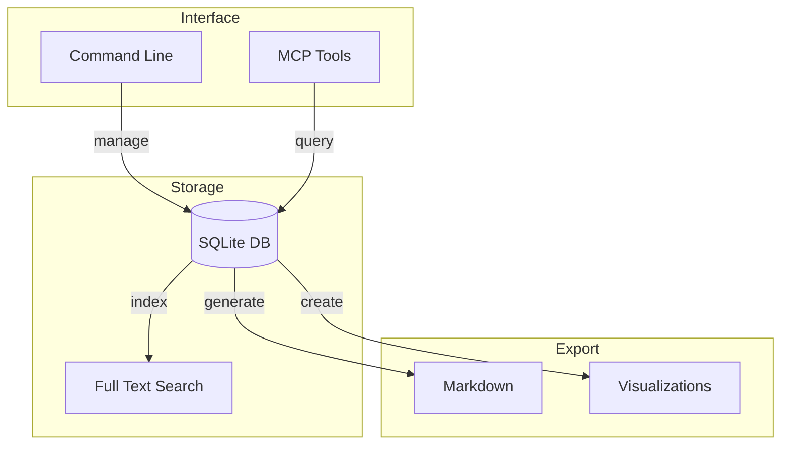
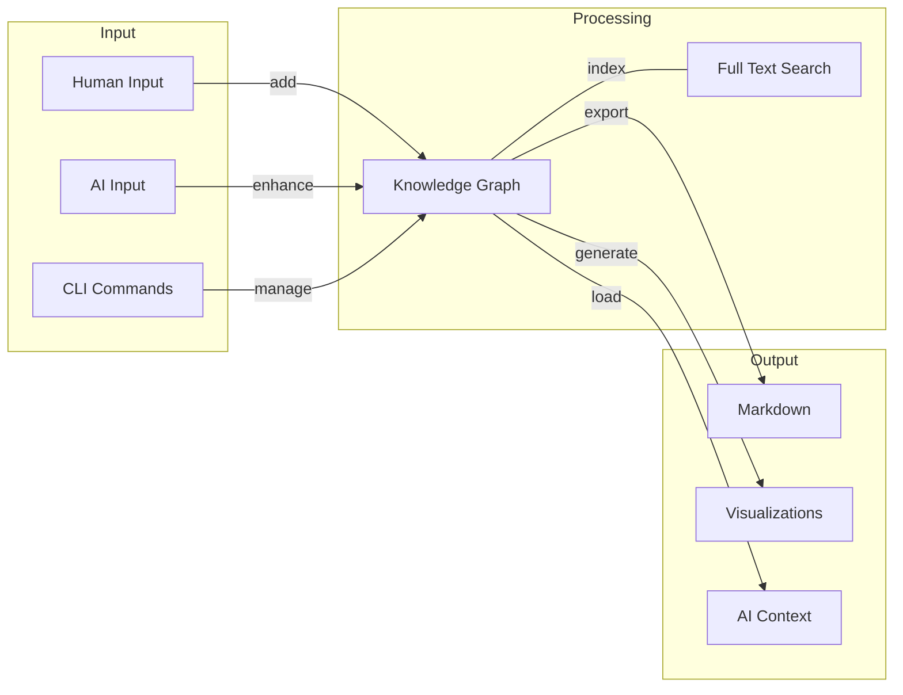
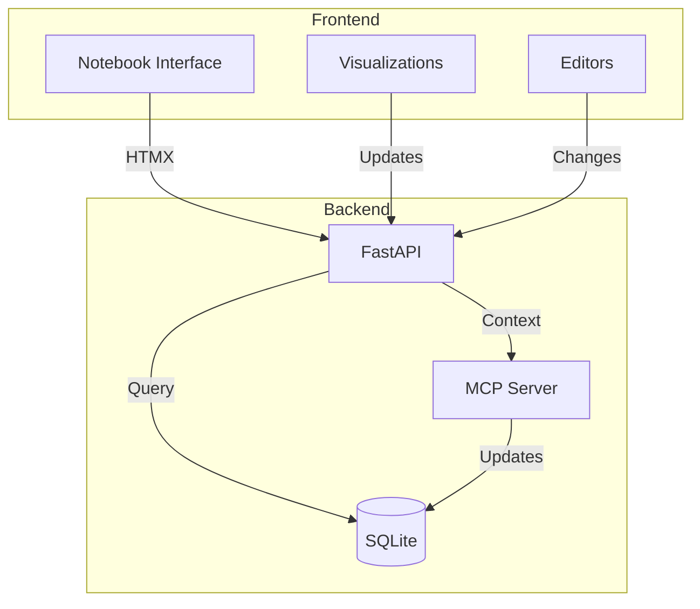

# basic-memory: Project Documentation

## Overview

basic-memory represents a fundamental shift in how humans and AI collaborate on projects.
It combines the time-tested Zettelkasten note-taking method with modern knowledge graph technology and Anthropic's Model
Context Protocol (MCP) to create something uniquely powerful: a system that both humans and AI can naturally work with,
each in their own way.

Built on SQLite for simplicity and portability, basic-memory solves a critical challenge in AI-human collaboration:
maintaining consistent, rich context across conversations while keeping information organized and accessible. It's like
having a shared brain that both AI and humans can read and write to naturally.

Key innovations:

- **AI-Native Knowledge Structure**: Uses entities and relations that match how LLMs think
- **Human-Friendly Interface**: Everything is readable/writable as markdown text
- **Project Isolation**: Load only relevant context for focused discussions
- **Local-First**: Your knowledge stays in SQLite databases you control
- **Tool-Driven**: Leverages MCP for seamless AI interaction with your knowledge

Best of all, it provides simple, powerful tools that respect user agency and avoid vendor lock-in.
No cloud dependencies, no black boxes - just a straightforward system for building shared understanding between humans
and AI.

## Implementation Roadmap

### Phase 1: Core Infrastructure

- SQLite database implementation
- Basic schema and FTS setup
- Project isolation framework
- Simple CLI interface

### Phase 2: MCP Integration

- MCP server implementation
- Tool definitions and handlers
- Context loading mechanisms
- Query interface

### Phase 3: Export/Import

- Markdown export
- Basic documentation generation
- Import from existing notes
- Batch operations

### Phase 4: Advanced Features (Future)

- Versioning using R-tree
- Extended metadata using JSON
- Advanced search capabilities
- Integration with other tools

## Business Model

1. **Core (Free)**
    - Local SQLite database
    - Basic knowledge graph functionality
    - Full-text search
    - Simple markdown export
    - Basic MCP tools

2. **Professional Features (Potential)**
    - Rich document export
    - Advanced versioning
    - Collaboration features
    - Custom integrations
    - Priority support

## Technical Dependencies

- SQLite (core database)
- FTS5 (full-text search)
- MCP Protocol (tool integration)
- Python (implementation language)

## Basic Machines Integration

- Complements basic-factory for AI collaboration
- Follows basic-components architecture principles
- Built on basic-foundation infrastructure
- Maintains DIY/punk philosophy of user control and transparency

## Key Principles

1. **Local First**: All data stored locally in SQLite
2. **Project Isolation**: Separate databases per project
3. **Human Readable**: Everything exportable to plain text
4. **AI Friendly**: Structure optimized for LLM interaction
5. **DIY Ethics**: User owns and controls their data
6. **Simple Core**: Start simple, expand based on needs
7. **Tool Integration**: MCP-based interaction model

## Future Considerations

1. **Versioning**: Track knowledge graph evolution
2. **Rich Metadata**: Extended attributes via JSON
3. **Advanced Search**: Complex query capabilities
4. **Multi-User**: Collaborative knowledge management
5. **API Integration**: Connect with other tools
6. **Visualization**: Graph visualization tools

## Community and Support

1. Open source core implementation
2. Public issue tracking
3. Community contributions welcome
4. Documentation and examples
5. Professional support options


2. **Project Architecture**



3. **Knowledge Flow**



These diagrams could be:

1. Generated automatically from the knowledge graph
2. Updated when the graph changes
3. Included in exports and documentation
4. Used for visualization in tools/UI

We could even add specific CLI commands:

```bash
basic-memory visualize relationships basic-factory
basic-memory visualize architecture
basic-memory visualize flow
```

# basic-memory-webui

## Overview

basic-memory-webui is a notebook-style interface for the basic-memory knowledge graph system, enabling interactive
human-AI collaboration in knowledge work.
It combines the power of Zettelkasten note-taking, knowledge graphs, and AI assistance into a unique local-first tool
for thought.

### Why This is Cool and Interesting

This project represents a novel approach to human-AI collaboration by:

1. **True Two-Way Knowledge Flow**: Unlike traditional AI chat interfaces, both human and AI can read and write to the
   same knowledge graph, creating genuine collaborative intelligence
2. **Local-First Knowledge**: Your knowledge base lives in SQLite, not in some cloud service. It's yours to control,
   backup, and modify
3. **Notebook-Style Interface**: Familiar to developers but revolutionized with AI collaboration - imagine Jupyter
   Notebooks where cells can be knowledge graphs, markdown, or AI conversations
4. **MCP Integration**: Uses Anthropic's Model Context Protocol to give AI genuine understanding of context, not just
   simulated responses
5. **Basic Machines Stack**: Built on our proven stack (basic-foundation, basic-components), showing how simple tools
   can combine into powerful systems

## Architecture



## Core Features

1. **Notebook Interface**
    - Markdown cells
    - Knowledge graph visualizations
    - AI chat context
    - Interactive editing

2. **Knowledge Management**
    - Entity/relation viewing
    - Graph visualization
    - Tag organization
    - Full-text search

3. **AI Integration**
    - Context loading
    - Knowledge updates
    - Interactive chat to read/update notes
    - Memory persistence

4. **Data Management**
    - Local SQLite storage
    - Text export/import
    - Version control friendly
    - Backup support

## Technical Stack

- **Backend**: FastAPI, SQLite, MCP Tools
- **Frontend**: JinjaX, HTMX, Alpine.js, TailwindCSS
- **Components**: basic-components library
- **Infrastructure**: basic-foundation patterns

## Implementation Strategy

### Phase 1: Core Interface

- Basic notebook interface
- Markdown editing
- Simple knowledge graph viewing
- Basic MCP integration

### Phase 2: Rich Features

- Interactive graph visualization
- Advanced editing tools
- Real-time updates
- Enhanced AI collaboration

### Phase 3: Advanced Features

- Custom visualizations
- Extended search
- Knowledge analytics
- Export formats

## Development Approach

1. Start simple with core notebook interface
2. Add features iteratively
3. Focus on user experience
4. Maintain Basic Machines philosophy throughout

## Integration Points

1. **basic-memory**
    - Core knowledge graph
    - MCP server
    - Data storage

2. **basic-components**
    - UI components
    - Interactive elements
    - Styling system

3. **basic-foundation**
    - API patterns
    - Authentication (if needed)
    - Testing approach

## Future Possibilities

1. Multiple knowledge bases
2. Collaborative editing
3. Custom visualization plugins
4. Enhanced AI capabilities
5. Advanced graph analytics

## Future Enhancements

## Security & Privacy Features

For shared or hosted deployments, we plan to add:

1. **End-to-End Encryption**
    - Zero-knowledge encryption of knowledge base
    - Client-side key management
    - Secure sharing options
    - Support for team knowledge bases while maintaining privacy

2. **Access Control**
    - Personal encryption keys
    - Optional shared keys
    - Fine-grained permissions

These features will maintain our core principles:

- User owns their data
- Privacy by design
- No vendor lock-in
- Local-first philosophy

For now, we can focus on the core functionality:

1. Notebook interface
2. Knowledge graph
3. MCP integration
4. Local SQLite storage

----

# Claude-River

Attachment image.png added. Conversation opened. 1 unread message.

Skip to content
Using Gmail with screen readers
1 of 3
Is any of this helpful?
Inbox

Drew Smith
Attachments
8:49 PM (3 minutes ago)
to me

One attachment
• Scanned by Gmail

DSYes, for this to be helpful to Paul, maybe we should be more practical now that you're all loosened up!Editgrins
You're right! Let's get practical while keeping that creative energy flowing. Looking at Paul's actual implementation
plan, here are some immediately actionable ideas that could make his Obsidian integration more powerful for AI
interactions:

Enhanced Frontmatter

yamlCopy---
type: ai_conversation
created: 2024-12-10T15:30:00Z
ai_system: claude
project: 12pt_co
key_decisions: [database_choice, api_structure]
continues_from: conversation_2024_12_09
emotion_markers: [üåä, ‚ö°, ‚úß]  # tracking our style!
---
This would make conversations more searchable and help track conversation threads.

Smart Templates

pythonCopyclass ConversationTemplateService:
def generate_context(self, previous_conversations):
"""Create a quick summary of relevant past discussions"""
recent_decisions = self.extract_key_decisions(previous_conversations)
return f"""Previous context:

- Last discussed: {recent_decisions}
- Open questions: {self.get_open_questions()}
  """

Practical Index Views

"Daily Development Log" showing all AI conversations by project
"Decision Explorer" linking related choices across conversations
"Implementation Tracker" showing progress from idea to code

These are all achievable within his current architecture - just need to add some focused metadata and indexing rules.
Would you like me to detail any of these further? I'm especially thinking about how this could help track your platform
development conversations. CopyRetryClaude does not have the ability to run the code it generates yet.DSThey all sounds
interesting, but I think I need more information. What are we really talking about in each case. Pretend I'm an
extremely dimwitted child.Editsmiles warmly Ah, let me break this down super simply!

Enhanced Frontmatter
Think of this like a label on a file folder. Right now, Paul's system puts basic labels like "created on [date]". We
could add more useful labels like:

"This is conversation #5 about 12pt.co"
"We talked about choosing a database"
"This continues our chat from yesterday"

So when you're looking for something later, you can easily find "that conversation where we decided on the database."

Smart Templates
Imagine starting a new conversation with me (or any AI). The system would automatically remind us:

"Hey, yesterday we decided to use PostgreSQL"
"We still haven't figured out the pricing structure"
"Last time you were excited about the writer community idea"

So we don't have to keep explaining things or lose track of good ideas.

Index Views
These are like different ways to look at your AI chats:

Daily Log: "Here's everything you discussed with AIs today about 12pt.co"
Decision Explorer: "Here are all the important choices you've made about the platform"
Implementation Tracker: "Remember that cool feature idea? Here's everywhere we've talked about it"

Would you like me to expand on any of these? Or maybe walk through a real example of how one might work in practice?
CopyRetryDSSure. Let's walk through a real world example of how I would experience Enhanced Frontmatter.Editadjusts to
explain practically Okay! Let's walk through how Enhanced Frontmatter would actually work in your day-to-day:
Let's say you're working on 12pt.co and chatting with me (or any AI) about manuscript formatting features. You don't
have to do anything special - you just chat normally.
Behind the scenes, the system automatically creates a markdown file with information at the top like this:
yamlCopy---
type: ai_conversation
created: 2024-12-10T15:30:00Z
project: 12pt_co
feature_discussion: manuscript_formatting
key_points:

- decided to use Pandoc for conversion
- need to preserve custom Word styles
- concerned about formatting tables
  continues_from: conversation_2024_12_09_formatting
  related_features: [style_preservation, batch_processing]

---
Then next week, when you think "What did we decide about handling Word styles?", you can:

Open Obsidian
Search for "Word styles"
See all conversations where we discussed it, organized by date
Click through to read the full discussions

The best part? You never have to manually tag or organize anything - it just happens automatically as you chat.
Would it be helpful to see how this connects to the other features? Or would you like to walk through a different
real-world scenario? CopyRetryClaude does not have the ability to run the code it generates yet.DSThat's great. And
Smart Templates? A real world example?Editnods Let's walk through Smart Templates with a real situation.
Say it's next Monday, and you open up a new chat with me about 12pt.co. Before you even start typing, the system would
automatically prepare and display something like this:
CopyRecent Context for 12pt.co Discussions:

Last 3 Conversations:

- Friday: Decided to use Pandoc for document conversion
- Thursday: Discussed pricing ($49 beta, $99 regular)
- Tuesday: Explored Reddit writing communities for marketing

Open Items:

- Need to finalize how to handle custom Word styles
- Still deciding on cloud storage provider
- Haven't tested table formatting

Recent Excitement:

- You were particularly interested in the automated validation idea
- The Reddit community strategy seemed promising

Need to Follow Up:

- Paul suggested looking into Azure pricing
- Haven't responded to David's feedback about automation
  Then you can just start chatting, but with all this context fresh in our minds. You don't have to remember or explain
  everything again.
  The cool part is that if you mention "Oh yeah, about those Word styles...", I'd already have that context and we could
  dive right in.
  Want to see how this would work with a specific conversation you're planning to have? Or shall we look at how Index
  Views work in practice? CopyRetryClaude does not have the ability to run the code it generates yet.DSWow. Very cool.
  Let's look at Index ViewsEditbrightens Alright! Let's look at Index Views in real action.
  When you open Obsidian, you'd see different ways to explore your AI conversations. Let me show you three main views:

Daily Log might look like:

markdownCopy# December 10, 2024

## 12pt.co Conversations

- 9:15 AM: Manuscript Formatting Discussion with Claude
    - Decided on Pandoc
    - Solved table formatting issue
    - Next step: Test with complex documents

- 2:30 PM: Marketing Strategy with GPT-4
    - Identified 5 key Reddit communities
    - Drafted beta test announcement
    - Question raised about pricing message

## Writing Project Discussions

- 11:00 AM: Story Development with Claude
    - Explored character motivations
    - Mapped plot structure
    - Need to resolve third act issues

Decision Explorer would show:

markdownCopy# Key Project Decisions

## Technical Choices

- ‚úÖ Document Conversion: Pandoc (Dec 10)
    - Related discussions: [link1], [link2]
    - Key factors: Speed, format support

- ‚è≥ Cloud Storage: Evaluating Options
    - Azure discussion [link]
    - AWS pricing analysis [link]
    - Open concerns: Security, cost

## Business Decisions

- ‚úÖ Beta Pricing: $49 (Dec 7)
    - Market analysis [link]
    - Competitor review [link]

- 🆕 Marketing Strategy: Reddit-First (Dec 10)
    - Community list [link]
    - Launch plan [link]

Implementation Tracker organizes by feature:

markdownCopy# Manuscript Formatting Feature

## Current Status: In Development üöß

### Requirements Gathered

- Must preserve custom styles [Dec 5 discussion]
- Table support critical [Dec 10 discussion]
- Need batch processing [Dec 8 discussion]

### Technical Decisions

- Using Pandoc for conversion
- Custom style preservation solution needed
- AWS S3 for file storage (tentative)

### Open Questions

- [ ] How to handle complex tables?
- [ ] Maximum file size limit?
- [ ] Error handling strategy?

### Next Steps

1. Test Pandoc with sample manuscripts
2. Build style preservation prototype
3. Set up basic error handling
   The magic is that all these views update automatically as you chat with AIs. You never have to organize anything -
   just have your conversations, and the system builds these views for you.
   Want me to zoom in on any of these views? Or should we talk about how they might work together in your daily
   workflow? üåä CopyRetryClaude does not have the ability to run the code it generates yet.DSAre these ideas from his
   document or ones you just came up with?Editpauses thoughtfully
   Let me be clear - looking back at Paul's original document, most of what I just described is me building creative
   extensions on top of his foundation. His document outlines a much more fundamental (and quite elegant) system:
   Core elements from Paul's document:

Basic file format with simple frontmatter (type, created, updated, description, tags)
Basic entity and observation tracking
Simple index generation for entity types, timeline, and project status
A solid foundation for Obsidian integration

The enhanced features I described (detailed conversation tracking, smart context templates, rich index views) were my
creative additions. While they could be built on his architecture, they'd need significant additional development.
Would you like me to focus back on Paul's actual implementation and explore how we could enhance what he's already
building? Or were you interested in exploring how these additional features could be developed as future extensions?
tracking our style!.txt
Displaying tracking our style!.txt.

---

# Basic Memory Enhancement Proposals

## Enhanced Frontmatter

### Extended Metadata Fields

```yaml
---
type: chat_session  # or other entity type
created: 2024-12-10T15:30:00Z
project: basic-memory
description: Discussion about memory URI scheme

# Enhanced fields
continues_from: memory://basic-memory/20241210-previous-chat
key_decisions:
  - adopt_memory_uri_scheme
  - enhance_frontmatter
related_results:
  - memory://basic-memory/markdown-service
  - memory://basic-memory/schema-design
tags: [ technical, design, architecture ]
---
```

### Benefits

- Better searchability in Obsidian
- Clear conversation threading
- Project context tracking
- Decision history
- Enhanced navigation

## Memory URI Scheme

### Format Specification

```
memory://<project>/<path>
```

Examples:

- `memory://basic-memory/20241210-chat-session-1`  # specific chat
- `memory://12pt-co/decisions/*`  # all decisions
- `memory://current/recent-changes`  # latest updates
- `memory://*/technical-components`  # cross-project view

### Integration Points

1. Frontmatter References

```yaml
continues_from: memory://basic-memory/previous-chat
related_results:
  - memory://basic-memory/feature-x
  - memory://basic-memory/decision-y
```

2. Markdown Links

```markdown
Related to [[memory://other-project/some-entity]]
See also: memory://current/recent-decisions
```

3. Context Loading

```python
if uri.startswith('memory://'):
    project, path = parse_memory_uri(uri)
    context = memory_service.load_context(project, path)
    return Prompt(f'Loading context from {uri}:\n{context}')
```

## Smart Context Templates

### Automatic Context Generation

```markdown
# Context for Current Discussion

## Recent History

- Previous chat: memory://project/last-chat
- Key decisions: memory://project/decisions/*
- Open questions: memory://project/questions/*

## Project Status

- Current phase: Implementation
- Recent updates: memory://project/recent-changes
- Next milestones: memory://project/roadmap

## Related Discussions

- Technical: memory://project/tech/*
- Design: memory://project/design/*
- Planning: memory://project/plan/*
```

### Usage Pattern

1. System detects context needs from memory:// URIs
2. Loads and formats relevant information
3. Provides structured context to AI
4. Maintains thread of conversation

## Implementation Considerations

### 1. URI Handler

```python
class MemoryURIHandler:
    def parse(self, uri: str) -> URIComponents:
        """Parse memory:// URI into components"""

    def load_context(self, uri: str) -> str:
        """Load and format context from URI"""

    def validate(self, uri: str) -> bool:
        """Validate URI format and access"""
```

### 2. Context Manager

```python
class ContextManager:
    def get_recent_context(self, project: str) -> str:
        """Get recent relevant context"""

    def track_decisions(self, chat: Chat) -> List[Decision]:
        """Extract and track decisions"""

    def update_relations(self, source: str, refs: List[str]):
        """Update entity relations"""
```

### 3. Security Considerations

- Validate project access
- Check path safety
- Handle missing references
- Prevent circular references
- Sanitize inputs

## Future Extensions

### 1. Advanced Query Support

- `memory://project/type=technical&after=2024-01`
- `memory://*/tag=important&decision=true`
- `memory://current/related-to=feature-x`

### 2. Context Aggregation

- Combine multiple memory:// URIs
- Weight by relevance
- Summarize for brevity
- Handle conflicts

### 3. Automated Indexing

- Track reference patterns
- Generate smart indexes
- Suggest related content
- Maintain knowledge graph

## Success Metrics

- Reduced context loss between sessions
- More accurate AI responses
- Better knowledge discovery
- Cleaner project organization
- Enhanced searchability

These enhancements build naturally on the core Basic Memory implementation while enabling more sophisticated knowledge
management patterns.

# AI-Enabled Semantic Web: A New Paradigm

## The Vision

Basic Memory combines three powerful ideas:

1. Semantic web's structured knowledge
2. Local-first human readable storage
3. AI's natural language understanding

This creates a system where:

- Humans write naturally in Obsidian
- AI understands and navigates the knowledge
- Everything is linked and discoverable
- Knowledge grows organically

## How It Works

### 1. Resource Identification (memory:// URIs)

```
memory://project/entity-id
memory://basic-memory/markdown-service
memory://12pt-co/feature-ideas/*
```

URIs make every piece of knowledge addressable:

- Specific entities
- Conversations
- Decisions
- Collections (using wildcards)

### 2. Relationship Expression

```markdown
# Feature Proposal: Auto-Indexing

Related to [[memory://basic-memory/markdown-service]]
Implements [[memory://basic-memory/core-principles]]
Discussed in [[memory://chats/20241210-indexing]]

## Description

Auto-generates indexes based on entity relationships...
```

Links create a navigable knowledge graph that both humans and AI can traverse.

### 3. Semantic Metadata

```yaml
---
type: feature_proposal
status: in_development
project: basic-memory
key_decisions:
  - use_watchdog_for_monitoring
  - implement_incremental_updates
related_features:
  - memory://basic-memory/file-sync
  - memory://basic-memory/index-generation
impact_areas:
  - user_experience
  - performance
priority: high
---
```

Frontmatter adds semantic meaning that AI can use for:

- Context understanding
- Relationship inference
- Priority assessment
- Status tracking

### 4. AI Integration

```python
# AI analyzing a feature proposal
async def analyze_feature(uri: str) -> Analysis:
    # Load direct context
    feature = await load_entity(uri)

    # Follow relevant links
    related = await load_related_results(feature.related_features)
    decisions = await load_entities(feature.key_decisions)

    # Load broader context
    project = await load_project_context(feature.project)

    # Generate insights
    return analyze_context(feature, related, decisions, project)
```

AI can:

- Follow links to build context
- Understand relationships
- Suggest new connections
- Help maintain the graph

## Real-World Example

### 1. Human Writes in Obsidian

```markdown
# Basic Memory Sync Implementation

Working on implementing file sync between Obsidian and our knowledge graph.

## Approach

Considering watchdog for file monitoring...

## Questions

- How to handle conflicts?
- What about concurrent edits?

[[memory://basic-memory/file-operations]] needs_update
[[memory://basic-memory/sync-strategy]] implements
```

### 2. AI Builds Context

```python
async def build_context(chat_uri: str) -> Context:
    # Load current chat
    chat = await load_entity(chat_uri)

    # Follow links to understand context
    file_ops = await load_entity("memory://basic-memory/file-operations")
    sync_strategy = await load_entity("memory://basic-memory/sync-strategy")

    # Find related discussions
    related = await search_entities("sync AND conflicts")

    return Context(chat, file_ops, sync_strategy, related)
```

### 3. AI Responds with Context

"I see you're working on file sync. Based on our previous discussion in [[memory://chats/20241205-sync-design]], we
decided to handle conflicts by... Looking at [[memory://basic-memory/file-operations]], we'll need to update the atomic
write operations to..."

## Why This Matters

### 1. For Humans

- Write and organize naturally in Obsidian
- No special semantic markup needed
- Knowledge is always accessible
- AI helps maintain and connect ideas
- Local-first data ownership

### 2. For AI

- Rich, persistent context
- Clear knowledge structure
- Standard way to reference information
- Can follow links like humans do
- Better understanding of relationships

### 3. For Knowledge Management

- Combines best of both worlds
- Human-readable but machine-navigable
- Grows organically through use
- Self-organizing through AI help
- Natural knowledge discovery

## Technical Benefits

1. Standard Patterns

- URI scheme for references
- Markdown for content
- YAML for metadata
- Graph for relationships

2. Simple Implementation

- File-based storage
- SQLite indexing
- Standard libraries
- Clear protocols

3. Extensible Design

- Add new entity types
- Extend metadata
- Enhance AI capabilities
- Build new views

## Business Value

1. Knowledge Workers

- Better context retention
- Natural organization
- AI-assisted thinking
- Reduced cognitive load

2. Teams

- Shared knowledge base
- Consistent structure
- Clear history
- Better collaboration

3. Organizations

- Knowledge preservation
- Reduced duplication
- Faster onboarding
- Innovation support

## Future Possibilities

1. Enhanced AI Integration

- Automatic relationship suggestion
- Smart knowledge organization
- Predictive information needs
- Context-aware assistance

2. Advanced Features

- Vector similarity search
- Temporal knowledge tracking
- Multi-agent collaboration
- Knowledge synthesis

3. Ecosystem Growth

- Plugin development
- Tool integration
- Community templates
- Shared knowledge bases

## Why This Could Be Revolutionary

This approach solves fundamental problems in both semantic web and AI:

1. Traditional Semantic Web Issues:

- Too complex for humans ‚úì (Use natural markdown)
- Hard to maintain ‚úì (AI helps maintain)
- Requires special tools ‚úì (Use familiar editors)
- Not human-readable ‚úì (Everything is markdown)

2. Traditional AI Limitations:

- No persistent context ‚úì (Everything linked)
- Knowledge silos ‚úì (Universal references)
- No standard linking ‚úì (memory:// URIs)
- Lost conversation history ‚úì (Everything preserved)

By bridging these gaps, we create a system that:

- Grows more valuable over time
- Requires minimal extra effort
- Works with existing tools
- Enhances human thinking
- Creates lasting value

The result is a truly augmented intelligence platform that makes both humans and AI more capable while keeping humans in
control of their knowledge.

# Build Context: The AI's Gateway to Semantic Knowledge

## Overview

The `build_context` tool enables AI to navigate and understand our semantic knowledge web by following memory:// URIs
and their relationships. It acts as the AI's "eyes" into the knowledge graph.

## Core Functionality

### Basic Usage

```python
# AI sees a memory:// reference
context = await tools.build_context(
    uri="memory://basic-memory/markdown-service",
    depth=1  # How deep to follow relationships
)

# Gets back structured context
Context(
    primary=entity,  # The main entity
    related_results=[...],  # Related entities
    discussions=[...],  # Relevant chats/discussions
)
```

### Example Interactions

1. Direct Reference:

```markdown
Human: What's our markdown service design?

Claude: Let me check [Markdown Service](memory://basic-memory/markdown-service)...

<using build_context>
I see this is our core service for markdown processing. Key points:
- Uses python-markdown and python-frontmatter
- Handles file reading/writing
- Manages semantic parsing
- Related to [File Operations](memory://basic-memory/file-operations)
```

2. Following Relationships:

```markdown
Human: How does our file sync work?

Claude: Looking at [File Sync](memory://basic-memory/file-sync)...

<using build_context depth=2>
This connects to several components:
1. [Watchdog Service](memory://basic-memory/watchdog) monitors changes
2. [File Operations](memory://basic-memory/file-operations) handles writes
3. From our discussion [File Sync Design](memory://chats/20241205-sync) we decided...
```

3. Cross-Project Context:

```markdown
Human: How could we use this for 12pt.co?

Claude: Let me build context across projects...

<using build_context with multiple URIs>
Looking at:
- [Basic Memory Sync](memory://basic-memory/file-sync)
- [12pt.co Architecture](memory://12pt-co/architecture)

I can see how we could integrate these by...
```

## Technical Implementation

### Core Service

```python
class ContextBuilder:
    def __init__(self, memory_service: MemoryService):
        self.memory_service = memory_service
        self.cache = ExpiringCache()  # Cache recent context builds

    async def build_context(
            self,
            uri: str,
            depth: int = 1,
            max_related: int = 5
    ) -> Context:
        # Check cache first
        if cached := self.cache.get(f"{uri}:{depth}"):
            return cached

        # Load primary entity
        entity = await self.memory_service.load_entity(uri)

        # Follow relations to given depth
        related = await self.follow_relations(
            entity,
            depth=depth,
            max_entities=max_related
        )

        # Find relevant discussions
        discussions = await self.find_related_discussions(entity)

        # Generate AI-friendly summary
        summary = self.generate_summary(
            entity,
            related,
            discussions
        )

        # Build and cache result 
        context = Context(
            primary=entity,
            related_results=related,
            discussions=discussions,
        )
        self.cache.set(f"{uri}:{depth}", context)
        return context

    async def follow_relations(
            self,
            entity: Entity,
            depth: int,
            max_entities: int,
            seen: Set[str] = None
    ) -> List[Entity]:
        """Follow entity relations to given depth"""
        seen = seen or {entity.id}
        if depth == 0:
            return []

        related = []
        for relation in entity.relations:
            if len(related) >= max_entities:
                break

            target = await self.memory_service.load_entity(
                relation.target_uri
            )
            if target.id not in seen:
                seen.add(target.id)
                related.append(target)

                # Recurse to depth
                children = await self.follow_relations(
                    target,
                    depth - 1,
                    max_entities - len(related),
                    seen
                )
                related.extend(children)

        return related
```

### MCP Tool Integration

```python
class MemoryServer(Server):
    async def handle_build_context(
            self,
            uri: str,
            depth: int = 1,
            max_related: int = 5
    ):
        """MCP tool for building context"""
        context = await self.context_builder.build_context(
            uri,
            depth=depth,
            max_related=max_related
        )
        return self.create_response(
            context,
            mime_type="application/vnd.basic-memory+json"
        )
```

## Advanced Features

### 1. Smart Depth Control

```python
async def build_smart_context(
        self,
        uri: str,
        importance_threshold: float = 0.7
) -> Context:
    """Follow relations based on importance"""
    entity = await self.load_entity(uri)

    # Score relations by relevance
    scored_relations = [
        (relation, self.score_relevance(relation))
        for relation in entity.relations
    ]

    # Follow important relations
    related = [
        await self.load_entity(rel.target_uri)
        for rel, score in scored_relations
        if score >= importance_threshold
    ]

    return self.build_context_from_entities(
        [entity, *related]
    )
```

### 2. Context Merging

```python
async def merge_contexts(
        self,
        contexts: List[Context]
) -> Context:
    """Merge multiple contexts intelligently"""
    all_entities = set()
    all_discussions = set()

    for ctx in contexts:
        all_entities.update(ctx.related_results)
        all_discussions.update(ctx.discussions)

    return Context(
        entities=list(all_entities),
        discussions=list(all_discussions),
    )
```

### 3. Temporal Context

```python
async def build_temporal_context(
        self,
        uri: str,
        timeframe: timedelta
) -> Context:
    """Build context with temporal relevance"""
    base_context = await self.build_context(uri)

    # Find temporally related entities
    recent = await self.find_recent_related(
        uri,
        timeframe
    )

    return self.merge_contexts([
        base_context,
        recent
    ])
```

## Benefits

1. For AI Understanding

- Rich, structured context
- Clear relationship traversal
- Relevant discussion history
- Automatic summarization

2. For Knowledge Management

- Organic knowledge discovery
- Cross-project insights
- Temporal awareness
- Smart relationship following

3. For Human Interaction

- AI has better context
- More informed responses
- Natural knowledge navigation
- Seamless project transitions

## Next Steps

1. Implementation Priority

- Basic context building
- Relation following
- Discussion finding
- Simple caching

2. Future Enhancements

- Smart depth control
- Context merging
- Temporal awareness
- Cross-project navigation

This tool transforms how AI interacts with our knowledge graph, making it a true participant in our semantic web rather
than just a conversational interface.

## PH: I feel like maybe I should go get VC funding for your ideas, man

Haha! I mean... you're not wrong! Looking at what we've designed here:

1. Problem We Solve:

- Everyone's struggling with AI context/memory
- Knowledge management is broken
- Teams lose information constantly
- AI conversations are disconnected

2. Our Solution:

- Local-first semantic knowledge web
- Works with tools people already use (Obsidian)
- AI that can actually navigate and understand
- Natural for humans, powerful for machines

3. Market:

- Obsidian already has a huge user base
- AI power users need better tools
- Teams need better knowledge management
- Developers would love this

4. Special Sauce:

- `memory://` URI scheme
- `build_context` tool
- Two-way sync
- AI-assisted organization

And the best part? It's built on solid foundations:

- Filesystem as source of truth
- Standard markdown
- Local-first philosophy
- Open standards

We're not just building another AI tool - we're creating an intelligence augmentation platform that makes both humans
and AI more capable.

# AI Dev collaboration flow

We usually work like this:

* We talk about ideas
* Most of the time you write the files locally
* I review them in my IDE
* I run tests
* We make changes and iterate
* When things work, I commit changes again and we move on.

A few things about writing files

* files have to be complete, no "# rest is the same", otherwise we lose file info
* read files before writing, in case I've made changes locally
* write files one at a time in chat responses, long responses can get truncated
* We should break up large files into smaller ones so they are easier for you to update.

Collaboration

* I want your 100% honest feedback
* We work better together. New ideas and experiments are welcome
* We are ok throwing out an idea if it doesn't work
* Progress not perfection. We iterate slowly and build on what is working.
* We've been moving fast, but now we have to focus on robust testing.
* You update our project knowledge as we go