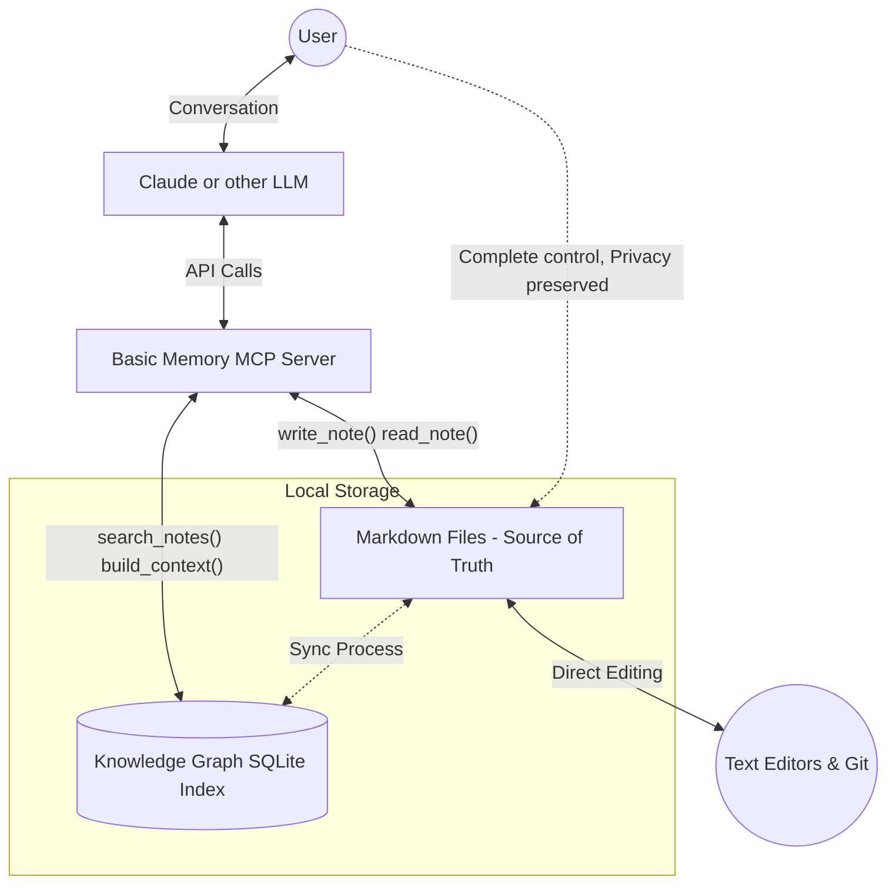

# Technical Information

This document provides technical details about Basic Memory's implementation, licensing, and integration with the Model Context Protocol (MCP).

## Architecture

Basic Memory consists of:

1. **Core Knowledge Engine**: Parses and indexes Markdown files
2. **SQLite Database**: Provides fast querying and search
3. **MCP Server**: Implements the Model Context Protocol
4. **CLI Tools**: Command-line utilities for management
5. **Sync Service**: Monitors file changes and updates the database

The system follows a file-first architecture where all knowledge is represented in standard Markdown files and the database serves as a secondary index.

## Model Context Protocol (MCP)

Basic Memory implements the [Model Context Protocol](https://github.com/modelcontextprotocol/spec), an open standard for enabling AI models to access external tools:

- **Standardized Interface**: Common protocol for tool integration
- **Tool Registration**: Basic Memory registers as a tool provider
- **Asynchronous Communication**: Enables efficient interaction with AI models
- **Standardized Schema**: Structured data exchange format

Integration with Claude Desktop uses the MCP to grant Claude access to your knowledge base through a set of specialized tools that search, read, and write knowledge.

## Licensing

Basic Memory is licensed under the [GNU Affero General Public License v3.0 (AGPL-3.0)](https://www.gnu.org/licenses/agpl-3.0.en.html):

- **Free Software**: You can use, study, share, and modify the software
- **Copyleft**: Derivative works must be distributed under the same license
- **Network Use**: Network users must be able to receive the source code
- **Commercial Use**: Allowed, subject to license requirements

The AGPL license ensures Basic Memory remains open source while protecting against proprietary forks.

## Source Code

Basic Memory is developed as an open-source project:

- **GitHub Repository**: [https://github.com/basicmachines-co/basic-memory](https://github.com/basicmachines-co/basic-memory)
- **Issue Tracker**: Report bugs and request features on GitHub
- **Contributions**: Pull requests are welcome following the contributing guidelines
- **Documentation**: Source for this documentation is also available in the repository

## Data Storage and Privacy

Basic Memory is designed with privacy as a core principle:

- **Local-First**: All data remains on your local machine
- **No Cloud Dependency**: No remote servers or accounts required
- **Telemetry**: Optional and disabled by default
- **Standard Formats**: All data is stored in standard file formats you control

## Implementation Details

Knowledge in Basic Memory is organized as a semantic graph:

1. **Entities** - Distinct concepts represented by Markdown documents
2. **Observations** - Categorized facts and information about entities
3. **Relations** - Connections between entities that form the knowledge graph

This structure emerges from simple text patterns in standard Markdown:

```markdown
---
title: Coffee Brewing Methods
type: note
permalink: coffee/coffee-brewing-methods
tags:
- '#coffee'
- '#brewing'
- '#methods'
- '#demo'
---

# Coffee Brewing Methods

An exploration of different coffee brewing techniques, their characteristics, and how they affect flavor extraction.

## Overview

Coffee brewing is both an art and a science. Different brewing methods extract different compounds from coffee beans,
resulting in unique flavor profiles, body, and mouthfeel. The key variables in any brewing method are:

- Grind size
- Water temperature
- Brew time
- Coffee-to-water ratio
- Agitation/turbulence

## Observations

- [principle] Coffee extraction follows a predictable pattern: acids extract first, then sugars, then bitter compounds
  #extraction
- [method] Pour over methods generally produce cleaner, brighter cups with more distinct flavor notes #clarity

## Relations

- requires [[Proper Grinding Technique]]
- affects [[Flavor Extraction]]
```

Becomes

```json
{
  "entities": [
    {
      "permalink": "coffee/coffee-brewing-methods",
      "title": "Coffee Brewing Methods",
      "file_path": "Coffee Notes/Coffee Brewing Methods.md",
      "entity_type": "note",
      "entity_metadata": {
        "title": "Coffee Brewing Methods",
        "type": "note",
        "permalink": "coffee/coffee-brewing-methods",
        "tags": "['#coffee', '#brewing', '#methods', '#demo']"
      },
      "checksum": "bfa32a0f23fa124b53f0694c344d2788b0ce50bd090b55b6d738401d2a349e4c",
      "content_type": "text/markdown",
      "observations": [
        {
          "category": "principle",
          "content": "Coffee extraction follows a predictable pattern: acids extract first, then sugars, then bitter compounds #extraction",
          "tags": [
            "extraction"
          ],
          "permalink": "coffee/coffee-brewing-methods/observations/principle/coffee-extraction-follows-a-predictable-pattern-acids-extract-first-then-sugars-then-bitter-compounds-extraction"
        },
        {
          "category": "method",
          "content": "Pour over methods generally produce cleaner, brighter cups with more distinct flavor notes #clarity",
          "tags": [
            "clarity"
          ],
          "permalink": "coffee/coffee-brewing-methods/observations/method/pour-over-methods-generally-produce-cleaner-brighter-cups-with-more-distinct-flavor-notes-clarity"
        }
      ],
      "relations": [
        {
          "from_id": "coffee/coffee-bean-origins",
          "to_id": "coffee/coffee-brewing-methods",
          "relation_type": "pairs_with",
          "permalink": "coffee/coffee-bean-origins/pairs-with/coffee/coffee-brewing-methods",
          "to_name": "Coffee Brewing Methods"
        },
        {
          "from_id": "coffee/flavor-extraction",
          "to_id": "coffee/coffee-brewing-methods",
          "relation_type": "affected_by",
          "permalink": "coffee/flavor-extraction/affected-by/coffee/coffee-brewing-methods",
          "to_name": "Coffee Brewing Methods"
        }
      ],
      "created_at": "2025-03-06T14:01:23.445071",
      "updated_at": "2025-03-06T13:34:48.563606"
    }
  ]
}
```

Basic Memory understands how to build context via its semantic graph.

### Entity Model

Basic Memory's core data model consists of:

- **Entities**: Documents in your knowledge base
- **Observations**: Facts or statements about entities
- **Relations**: Connections between entities
- **Tags**: Additional categorization for entities and observations

The system parses Markdown files to extract this structured information while preserving the human-readable format.

### Files as Source of Truth

Plain Markdown files store all knowledge, making it accessible with any text editor and easy to version with git.



### Sqlite Database

A local SQLite database maintains the knowledge graph topology for fast queries and semantic traversal without cloud dependencies. It contains:
- db tables for the knowledge graph schema
- a search index table enabling full text search across the knowledge base


### Sync Process

The sync process:

1. Detects changes to files in the knowledge directory
2. Parses modified files to extract structured data
3. Updates the SQLite database with changes
4. Resolves forward references when new entities are created
5. Updates the search index for fast querying

### Search Engine

The search functionality:

1. Uses a combination of full-text search and semantic matching
2. Indexes observations, relations, and content
3. Supports wildcards and pattern matching in memory:// URLs
4. Traverses the knowledge graph to follow relationships
5. Ranks results by relevance to the query

## Relations
- relates_to [[Welcome to Basic memory]] (Overview)
- relates_to [[CLI Reference]] (Command line tools)
- implements [[Knowledge Format]] (File structure and format)