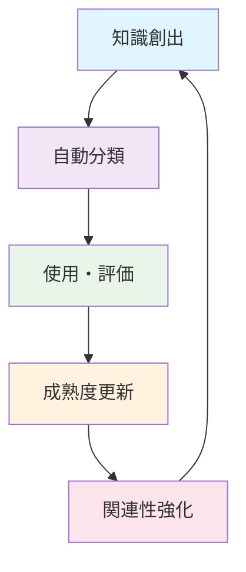

# Core Concepts

Claude Knowledge Catalystの中核となる概念と設計思想について説明します。

## 知識成熟度の段階的管理

CKCは「10-step numbering」システムを採用し、知識の成熟度を視覚的に管理します。

### 成熟度レベル

```{mermaid}
graph LR
    A[00: カオス] --> B[10: プロジェクト]
    B --> C[20: 知識ベース]
    C --> D[30: 知恵資産]
    
    style A fill:#ff9999
    style B fill:#ffcc99
    style C fill:#99ccff
    style D fill:#99ff99
```

#### 00: カオス（Chaos）
- 未整理の情報、一時的なメモ
- 実験的なアイデア、断片的な知識
- 自動的に配置される初期状態

#### 10: プロジェクト（Project）
- 特定のプロジェクトに関連する知識
- 実装や実験の記録
- プロジェクト固有の学習内容

#### 20: 知識ベース（Knowledge Base）
- 汎用的で再利用可能な知識
- パターンやベストプラクティス
- 複数プロジェクトで活用できる情報

#### 30: 知恵資産（Wisdom Assets）
- 高度に抽象化された原則
- 戦略的な意思決定に活用
- 長期的な価値を持つ洞察

## インテリジェント分類システム

### 自動分類の仕組み

CKCは以下の要素を総合的に分析して、知識の自動分類を行います：

```python
# 分類要素の例
classification_factors = {
    "content_analysis": {
        "technical_depth": "高度な技術内容の分析",
        "generalizability": "汎用性の評価",
        "context_specificity": "文脈依存性の測定"
    },
    "usage_patterns": {
        "reference_frequency": "参照頻度の追跡",
        "cross_project_usage": "プロジェクト横断での使用",
        "success_rate": "実装成功率の記録"
    },
    "metadata_signals": {
        "tags": "タグによる分類情報",
        "project_association": "プロジェクト関連性",
        "temporal_patterns": "時系列パターン"
    }
}
```

### メタデータの自動抽出

#### フロントマター解析
```yaml
---
title: "API統合パターン"
project: "claude-knowledge-catalyst"
tags: ["api", "integration", "pattern"]
maturity: 20
success_rate: 0.85
---
```

#### コンテンツ解析
- **技術深度**: コードの複雑さ、専門用語の使用頻度
- **汎用性**: 他のプロジェクトでの適用可能性
- **実用性**: 実装の具体性、実行可能性

## Obsidian深層統合

### 双方向リンクの活用

CKCは知識間の関連性を自動的に発見し、Obsidianの双方向リンク機能と連携します：

```markdown
# 例：自動生成されるリンク
この[[API設計パターン]]は、[[RESTful API]]の実装において
[[エラーハンドリング]]と密接に関連しています。

## 関連する知識
- [[HTTP ステータスコード]]
- [[認証・認可パターン]]
- [[API バージョニング]]
```

### グラフビューでの可視化

知識の関連性がグラフとして可視化され、以下の洞察を提供します：

- **知識クラスター**: 関連する知識群の特定
- **知識ギャップ**: 未接続の知識領域の発見
- **影響力の可視化**: 多くの知識から参照される重要な概念

## テンプレートシステム

### 知識タイプ別テンプレート

```python
template_types = {
    "prompt": "プロンプトエンジニアリングの記録",
    "code": "コードスニペットと実装パターン",
    "concept": "概念や理論の説明",
    "project_log": "プロジェクトの進捗と学習記録"
}
```

#### プロンプトテンプレート
```markdown
# {{title}}

## Context
{{context}}

## Prompt
{{prompt}}

## Response Quality
- Success Rate: {{success_rate}}
- Effectiveness: {{effectiveness}}

## Improvements
{{improvements}}
```

## 知識の進化プロセス

### 段階的な知識成熟

1. **発見**: 新しい知識の自動検出
2. **分類**: 成熟度レベルの自動判定
3. **関連付け**: 既存知識との関係性構築
4. **精緻化**: 使用実績に基づく品質向上
5. **統合**: 高次の知識への発展

### 継続的改善



## Next Steps

- [Tutorials](tutorials/index.md) - 実践的な使用方法を学習
- **Best Practices** - 効果的な知識管理のコツ（準備中）
- [API Reference](../api-reference/index.md) - 技術的な詳細情報