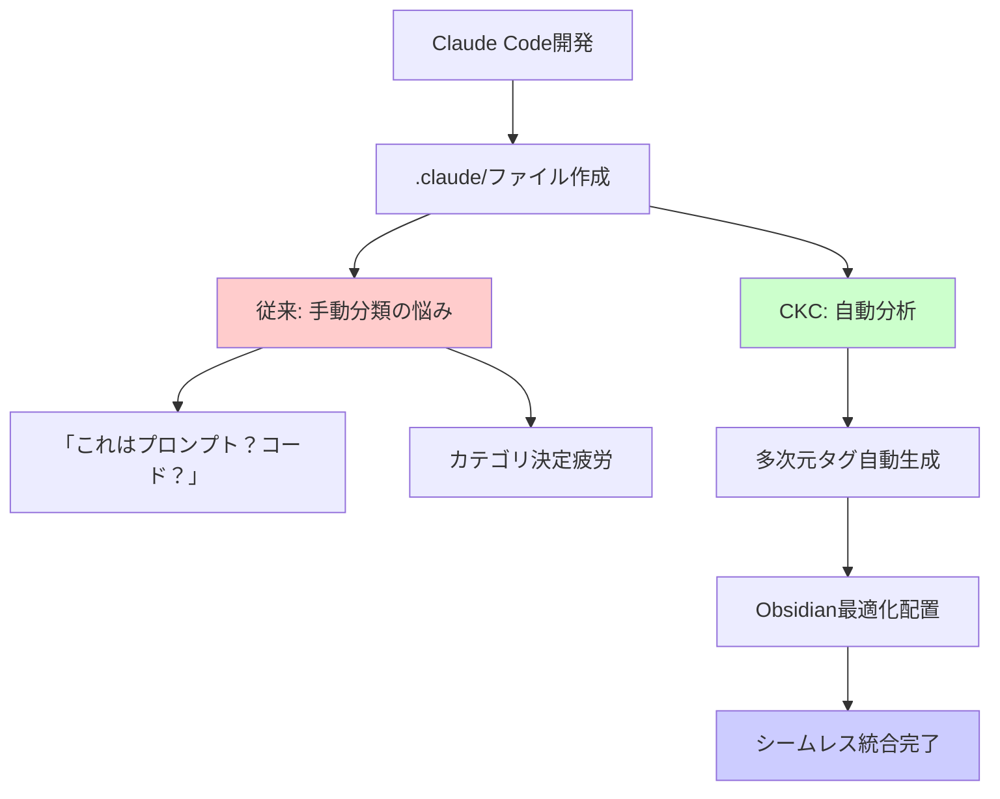
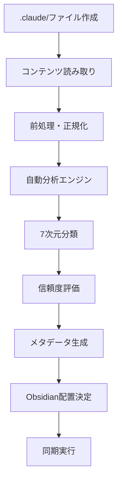

# Tag Architecture Guide

Claude Code ⇄ Obsidian統合の副次的効果として実現される、自動多次元タグシステムについて詳しく解説します。

## タグアーキテクチャの位置づけ

CKCの主目標は**Claude Code ⇄ Obsidian統合**ですが、その過程で手動分類負荷を軽減するために、自動多次元タグシステムが副次的効果として生まれます。

### 従来の問題とCKCの解決アプローチ



## 7次元タグシステム（副次的効果）

### タグ次元の概要

CKCの自動分析により、以下の7次元でコンテンツが自動分類されます：

```yaml
# Claude Code開発コンテンツの自動分析例
type: prompt                           # コンテンツ性質
tech: [python, fastapi, rest]          # 技術スタック  
domain: [web-dev, backend]             # アプリケーション領域
team: [backend, fullstack]             # チーム関連性
status: tested                         # ライフサイクル状態
complexity: intermediate              # スキルレベル
confidence: high                      # 分析信頼度
```

### 各次元の詳細解説

#### 1. Type（コンテンツ性質）

```yaml
type:
  prompt:    # Claudeへの指示・プロンプト
  code:      # 実行可能コード・スニペット
  concept:   # 概念・アイデア・設計思想
  resource:  # 参考資料・ドキュメント・リンク
```

**判定例:**
```bash
$ uv run ckc classify .claude/api_prompt.md --show-evidence

type: prompt (信頼度: 93%)
└── 根拠: "以下のプロンプトを使用", "Claudeに依頼", "指示文"
```

#### 2. Tech（技術スタック）

```yaml
tech:
  languages:    [python, javascript, typescript, rust, go, ...]
  frameworks:   [react, fastapi, django, express, nextjs, ...]
  tools:        [git, docker, kubernetes, terraform, ...]
  platforms:    [aws, gcp, azure, vercel, ...]
  databases:    [postgresql, mongodb, redis, ...]
```

**Claude Code特化例:**
```yaml
# Claude開発でよく使用される技術
tech: [python, fastapi, pydantic, typer, rich, pytest]
claude_integration: [anthropic-api, claude-sdk]
```

#### 3. Domain（アプリケーション領域）

```yaml
domain:
  web-dev:           # Web開発
  mobile-dev:        # モバイル開発
  machine-learning:  # AI/ML
  devops:           # インフラ・運用
  data-science:     # データ分析
  security:         # セキュリティ
  ui-ux:           # デザイン
```

#### 4. Team（チーム関連性）

```yaml
team:
  backend:       # バックエンド開発
  frontend:      # フロントエンド開発
  fullstack:     # フルスタック開発
  ml-research:   # AI/ML研究
  devops:        # インフラ・運用
  design:        # UI/UXデザイン
  product:       # プロダクト管理
```

#### 5. Status（ライフサイクル状態）

```yaml
status:
  draft:        # 作成中・実験段階
  tested:       # テスト済み・検証済み
  production:   # 本番使用中・実用化
  deprecated:   # 非推奨・古い
```

**Obsidian配置との連携:**
```yaml
# 状態ベースファイル配置
status: draft      → inbox/
status: tested     → active/
status: production → knowledge/
status: deprecated → archive/
```

#### 6. Complexity（スキルレベル）

```yaml
complexity:
  beginner:     # 初心者向け・基本的
  intermediate: # 中級者向け・応用
  advanced:     # 上級者向け・専門的
  expert:       # エキスパート向け・研究レベル
```

#### 7. Confidence（分析信頼度）

```yaml
confidence:
  low:    # 50-70% - 人間による確認推奨
  medium: # 71-85% - 一般的な信頼度
  high:   # 86%+   - 高信頼度
```

## Claude Code特化メタデータ

### 追加のClaude特化タグ

```yaml
# Claude Code開発特化メタデータ
claude_model: sonnet-4              # 使用Claudeモデル
claude_feature: code-generation     # Claude機能分類
success_rate: 87                    # プロンプト成功率
iteration: 3                       # 改善回数
project_context: "API開発"          # プロジェクト文脈
usage_frequency: high              # 使用頻度
last_used: "2025-06-20"           # 最終使用日
```

### プロンプト特化メタデータ

```yaml
# プロンプトファイル専用メタデータ
prompt_type: system_prompt         # システム/ユーザープロンプト
input_format: markdown            # 入力形式
output_format: code               # 期待出力形式
token_estimate: 150               # 推定トークン数
temperature: 0.7                  # 推奨温度設定
```

## 自動分析プロセス

### 自動分析フロー



### 分析根拠の透明性

```bash
$ uv run ckc classify .claude/react_component.md --show-evidence

分析結果:
├── type: code (信頼度: 94%)
│   └── 根拠: "```jsx", "export default", "コンポーネント"
├── tech: [react, typescript, jsx] (信頼度: 96%)
│   └── 根拠: "React.useState", "TypeScript", "JSX構文"
├── domain: [web-dev, frontend] (信頼度: 92%)
│   └── 根拠: "UI component", "ブラウザ", "フロントエンド"
├── team: [frontend, fullstack] (信頼度: 89%)
│   └── 根拠: React技術、UI開発
├── complexity: intermediate (信頼度: 85%)
│   └── 根拠: TypeScript使用、カスタムhooks
└── confidence: high (信頼度: 91%)
    └── 根拠: 明確な技術指標、構造化されたコード
```

## Obsidian統合での活用

### 動的クエリ生成

CKCは多次元タグを活用して、Obsidian用の高度なクエリを自動生成します：

````markdown
# 自動生成されるObsidianクエリ例

## 高成功率Python プロンプト
```
TABLE success_rate, claude_model, updated, iteration
FROM #prompt 
WHERE contains(tech, "python") AND success_rate > 80
SORT success_rate DESC, updated DESC
```

## チーム別知識マップ
```
TABLE type, domain, complexity, status
FROM #backend OR #frontend
WHERE status = "production"
GROUP BY team
```

## 技術進化追跡
```
LIST iteration, updated, success_rate
WHERE contains(tech, "fastapi") AND type = "prompt"
SORT updated DESC
```
````

### タグベースナビゲーション

```markdown
# Obsidian内での高度検索例

# 特定技術の知識横断
#tech/python AND #status/production

# 複雑度別学習パス
#complexity/beginner → #complexity/intermediate → #complexity/advanced

# プロジェクト横断パターン発見
#domain/api-design AND #success-rate/>80

# チーム知識共有
#team/backend AND #confidence/high
```

## カスタマイズと拡張

### タグ設定のカスタマイズ

```yaml
# ckc_config.yaml - タグ設定例
tags:
  # 基本7次元
  type_tags: ["prompt", "code", "concept", "resource"]
  tech_tags: ["python", "javascript", "react", "fastapi"]
  domain_tags: ["web-dev", "machine-learning", "devops"]
  team_tags: ["backend", "frontend", "ml-research"]
  status_tags: ["draft", "tested", "production", "deprecated"]
  complexity_tags: ["beginner", "intermediate", "advanced"]
  confidence_tags: ["low", "medium", "high"]
  
  # プロジェクト特化拡張
  custom_tags:
    business_value: ["low", "medium", "high", "critical"]
    maintenance: ["stable", "active", "deprecated"]
    security_level: ["public", "internal", "confidential"]
```

### 分析の調整

```yaml
# 自動分析設定
ai:
  auto_classification: true
  confidence_threshold: 0.75
  evidence_tracking: true
  
  # 特定次元の重み調整
  dimension_weights:
    type: 1.0
    tech: 0.9
    domain: 0.8
    complexity: 0.7
```

## ベストプラクティス

### 効果的なタグ活用

1. **自動分析の活用**
   ```bash
   # 自動分析を信頼し、手動調整は最小限に
   uv run ckc classify .claude/ --batch --auto-apply
   ```

2. **Obsidian内での発見**
   ```markdown
   # 予期しない知識の関連性を発見
   #tech/react AND #domain/machine-learning
   ```

3. **チーム知識共有**
   ```bash
   # チーム固有の知識を特定
   uv run ckc search --team backend --confidence high
   ```

### 手動調整が必要な場合

```yaml
# 手動でタグを追加・修正する例
---
title: "特殊なAPIパターン"
type: concept
tech: [python, fastapi]
domain: [web-dev, backend]
complexity: advanced
confidence: medium  # 自動分析では低かったが、実際は確実
manual_override: true  # 手動調整したことを記録
custom_tags: [enterprise, scalability]  # プロジェクト特化タグ
---
```

## まとめ

多次元タグシステムは、Claude Code ⇄ Obsidian統合の**副次的効果**として生まれる強力な機能です：

### 主な価値
- **手動分類負荷軽減**: 「どのカテゴリ？」の決定疲労解消
- **知識発見強化**: Obsidian内での高度な横断検索
- **分析透明性**: 分析根拠の明示による信頼性確保

### 統合との関係
- **主目標**: Claude Code ⇄ Obsidian シームレス統合
- **副次効果**: 自動多次元タグによる組織化
- **結果**: 手動負荷なしの構造化知識管理

このタグアーキテクチャにより、開発者は分類作業に時間を取られることなく、Claude Code開発に集中しながら、Obsidianで高度に組織化された知識を自動蓄積できます。