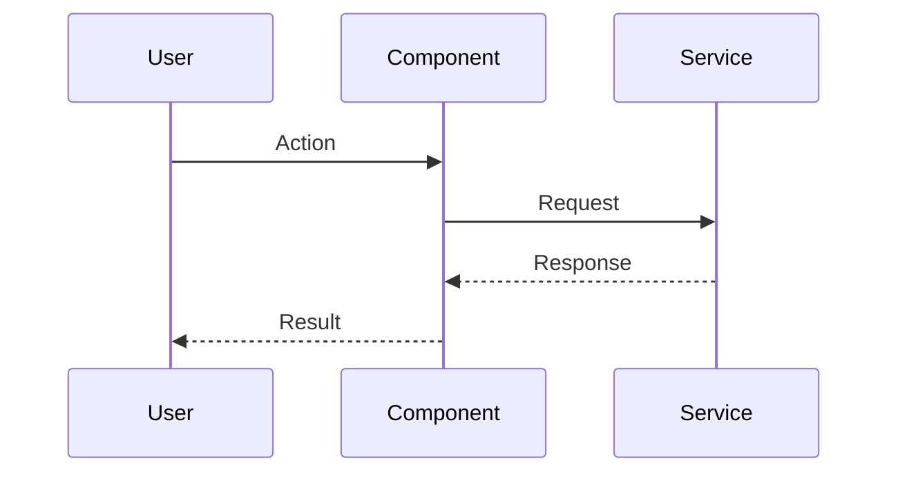
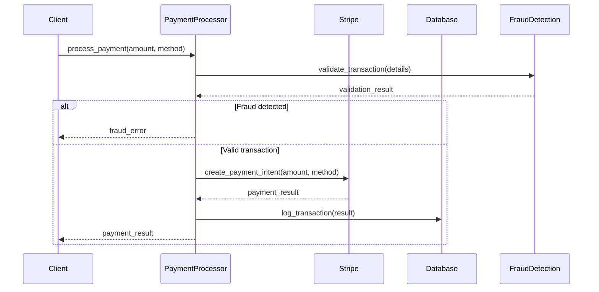
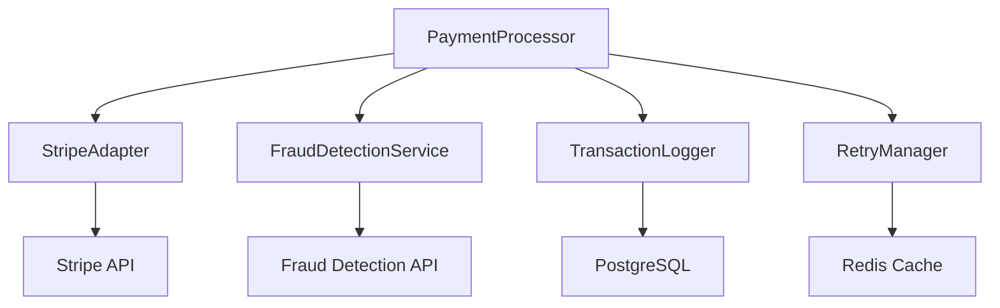

# Getting Started with Dungeon Master

This guide will walk you through setting up Dungeon Master in your project and using it for the first time. By the end, you'll have a fully configured documentation enforcement system with Cursor IDE integration for AI-assisted development.

## 📋 Prerequisites

- Python 3.8 or higher
- Git repository (existing or new)
- Basic familiarity with command line

## 🚀 Installation

### Install via pip

```bash
pip install cursor-dungeon-master
```

### Verify Installation

```bash
dm --help
```

You should see the Dungeon Master CLI help menu.

## 🏗️ First-Time Setup

### Step 1: Initialize Dungeon Master

Navigate to your project root and run:

```bash
dm init
```

This will create:

- `.lore/` directory for documentation
- `.cursor/rules/` directory with Cursor IDE integration rules
- `dmconfig.json` configuration file
- `dmcache.json` state tracking (auto-gitignored)
- Pre-commit hook setup

**Cursor IDE Integration**: The `.cursor/rules/` directory contains specialized rules that help Cursor's AI understand your documentation workflow and provide better code suggestions that align with your documentation standards.

**Expected Output:**

```
✨ Initializing Dungeon Master ✨

📁 Creating directory structure...
  ✅ Created .lore/ directory
  ✅ Created .cursor/rules/ directory

📝 Creating configuration files...
  ✅ Created dmconfig.json
  ✅ Created dmcache.json

🔮 Setting up gitignore...
  ✅ Updated .gitignore to exclude dmcache.json

🧙 Setting up Cursor rules...
  ✅ Copied dungeon_master_workflow.mdc to .cursor/rules/
  ✅ Copied dungeon_master_enforcement.mdc to .cursor/rules/
  ✅ Copied dungeon_master_commands.mdc to .cursor/rules/
  ✅ Copied dungeon_master_template.mdc to .cursor/rules/

Initialization complete! Your project is now protected by Dungeon Master.
```

### Step 2: Examine Your Project Structure

After initialization, your project will have:

```
your-project/
├── .lore/                    # Documentation directory
├── .cursor/rules/            # IDE integration rules
├── dmconfig.json            # Configuration
├── dmcache.json             # State (gitignored)
├── .gitignore               # Updated to exclude cache
└── .git/hooks/pre-commit    # Pre-commit hook
```

## 🏷️ Adding Your First Tracked Files

### Step 3: Add Track Lore Decorators

Choose important files in your codebase to start tracking. Add decorators at the top:

**Python Example:**

```python
# track_lore("api/payment_processing.md")
# track_lore("core/business_logic.md")
class PaymentProcessor:
    def process_payment(self, amount, method):
        """Process a payment transaction."""
        pass
```

**TypeScript Example:**

```typescript
// track_lore("frontend/user_authentication.md")
// track_lore("api/auth_middleware.md")
export class AuthService {
  authenticate(credentials: UserCredentials): Promise<AuthResult> {
    // Authentication logic
  }
}
```

**Important Guidelines:**

- Use descriptive paths that reflect the component's purpose
- Multiple files can reference the same documentation
- Paths are relative to `.lore/` directory
- Use forward slashes even on Windows

### Step 4: Generate Documentation Templates

Create documentation files for all your tracked decorators:

```bash
dm create_lore
```

**Expected Output:**

```
🔮 Creating Lore Files 🔮

🔍 Scanning for track_lore decorators...
  Found 3 unique lore files referenced in code

📝 Checking documentation status...
  ❌ .lore/api/payment_processing.md (missing)
  ❌ .lore/core/business_logic.md (missing)
  ❌ .lore/frontend/user_authentication.md (missing)

📁 Creating necessary directories...
  ✅ Created .lore/api/ directory
  ✅ Created .lore/core/ directory
  ✅ Created .lore/frontend/ directory

📑 Creating missing lore files with templates...
  ✅ Created .lore/api/payment_processing.md with documentation template
  ✅ Created .lore/core/business_logic.md with documentation template
  ✅ Created .lore/frontend/user_authentication.md with documentation template

✨ Complete! All lore files are now created.
⚠️ WARNING: FILL OUT ALL TEMPLATES WITH ACTUAL DOCUMENTATION BEFORE COMMITTING.
```

## 📝 Filling Out Documentation Templates

### Step 5: Complete Your First Documentation

Open one of the generated files (e.g., `.lore/api/payment_processing.md`):

````markdown
# Documentation for payment_processing.md

## Overview

<!-- REQUIRED: Provide a brief overview of what this file does and its purpose -->

[PLEASE FILL OUT: Overview]

## Dependencies

<!-- List any important dependencies or related components -->

[PLEASE FILL OUT: Dependencies]

## Key Functions/Components

<!-- REQUIRED: Document the main functions, classes, or features -->

[PLEASE FILL OUT: Functions/Components]

## Usage Examples

<!-- Provide examples of how to use this code -->

[PLEASE FILL OUT: Examples]

## Diagrams

<!-- REQUIRED: Include professional diagrams -->

### Sequence Diagram


````

````

**Replace the placeholders** with actual content:

```markdown
# Documentation for payment_processing.md

## Overview
Handles payment processing operations including credit card transactions, refunds, and subscription management. Integrates with Stripe API and provides retry logic for failed transactions.

## Dependencies
- Stripe Python SDK (>= 5.0.0)
- Redis for transaction caching
- PostgreSQL for transaction logging
- Internal rate limiting service

## Key Functions/Components

### PaymentProcessor Class
- `process_payment(amount, method)`: Main payment processing entry point
- `handle_refund(transaction_id, amount)`: Process partial or full refunds
- `validate_payment_method(method)`: Validate payment method details
- `retry_failed_payment(transaction_id)`: Retry logic for failed transactions

### Key Features
- Automatic retry with exponential backoff
- PCI-compliant data handling
- Real-time fraud detection integration
- Multi-currency support

## Usage Examples

```python
# Process a credit card payment
processor = PaymentProcessor()
result = processor.process_payment(
    amount=99.99,
    method={
        'type': 'credit_card',
        'token': 'stripe_token_xyz'
    }
)

# Handle refund
refund_result = processor.handle_refund(
    transaction_id='txn_12345',
    amount=50.00
)
````

## Diagrams

### Payment Processing Flow



### Component Architecture



---

_This documentation is linked to src/payment/processor.py, src/payment/models.py_

````

### Step 6: Check Documentation Status

Review what needs attention:
```bash
dm review
````

**Expected Output:**

```
🔍 Documentation Review 🔍

┏━━━━━━━━━━━━━━━━━━━━━━━━━━━━━━━━┳━━━━━━━━━━━━━━━━━━━━━━━━━━━━━━━━━━━━━━━━━━━━┳━━━━━━━━━━━━━━━━━━━━━━┓
┃ Lore File                      ┃ Tracked Files                              ┃ Status               ┃
┡━━━━━━━━━━━━━━━━━━━━━━━━━━━━━━━━╇━━━━━━━━━━━━━━━━━━━━━━━━━━━━━━━━━━━━━━━━━━━━╇━━━━━━━━━━━━━━━━━━━━━━┩
│ .lore/api/payment_processing.md│ src/payment/processor.py                   │ UP TO DATE           │
│                                │ src/payment/models.py                      │                      │
├────────────────────────────────┼────────────────────────────────────────────┼──────────────────────┤
│ .lore/core/business_logic.md   │ src/business/rules.py                      │ TEMPLATE ONLY        │
├────────────────────────────────┼────────────────────────────────────────────┼──────────────────────┤
│ .lore/frontend/user_auth.md    │ src/frontend/auth.ts                       │ TEMPLATE ONLY        │
└────────────────────────────────┴────────────────────────────────────────────┴──────────────────────┘

❗ REQUIRED ACTIONS:
  → COMPLETE .lore/core/business_logic.md TEMPLATE WITH ACTUAL DOCUMENTATION
  → COMPLETE .lore/frontend/user_auth.md TEMPLATE WITH ACTUAL DOCUMENTATION
```

## ✅ Testing the System

### Step 7: Test Pre-commit Protection

1. **Make a change to a tracked file:**

   ```bash
   echo "# New function added" >> src/payment/processor.py
   git add src/payment/processor.py
   ```

2. **Try to commit without updating documentation:**

   ```bash
   git commit -m "Add new payment feature"
   ```

3. **See the protection in action:**

   ```
   🔒 Validating Documentation 🔒

   ❌ VALIDATION FAILED
   REQUIRED ACTIONS:
     1. UPDATE .lore/api/payment_processing.md TO REFLECT CHANGES IN src/payment/processor.py

   🛑 COMMIT BLOCKED: UPDATE DOCUMENTATION BEFORE PROCEEDING
   ```

4. **Update the documentation, then commit successfully:**
   ```bash
   # Edit .lore/api/payment_processing.md to reflect changes
   git add .lore/api/payment_processing.md
   git commit -m "Add new payment feature with documentation"
   ```

## 🎯 Best Practices for Your First Week

### Start Small

- Begin with 3-5 critical files
- Choose files that change frequently
- Focus on business logic and API endpoints

### Documentation Quality

- Be specific, not generic
- Include actual code examples
- Update diagrams when architecture changes
- Write for new team members

### Team Adoption

- Share the workflow guide with teammates
- Review documentation during code reviews
- Treat documentation as part of "definition of done"

### Common Pitfalls to Avoid

- Don't leave placeholder text in templates
- Don't use generic or high-level diagrams
- Don't bypass validation with `--no-verify`
- Don't remove decorators to avoid documentation

## 🚀 Next Steps

Once you're comfortable with basic usage:

1. **Explore Advanced Features**

   - Check out [Configuration Options](configuration.md)
   - Learn about [Team Workflow Strategies](examples/team-workflow/)

2. **Integrate with Your Tools**

   - Set up CI/CD validation
   - Configure IDE shortcuts
   - Create team documentation standards

3. **Scale Documentation**
   - Add more tracked files gradually
   - Develop team documentation guidelines
   - Regular documentation review sessions

## 🆘 Getting Help

- **Issues with setup**: See [Troubleshooting Guide](troubleshooting.md)
- **Command questions**: Check [Commands Reference](commands.md)
- **Workflow questions**: Review [Development Workflow](workflow.md)

Welcome to documentation-driven development! 🎉
