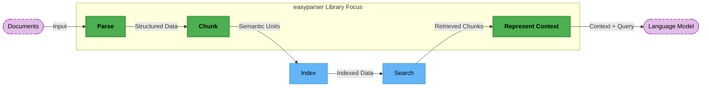

# easyparser

[](https://pypi.org/project/easyparser/)
[](https://opensource.org/license/apache-2-0)

A fast and lightweight Python library for intelligent document parsing, chunking, and analysis.

## 📊 Library Responsibility



The easyparser library focuses on the critical first steps in the document processing pipeline: **Parsing** documents into a unified format, **Chunking** content intelligently, and **Representing retrieval context** for LLMs.

## 🌟 Features

- **Universal Document Processing**: Parse PDFs, Word documents, PowerPoint, Excel, Markdown, HTML, images, audio, video, and more with a unified API
- **Intelligent Structure Preservation**: Keeps document hierarchy, tables, lists, and formatting intact
- **Modular Architecture**: Choose parsers and processing steps based on your needs
- **Multimodal Support**: Extract and process text, images, tables, and other elements
- **Smart Chunking Strategies**: Split content based on headers, semantic meaning, or custom rules
- **LLM-Ready**: Output chunks ready for embedding or use with language models
- **Extensible**: Easy to add custom parsers and processors

## 🚀 Quick Start

```python
from easyparser import parse

# Parse a file or directory into chunks
chunks = parse("path/to/document.pdf")

# Print the text
print(chunks.render())

# Or get a hierarchical structure
for depth, chunk in chunks.walk():
    print("  " * depth + f"{chunk.ctype}: {chunk.content[:30]}...")
```

Sample output:

```
# truncated output
Chunk(ctype=root, content=File assets/sample.docx)
    Chunk(ctype=para, content=(abridged from Sam Gross’s doc: https://docs.googl... (1 more words))
    Chunk(ctype=para, content=The goal of this project is to remove the global i... (31 more words))
    Chunk(ctype=list, mimetype=text/plain)
        Chunk(ctype=list, content=1. That it is feasible to remove the GIL from Python.)
        Chunk(ctype=list, content=2. That the tradeoffs are manageable and the effor... (7 more words))
        Chunk(ctype=list, content=3. That the main technical ideas of this project (... (16 more words))
    Chunk(ctype=header, content=Why remove the GIL?)
        Chunk(ctype=para, content=The GIL is a major obstacle to concurrency. For sc... (52 more words))
    Chunk(ctype=header, content=Design)
        Chunk(ctype=header, content=Reference counting)
            Chunk(ctype=para, content=CPython’s reference counting system is not thread-... (48 more words))
            ...
```

## 📦 Installation

```bash
pip install easyparser
```

For specialized parsers, install with extras:

```bash
pip install easyparser[pdf,ocr,audio]  # Install with PDF, OCR, and audio support
```

### External Dependencies

Some parsers require external tools to be installed on your system:

- **pandoc**: Required for parsing markup languages (EPUB, HTML, RTF, RST, DOCX, etc.)
  ```bash
  # Ubuntu/Debian
  sudo apt-get install pandoc

  # macOS
  brew install pandoc
  ```

<details>
<summary>
For legacy Office documents support
</summary>

- **libreoffice**: Required for file conversion (DOC → DOCX, PPT → PPTX, PPTX → PDF, etc.)

  ```bash
  # Ubuntu/Debian
  sudo apt-get install libreoffice

  # macOS
  brew install --cask libreoffice
  ```

</details>

## 🔍 Supported File Types

- **Documents**: PDF, DOCX, PPTX, XLSX, EPUB
- **Markup**: HTML, Markdown
- **Data**: CSV, JSON, YAML, TOML
- **Media**: Images (JPEG, PNG), Audio (MP3, WAV), Video (MP4)
- **Code**: Various programming languages
- **Directories**: Process entire folders of mixed documents

## 🧩 Components

### Parsers

Parsers read different file formats and convert them into a unified chunk structure:

```python
from easyparser.controller import get_controller
from easyparser.parser import FastPDF, Markdown, RapidOCRImageText

# Get a controller and parse a document
ctrl = get_controller()
chunk = ctrl.as_root_chunk("file.path")

# Parse a PDF with a faster parser
pdf_chunks = FastPDF.run(chunk)

# Parse Markdown into a structured tree
md_chunks = Markdown.run(chunk)

# Extract text from images using OCR
img_chunks = RapidOCRImageText.run(chunk)
```

### Chunking Strategies

Split content into meaningful chunks with different strategies:

```python
from easyparser.split import AgenticChunker, FlattenToMarkdown, LumberChunker

# Flatten hierarchical content while preserving structure
chunks = FlattenToMarkdown.run(doc, max_size=500)

# Use an LLM for semantic chunking (requires LLM setup)
chunks = LumberChunker.run(doc, chunk_size=800)

# Use an LLM for agentic chunking (requires LLM setup)
chunks = AgenticChunker.run(doc, chunk_size=800)
```

### Processing Pipeline

Build custom processing pipelines:

```python
from easyparser.controller import get_controller
from easyparser.parser.pdf import FastPDF
from easyparser.split import MarkdownSplitByHeading, Propositionizer

# Get a controller and parse a document
ctrl = get_controller()
chunk = ctrl.as_root_chunk("document.pdf")
FastPDF.run(chunk)

# Process the parsed document
sections = MarkdownSplitByHeading.run(chunk, min_chunk_size=200)
propositions = Propositionizer.run(sections)
```

## 🔧 Advanced Usage

### Custom Parsers

Create your own parsers for specialized formats:

```python
from easyparser.base import BaseOperation, Chunk, ChunkGroup, CType

class MyCustomParser(BaseOperation):
    @classmethod
    def run(cls, chunks: Chunk | ChunkGroup, **kwargs) -> ChunkGroup:
        # Custom parsing logic here
        return processed_chunks
```

### LLM Integration

Add LLM support for semantic splitting and processing:

### Add LLM support
By default, `easyparser` uses the `llm` ([repo](https://github.com/simonw/llm)) with
alias `easyparser-llm` to interact with LLM. Please setup the desired LLM
provider according to their docs, and set the alias `easyparser-llm` to that
model. Example, using Gemini model (as of April 2025):
```bash
# Install the LLM gemini
$ llm install llm-gemini
# Set the Gemini API key
$ llm keys set gemini
# Alias LLM to 'easyparser-llm' (you can see other model ids by running `llm models`)
$ llm aliases set easyparser-llm gemini-2.5-flash-preview-04-17
# Check the LLM is working correctly
$ llm -m easyparser-llm "Explain quantum mechanics in 100 words"
```

Once LLM is set up, you can use LLM-based chunkers:

```python
from easyparser.split import LumberChunker, AgenticChunker, Propositionizer

chunks = LumberChunker.run(doc)  # Semantically split content
chunks = Propositionizer.run(doc)  # Convert to atomic propositions
chunks = AgenticChunker.run(doc)  # Group chunks by topic
```

## 📊 Example Applications

- Create knowledge bases from document collections
- Build RAG (Retrieval-Augmented Generation) systems
- Extract structured data from unstructured documents
- Generate document summaries with preserved structure

## 🤝 Contributing

Contributions are welcome! Ensure that you have `git` and `git-lfs` installed. `git` will be used for version control and `git-lfs` will be used for test data.

```bash
# Clone the repository
git clone git@github.com:easyparser/easyparser.git
cd easyparser

# Fetch the test data
git submodule update --init --recursive

# Install development dependnecy
pip install -e ".[dev]"

# Initialize pre-commit hooks
pre-commit install
```

## 📄 License

Apache 2.0 License. See the [LICENSE](LICENSE) file for details.
