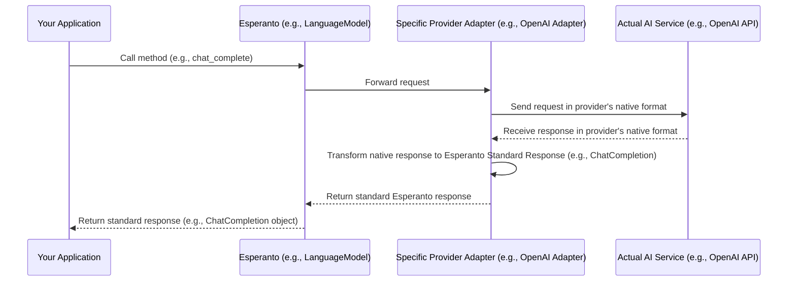

# Chapter 2: Standardized AI Responses (`ChatCompletion`, `TranscriptionResponse`, etc.)

In [Chapter 1: AI Service Interfaces (LanguageModel, EmbeddingModel, etc.)](01_ai_service_interfaces__languagemodel__embeddingmodel__etc___.md), we learned about Esperanto's "universal remote" concept – the AI Service Interfaces. These interfaces define a standard way to *ask* different AI services to perform tasks, like generating text or transcribing audio.

But what happens after you've asked? What does the AI service send back to you? This chapter dives into **Standardized AI Responses**, which ensure you get information back in a consistent and predictable format.

## The "Everyone Speaks a Different Language" Problem

Imagine you're a world traveler collecting information. You ask the same question – "What's the weather like?" – to people in different countries.
*   One person might reply, "It's 25 degrees Celsius and sunny."
*   Another might say, "Sunny, with a high of 77 Fahrenheit."
*   A third might hand you a complex weather chart.

While you get the information you need, processing it is complicated because everyone presents it differently. You'd have to constantly convert temperatures, parse different sentence structures, or interpret charts.

AI providers are a bit like this. When you ask an OpenAI model for a chat completion, it gives you a response structured in OpenAI's specific way. If you ask a Groq model for a speech transcription, it gives you a response in Groq's format. If your application needs to work with both, you'd have to write separate code to understand each provider's unique "language."

**Our Goal:** What if every AI service, no matter the provider, gave you its "report" using the same template?

That's exactly what Esperanto's Standardized AI Responses do!

## Standardized AI Responses: Consistent "Report Templates"

Esperanto defines a set of **standardized response structures** (think of them as pre-designed report templates) for common AI tasks. Whether you receive a chat completion from OpenAI (which Esperanto wraps in a `ChatCompletion` object) or a speech transcription from another provider (wrapped in a `TranscriptionResponse`), the output you work with in your code will follow a predictable structure.

This is like using a universal delivery app for food:
*   You order from Restaurant A (AI Provider 1) or Restaurant B (AI Provider 2).
*   The app (Esperanto) ensures your order confirmation and delivery details (the AI Response) always look the same.
*   It will always have fields like `order_id`, `estimated_delivery_time`, `items`, and `total_cost`, regardless of the restaurant.

This consistency makes it much easier for you to write code that processes AI outputs. You know exactly what fields to expect, like `id` (a unique identifier for the response), `text` (the main content, like the AI's reply or the transcribed speech), `model` (which AI model was used), and `provider` (who supplied the model).

Let's look at a couple of the most common standardized responses you'll use in Esperanto.

### 1. `ChatCompletion`: For Language Model Responses

When you use a `LanguageModel` interface (from Chapter 1) to chat with an AI, the method `chat_complete()` will return a `ChatCompletion` object. This object neatly packages the AI's response.

**Key information in a `ChatCompletion` object:**

*   `id`: A unique identifier for this specific chat interaction.
*   `model`: The name of the AI model that generated the response (e.g., "gpt-3.5-turbo").
*   `provider`: The name of the AI provider (e.g., "openai").
*   `choices`: A list of possible responses from the AI. Usually, there's just one best response.
    *   Each `choice` contains a `message` object.
    *   The `message` object has a `content` field, which holds the actual text generated by the AI (e.g., "The capital of France is Paris.").
    *   It also has a `role` field, typically "assistant" for AI-generated messages.
*   `usage` (Optional): Information about how many "tokens" (pieces of text) were processed.

Here's a simplified idea of what the data inside a `ChatCompletion` object might look like if you could peek inside:

```python
# Conceptual Python dictionary representing a ChatCompletion
# ai_response = my_language_model.chat_complete(messages=[...])

# What ai_response might contain:
# {
#   "id": "chatcmpl-123xyz",
#   "model": "gpt-3.5-turbo",
#   "provider": "openai",
#   "choices": [
#     {
#       "message": {"role": "assistant", "content": "The capital of France is Paris."},
#       "finish_reason": "stop"
#     }
#   ],
#   # ... other fields like 'usage'
# }
```

Esperanto makes it even easier! A `ChatCompletion` object has a handy shortcut:

```python
# In your Python code:
# response is a ChatCompletion object from Esperanto
# For example, after:
# response = my_language_model.chat_complete(messages=messages)

# You can directly get the AI's main text response:
ai_message_text = response.content
# print(ai_message_text) # Output: "The capital of France is Paris."
```
This `response.content` gives you the most important part – the AI's answer – without needing to dig through `choices` and `message` yourself.

### 2. `TranscriptionResponse`: For Speech-to-Text Results

If you use a `SpeechToTextModel` interface (from Chapter 1) to convert audio to text, its `transcribe()` method will return a `TranscriptionResponse` object.

**Key information in a `TranscriptionResponse` object:**

*   `text`: The actual transcribed text from the audio.
*   `language` (Optional): The language detected in the audio (e.g., "en" for English).
*   `model` (Optional): The name of the speech-to-text model used.
*   `provider` (Optional): The provider of the transcription service.
*   `duration` (Optional): The length of the audio file in seconds.

Here's a conceptual peek at the data in a `TranscriptionResponse`:

```python
# Conceptual Python dictionary representing a TranscriptionResponse
# transcription = my_stt_model.transcribe(audio_file="my_recording.mp3")

# What transcription might contain:
# {
#   "text": "Hello world, this is Esperanto.",
#   "language": "en",
#   "model": "whisper-1",
#   "provider": "openai",
#   "duration": 5.3
#   # ... other fields
# }
```

And using it in your code is straightforward:

```python
# In your Python code:
# result is a TranscriptionResponse object from Esperanto
# For example, after:
# result = my_stt_model.transcribe(audio_file_path)

# You can get the transcribed text:
transcribed_audio = result.text
# print(transcribed_audio) # Output: "Hello world, this is Esperanto."
```

Esperanto also defines other standardized responses, like `AudioResponse` for text-to-speech results from a `TextToSpeechModel`, and structures for embedding results from an `EmbeddingModel`. They all follow the same principle: provide a consistent, easy-to-use format.

## Why Are Standardized Responses So Helpful?

1.  **Predictability:** You always know what kind of "report template" you'll get back and what fields it will contain. No surprises!
2.  **Simpler Code:** Your code for handling AI responses becomes much cleaner. You don't need lots of `if/else` statements to check which provider sent the response and then parse it differently. You write one piece of code that works for all.
3.  **Flexibility:** Switching AI providers becomes much easier. If you decide to change from OpenAI's language model to Google's, your code that processes the `ChatCompletion` response largely stays the same because Esperanto ensures the `ChatCompletion` object looks consistent.

## Under the Hood: How Esperanto Standardizes Responses

You might wonder: if each AI provider (like OpenAI or Google) sends back data in its *own* format, how does Esperanto give you a standard `ChatCompletion` or `TranscriptionResponse`?

Here’s the magic:

1.  Your application uses an Esperanto interface (e.g., `LanguageModel`) to make a request.
2.  Esperanto, using a provider-specific adapter (which we'll learn more about in [Chapter 5: Provider-Specific Implementations (e.g., OpenAILanguageModel)](05_provider_specific_implementations__e_g___openailanguagemodel__.md)), sends this request to the actual AI service (e.g., the OpenAI API).
3.  The external AI service processes the request and sends back a response in *its own unique format*.
4.  **This is the key step:** The Esperanto provider-specific adapter receives this unique response. It then acts like a translator, taking the data from the provider's specific fields and carefully mapping it into Esperanto's standard response object (like `ChatCompletion` or `TranscriptionResponse`).
5.  Your application receives this neat, standardized Esperanto response object.

Here’s a diagram showing this transformation:



So, even though the raw "reports" from different "restaurants" (AI providers) might be different, Esperanto's "delivery app" (the provider adapters) repackages them into a familiar, standardized format before handing them to you.

## A Glimpse into the Code: The "Report Templates"

These "report templates" or standardized response structures in Esperanto are defined using a Python library called Pydantic. Pydantic helps define data shapes with types, making sure the data you get is what you expect.

Let's look at a very simplified version of how `ChatCompletion` is defined. You can find the full definitions in the `src/esperanto/common_types/response.py` file.

```python
# Simplified concept from src/esperanto/common_types/response.py
from pydantic import BaseModel # Pydantic helps define data structures
from typing import List, Optional

class Message(BaseModel): # A_message_within_a_chat
    content: Optional[str] # The text content
    role: Optional[str]    # Who sent it (e.g., "assistant")

class Choice(BaseModel):   # One_possible_AI_response
    message: Message       # The actual message from the AI

class ChatCompletion(BaseModel): # The_overall_chat_response
    id: str
    choices: List[Choice]
    model: str
    provider: str
    # Plus a handy way to get the main text:
    @property
    def content(self) -> str:
        if self.choices and self.choices[0].message:
            return self.choices[0].message.content or ""
        return ""
```
In this snippet:
*   `BaseModel` is a Pydantic feature that lets us define fields like `id: str` (meaning `id` should be a string) or `choices: List[Choice]` (meaning `choices` should be a list of `Choice` objects).
*   The `@property def content(self)` part is a special Python feature that creates the easy `response.content` access we saw earlier.

Similarly, `TranscriptionResponse` is also defined using Pydantic. Here's a simplified idea, with the full version in `src/esperanto/common_types/stt.py`:

```python
# Simplified concept from src/esperanto/common_types/stt.py
from pydantic import BaseModel
from typing import Optional

class TranscriptionResponse(BaseModel): # The_speech_transcription_response
    text: str                     # The_transcribed_text
    language: Optional[str]       # e.g., "en"
    model: Optional[str]          # e.g., "whisper-1"
    # ... other fields like duration, provider
```
These Pydantic models act as enforceable "contracts" or "templates" for the data, ensuring consistency.

## Conclusion

You've now learned about Esperanto's **Standardized AI Responses**! These are like pre-defined "report templates" (`ChatCompletion`, `TranscriptionResponse`, etc.) that ensure you always get AI-generated information in a consistent, easy-to-process format, no matter which underlying AI provider is doing the work.

*   They make your code **simpler** because you don't have to write custom logic for each provider's output format.
*   They make your application **more flexible** and **easier to maintain**.
*   They work hand-in-hand with the [AI Service Interfaces (LanguageModel, EmbeddingModel, etc.)](01_ai_service_interfaces__languagemodel__embeddingmodel__etc___.md) from Chapter 1, which define *how to ask* for information, while standardized responses define *what you get back*.

So, we know about the "universal remote" (Interfaces) and the "standardized delivery confirmations" (Standardized Responses). But how do we actually get an instance of an AI model, like `my_language_model`, to start using these? That's where our next chapter comes in!

Next up: [Chapter 3: AIFactory](03_aifactory_.md)

---

Generated by [AI Codebase Knowledge Builder](https://github.com/The-Pocket/Tutorial-Codebase-Knowledge)