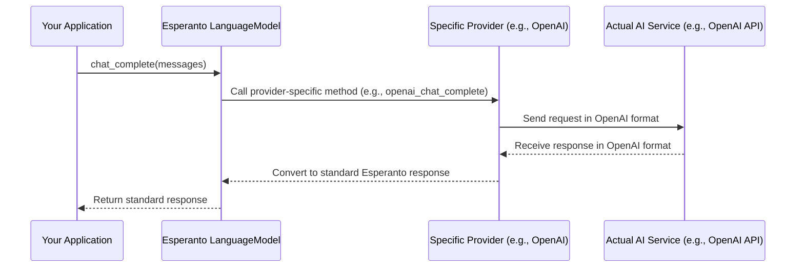

# Chapter 1: AI Service Interfaces (`LanguageModel`, `EmbeddingModel`, etc.)

Welcome to Esperanto! If you've ever wanted to use Artificial Intelligence (AI) in your projects, like making a chatbot, summarizing articles, or even generating images, you're in the right place. Esperanto is designed to make it much easier to work with various AI services from different companies.

This first chapter introduces a core idea in Esperanto: **AI Service Interfaces**.

## The "Too Many Remotes" Problem

Imagine you have a TV from Sony, a sound system from Bose, and a streaming box from Apple. Each device comes with its own remote control, and each remote has different buttons and layouts. It can get confusing trying to remember which remote does what!

Working with AI services can feel similar. There are many AI providers out there – OpenAI (makers of ChatGPT), Google (with Gemini), Anthropic (with Claude), and more. Each provider offers amazing AI capabilities, but they all have their own unique ways (their own "code libraries" or "APIs") to access them.

If you write code to use OpenAI's text generation, and later decide you want to try Google's, you often have to learn a whole new set of commands and rewrite parts of your code. This can be time-consuming and a bit frustrating.

**Our Goal:** What if you could have a "universal remote" for AI services? A single, consistent way to tell different AI services what to do?

That's exactly what Esperanto's AI Service Interfaces aim to provide!

## What are AI Service Interfaces?

In Esperanto, AI Service Interfaces are like **abstract blueprints** or **contracts**. They define a common set of "buttons" for different types of AI tasks.

Think of them like this:
*   A `LanguageModel` interface defines the standard "buttons" for **text generation** tasks (like asking questions, writing stories, summarizing text).
*   An `EmbeddingModel` interface defines the standard "buttons" for **text embedding** tasks (turning text into lists of numbers, which is useful for things like search or finding similar documents).
*   A `SpeechToTextModel` interface defines the standard "buttons" for **converting speech into text**.
*   A `TextToSpeechModel` interface defines the standard "buttons" for **converting text into speech**.

Any AI provider that Esperanto supports (like OpenAI, Google, etc.) and offers, say, text generation, must implement the "buttons" defined by the `LanguageModel` interface. This means you, the developer, can learn one way to "press the text generation button," and Esperanto handles talking to the specific provider behind the scenes.

This makes your code:
*   **Simpler:** You learn one set of Esperanto "buttons."
*   **More Flexible:** You can switch AI providers (e.g., from OpenAI to Google) with minimal code changes.

Let's look at the main interfaces you'll encounter in Esperanto:

1.  **`LanguageModel`**: For interacting with Large Language Models (LLMs).
    *   **What it does:** Generates text, answers questions, completes prompts, holds conversations.
    *   **Think of it as:** The "chat" or "writing assistant" button on your universal AI remote.
    *   **Key "button" (method):** `chat_complete()` (for getting a response from the model)

2.  **`EmbeddingModel`**: For creating text embeddings.
    *   **What it does:** Converts text into a list of numbers (an "embedding" or "vector") that captures the meaning of the text.
    *   **Think of it as:** The "understand text meaning" button. Useful for search, recommendations, or finding similar pieces of text.
    *   **Key "button" (method):** `embed()` (for turning text into embeddings)

3.  **`SpeechToTextModel` (STT)**: For converting audio into text.
    *   **What it does:** Takes an audio file (like someone speaking) and transcribes it into written words.
    *   **Think of it as:** The "dictation" or "transcribe audio" button.
    *   **Key "button" (method):** `transcribe()`

4.  **`TextToSpeechModel` (TTS)**: For converting text into audio.
    *   **What it does:** Takes written text and generates spoken audio.
    *   **Think of it as:** The "read aloud" or "generate voice" button.
    *   **Key "button" (method):** `generate_speech()`

## How Would I Use These Interfaces? (A Sneak Peek)

Let's imagine you want to ask an AI model a question. With Esperanto, using the `LanguageModel` interface, your code would look something like this conceptually:

```python
# This is a simplified, conceptual example.
# We'll learn how to get 'my_ai_model' in a later chapter!
# imagine my_ai_model is an Esperanto LanguageModel

question = "What is the capital of France?"
messages = [{"role": "user", "content": question}]

# The 'chat_complete' method is a standard "button"
# on all Esperanto LanguageModel interfaces.
# response = my_ai_model.chat_complete(messages=messages)

# print(response.content) # Expected: "The capital of France is Paris."
```

In this example, `my_ai_model` would be an instance of a language model (maybe from OpenAI, maybe from Google). The important part is that you'd call the `chat_complete()` method in the same way, regardless of which provider is actually doing the work. Esperanto ensures that the `messages` you send and the `response` you get back have a consistent structure. We'll explore these standardized responses in [Chapter 2: Standardized AI Responses (ChatCompletion, TranscriptionResponse, etc.)](02_standardized_ai_responses__chatcompletion__transcriptionresponse__etc___.md).

How you get an actual `my_ai_model` instance is something we'll cover in detail in [Chapter 3: AIFactory](03_aifactory_.md). For now, just focus on the idea that there's a common way to interact.

## What Happens Under the Hood?

When you use an Esperanto interface, like calling `chat_complete()` on a `LanguageModel` object, Esperanto does some clever work for you:

1.  **Your Request:** You make a request using Esperanto's standard format (e.g., calling `chat_complete` with a list of messages).
2.  **Esperanto's Role:** Esperanto knows which specific AI provider (e.g., OpenAI, Google) and model you intend to use for that `LanguageModel` object.
3.  **Translation (if needed):** It takes your standard request and translates it into the specific format that the chosen AI provider understands.
4.  **API Call:** Esperanto sends this translated request to the actual AI provider's service over the internet.
5.  **Provider's Response:** The AI provider processes the request and sends back a response in its own specific format.
6.  **Standardization:** Esperanto receives this provider-specific response and translates it back into Esperanto's standard response format.
7.  **Your Result:** You get the result in a nice, predictable, standardized way.

Here's a simple diagram showing this flow:



## A Glimpse into the Code: The Blueprints

These interfaces are defined in Python using something called "Abstract Base Classes" (ABCs). An ABC is like a template or a contract that says, "If you want to be considered a `LanguageModel`, you *must* have these methods (buttons)."

Let's look at a simplified version of how `LanguageModel` is defined in Esperanto:

```python
# Found in: src/esperanto/providers/llm/base.py
from abc import ABC, abstractmethod
from typing import List, Dict # ... and other types

class LanguageModel(ABC):  # ABC means it's an Abstract Base Class

    # ... (common settings like api_key, model_name might be here)

    @abstractmethod  # This means any real LanguageModel MUST implement this
    def chat_complete(
        self, messages: List[Dict[str, str]], # ... other parameters
    ): # -> returns a standard response (more on this in Chapter 2)
        """Send a chat completion request."""
        # No actual code here in the blueprint!
        # Specific providers will fill this in.
        pass

    # ... other abstract methods like 'achat_complete' (for async)
```
The `LanguageModel` class itself doesn't do the chatting. It just declares that any *concrete* language model (like one for OpenAI or one for Google) *must* provide a `chat_complete` method. This is what `@abstractmethod` means. You can see this file at `src/esperanto/providers/llm/base.py`.

Similarly, the `EmbeddingModel` interface is defined with its key methods:

```python
# Found in: src/esperanto/providers/embedding/base.py
from abc import ABC, abstractmethod
from typing import List # ... and other types

class EmbeddingModel(ABC):

    # ... (common settings)

    @abstractmethod
    def embed(self, texts: List[str], **kwargs) -> List[List[float]]:
        """Create embeddings for the given texts."""
        pass # Specific providers implement this

    # ... other abstract methods like 'aembed' (for async)
```
This ensures any embedding model in Esperanto will have an `embed` method that takes a list of texts and returns a list of embeddings (lists of numbers). You can find this in `src/esperanto/providers/embedding/base.py`.

The `SpeechToTextModel` (in `src/esperanto/providers/stt/base.py`) and `TextToSpeechModel` (in `src/esperanto/providers/tts/base.py`) follow the same pattern, defining abstract methods like `transcribe()` and `generate_speech()` respectively.

These base files define the "contracts." Then, for each AI provider, Esperanto has specific classes that *implement* these contracts. For example, there might be an `OpenAILanguageModel` class that provides the actual code for OpenAI's version of `chat_complete`. We'll touch more on these in [Chapter 5: Provider-Specific Implementations (e.g., OpenAILanguageModel)](05_provider_specific_implementations__e_g___openailanguagemodel__.md).

## Conclusion

You've just learned about one of the most powerful concepts in Esperanto: **AI Service Interfaces**. These are like universal remote control layouts (`LanguageModel`, `EmbeddingModel`, etc.) that provide a consistent way to interact with different AI capabilities, no matter which AI provider is powering them.

*   They define **what** you can do (e.g., "generate text," "create embeddings").
*   They make your code **simpler and more adaptable**.
*   They hide the complexities of dealing with different provider APIs.

These interfaces define the "buttons" you can press. But what happens when you press a button? What kind of information do you get back? That's what our next chapter is all about!

Next up: [Chapter 2: Standardized AI Responses (ChatCompletion, TranscriptionResponse, etc.)](02_standardized_ai_responses__chatcompletion__transcriptionresponse__etc___.md)

---

Generated by [AI Codebase Knowledge Builder](https://github.com/The-Pocket/Tutorial-Codebase-Knowledge)