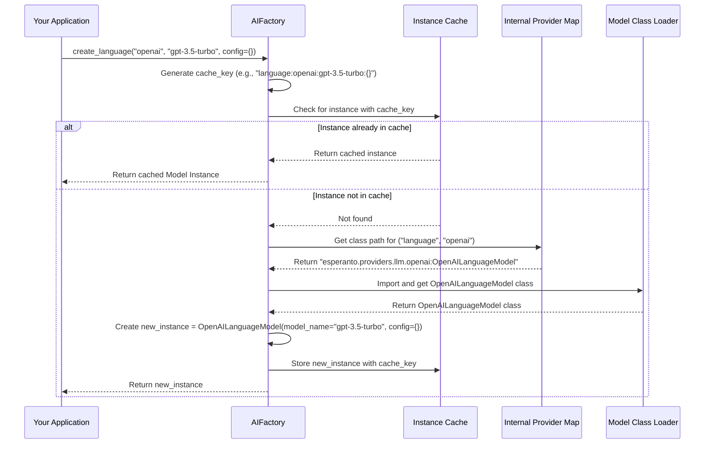

# Chapter 3: AIFactory

In the previous chapters, we learned about [AI Service Interfaces (LanguageModel, EmbeddingModel, etc.)](01_ai_service_interfaces__languagemodel__embeddingmodel__etc___.md) – Esperanto's "universal remote" for AI tasks – and [Standardized AI Responses (ChatCompletion, TranscriptionResponse, etc.)](02_standardized_ai_responses__chatcompletion__transcriptionresponse__etc___.md), which ensure AI answers come in a consistent format. You might have wondered, "Okay, I know *how* to talk to an AI model and *what kind of response* I'll get, but how do I actually *get* an AI model instance like `my_language_model` in the first place?"

That's exactly what this chapter is about! We'll explore `AIFactory`, a super helpful tool in Esperanto.

## The "Where Do I Find This Tool?" Problem

Imagine you need a very specific screwdriver. You could spend ages rummaging through a giant, messy toolbox, trying to find the right brand, the right size, and then figure out if it needs any special attachments. This is similar to working with AI models directly:
*   You need to find the correct library for the AI provider (e.g., OpenAI, Google).
*   You have to import the specific model class.
*   You need to configure it with your API keys and desired settings.
*   If you need the same tool later, you might have to do it all over again!

This can be a bit of a hassle, especially when you just want to get to the exciting part – using the AI!

**Our Goal:** What if you had an intelligent assistant or a well-organized "AI tool shop" where you could simply ask for the AI tool you need, and it's handed to you, ready to go?

Meet `AIFactory` – Esperanto's solution to this problem!

## What is AIFactory?

The `AIFactory` class in Esperanto acts like that centralized "AI tool shop" or an intelligent assistant. Instead of you manually searching for, importing, and configuring a specific AI model, you just tell the `AIFactory` what you need.

For example, you'd say, "I need a language model from OpenAI, specifically 'gpt-4'." The `AIFactory` then:
1.  **Locates:** Finds the correct Python class for an OpenAI language model.
2.  **Configures:** Sets it up with your desired model name (and any other settings you provide).
3.  **Delivers:** Gives you an instance of that model, ready for immediate use.
4.  **Remembers (Caches):** If you ask for the exact same configured tool again, it often gives you the one it already prepared, saving setup time.

This makes getting AI models much simpler and cleaner.

## Getting Your First AI Tool: Using `AIFactory`

Let's see how you can use `AIFactory` to get an AI model. Suppose you want a language model to chat with. In [Chapter 1](01_ai_service_interfaces__languagemodel__embeddingmodel__etc___.md), we talked about the `LanguageModel` interface. Now, let's get a concrete instance of one!

First, you'll need to import `AIFactory` from the `esperanto` library:

```python
from esperanto import AIFactory
```
This line tells Python you want to use the `AIFactory` from Esperanto.

Now, let's ask the `AIFactory` for a language model. We'll ask for OpenAI's "gpt-3.5-turbo" model. (You'd need an OpenAI API key set up in your environment for this specific example to run, but the concept is the same for other providers).

```python
# Requesting a language model from OpenAI
my_language_model = AIFactory.create_language(
    provider="openai",
    model_name="gpt-3.5-turbo"
)
```
Let's break this down:
*   `AIFactory.create_language(...)`: This is us telling the factory, "I want a language model."
*   `provider="openai"`: We're specifying the AI provider we want to use (OpenAI in this case).
*   `model_name="gpt-3.5-turbo"`: We're specifying the exact model from that provider.

And that's it! The `my_language_model` variable now holds an instance of an OpenAI language model, configured and ready to use. It will behave just like the `LanguageModel` interface we discussed in Chapter 1, so you can call methods like `chat_complete()` on it.

```python
# Now you can use it! (Conceptual - assumes API key is set)
# messages = [{"role": "user", "content": "Hello, AI!"}]
# response = my_language_model.chat_complete(messages=messages)
# print(response.content)
```
If this were a real run, you'd see the AI's greeting!

`AIFactory` has similar methods for other types of AI models:
*   `AIFactory.create_embedding(provider="some_provider", model_name="some_embedding_model")` for [EmbeddingModel](01_ai_service_interfaces__languagemodel__embeddingmodel__etc___.md) instances.
*   `AIFactory.create_speech_to_text(provider="some_provider", model_name="some_stt_model")` for [SpeechToTextModel](01_ai_service_interfaces__languagemodel__embeddingmodel__etc___.md) instances.
*   `AIFactory.create_text_to_speech(provider="some_provider", model_name="some_tts_model")` for [TextToSpeechModel](01_ai_service_interfaces__languagemodel__embeddingmodel__etc___.md) instances.

## The Magic of Caching: Save Time and Effort

`AIFactory` has another neat trick: it **caches** model instances.

Imagine you ask the shopkeeper for that "OpenAI gpt-3.5-turbo screwdriver." The first time, they find it, prepare it, and give it to you. If you come back five minutes later and ask for the *exact same* "OpenAI gpt-3.5-turbo screwdriver" with the *exact same* settings, the shopkeeper doesn't go through the whole preparation process again. They remember they just made one for you and hand you the existing one.

That's caching! `AIFactory` remembers the model instances it has already created. If you request a model with the same provider, model name, and configuration multiple times in your program, `AIFactory` will return the already-created instance instead of making a new one from scratch.

```python
# First request
llm1 = AIFactory.create_language(provider="openai", model_name="gpt-3.5-turbo")

# Second request for the *same* model and configuration
llm2 = AIFactory.create_language(provider="openai", model_name="gpt-3.5-turbo")

# llm1 and llm2 will be the *exact same* object in memory!
# print(llm1 is llm2) # Output: True
```
This is efficient because:
*   It's faster – no need to re-initialize the model.
*   It can save resources, as model setup might involve some computation or network calls.

If you need a model with a *different* configuration (e.g., a different `model_name` or other specific settings passed via a `config` dictionary), `AIFactory` will, of course, create a new instance for that.

## How Does `AIFactory` Work Its Magic? (Under the Hood)

Let's peek behind the counter of our "AI tool shop" to see how `AIFactory` operates.

When you call a method like `AIFactory.create_language("openai", "gpt-3.5-turbo")`:

1.  **Generate a Key:** `AIFactory` first creates a unique "label" or "key" for your request. This key includes the service type ("language"), provider ("openai"), model name ("gpt-3.5-turbo"), and any other configuration details you might have provided. This key looks something like `"language:openai:gpt-3.5-turbo:{}"` (the `{}` means no extra config).
2.  **Check the Cache:** It looks in its "storage room" (the `_model_cache`) to see if it already has an instance with this exact label.
3.  **Cache Hit?**
    *   **If Yes (Cache Hit):** Great! It found a pre-made tool. It pulls this existing instance from the cache and gives it to you. Super fast!
    *   **If No (Cache Miss):** No problem. The factory needs to make a new one.
        a.  **Find the Blueprint:** It consults its internal "catalog" (a dictionary called `_provider_modules`) to find out which specific Python class corresponds to an "openai" "language" model. This catalog might say, "For an OpenAI language model, use the `OpenAILanguageModel` class found in the `esperanto.providers.llm.openai` file."
        b.  **Import the Class:** It dynamically imports this `OpenAILanguageModel` class. This is like the shopkeeper finding the correct blueprint for the tool.
        c.  **Create the Instance:** It creates a new instance of `OpenAILanguageModel`, passing in the `model_name` ("gpt-3.5-turbo") and any other configuration. This is the tool being assembled.
        d.  **Store in Cache:** Before handing the new tool to you, it stores this new instance in its `_model_cache` using the unique label from Step 1. So, next time, it'll be a cache hit!
        e.  **Deliver:** It gives you the newly created model instance.

Here's a diagram showing this flow:



## A Peek at the `AIFactory` Code

The actual code for `AIFactory` is in `src/esperanto/factory.py`. Let's look at simplified snippets to understand the key parts.

**1. The Provider Catalog (`_provider_modules`)**

This is like the factory's list of known tool blueprints and where to find them.

```python
# Simplified from src/esperanto/factory.py
class AIFactory:
    _provider_modules = {
        "language": {
            "openai": "esperanto.providers.llm.openai:OpenAILanguageModel",
            "google": "esperanto.providers.llm.google:GoogleLanguageModel",
            # ... more language providers
        },
        "embedding": {
            "openai": "esperanto.providers.embedding.openai:OpenAIEmbeddingModel",
            # ... more embedding providers
        },
        # ... "speech_to_text" and "text_to_speech" sections
    }
    # ... rest of the class
```
Each entry like `"openai": "esperanto.providers.llm.openai:OpenAILanguageModel"` tells the factory: "If someone asks for a 'language' model from 'openai', the class they need is `OpenAILanguageModel`, and it's located in the `esperanto.providers.llm.openai` Python module."

**2. Importing the Provider Class (`_import_provider_class`)**

This method is responsible for taking the path (like `"esperanto.providers.llm.openai:OpenAILanguageModel"`) and actually loading the class into memory so an instance can be created. It uses a Python feature called `importlib` for this dynamic importing.

```python
# Simplified concept from src/esperanto/factory.py
import importlib # For dynamic imports

class AIFactory:
    # ... _provider_modules ...

    @classmethod
    def _import_provider_class(cls, service_type: str, provider: str):
        # provider_path_str = cls._provider_modules[service_type][provider]
        # Example: "esperanto.providers.llm.openai:OpenAILanguageModel"
        
        # module_name, class_name = provider_path_str.split(":")
        # module_name = "esperanto.providers.llm.openai"
        # class_name = "OpenAILanguageModel"
        
        # imported_module = importlib.import_module(module_name)
        # provider_class = getattr(imported_module, class_name)
        # return provider_class
        pass # Actual method includes error handling
```
This ensures Esperanto only loads the code for the specific provider you ask for, which is efficient.

**3. Creating an Instance and Caching (e.g., `create_language`)**

The `create_language` method (and its siblings like `create_embedding`) orchestrates the process.

```python
# Simplified from src/esperanto/factory.py
class AIFactory:
    _model_cache = {} # The cache starts empty
    # ... _provider_modules, _import_provider_class ...

    @classmethod
    def _generate_cache_key(cls, service_type, provider, model_name, config):
        # config_str = json.dumps(config or {}, sort_keys=True) # Stable string for config
        # return f"{service_type}:{provider}:{model_name or 'default'}:{config_str}"
        pass # Actual method creates a unique string key

    @classmethod
    def create_language(cls, provider: str, model_name: str,
                        config: Optional[Dict[str, Any]] = None):
        cache_key = cls._generate_cache_key("language", provider, model_name, config)
        
        if cache_key in cls._model_cache:
            return cls._model_cache[cache_key] # Found in cache!
            
        # Not in cache, so create it:
        ProviderClass = cls._import_provider_class("language", provider)
        instance = ProviderClass(model_name=model_name, config=config or {})
        
        cls._model_cache[cache_key] = instance # Add to cache
        return instance
```
Here you can see:
*   `_generate_cache_key`: This creates a unique string based on all the parameters (service type, provider, model name, and any specific `config`). This key is crucial for the cache to work correctly. The use of `json.dumps` with `sort_keys=True` ensures that even if dictionary keys in `config` are in a different order, they produce the same cache key if their content is the same.
*   The check `if cache_key in cls._model_cache:`.
*   If not found, it imports the class, creates an `instance`, and then stores it in `cls._model_cache`.

This combination of dynamic loading and caching makes `AIFactory` both flexible and efficient.

## Conclusion

You've now unlocked the secret to easily getting AI model instances in Esperanto: the `AIFactory`!
*   It acts as your friendly "AI tool shop assistant."
*   You simply tell it what kind of model you need, from which provider, and with which name (e.g., `AIFactory.create_language("openai", "gpt-3.5-turbo")`).
*   It handles the messy details of finding, importing, and configuring the model.
*   It intelligently caches instances, so repeated requests for the same configured model are super fast.

With `AIFactory`, you're now fully equipped to obtain any AI model Esperanto supports and start using it with the standard [AI Service Interfaces](01_ai_service_interfaces__languagemodel__embeddingmodel__etc___.md) and expect [Standardized AI Responses](02_standardized_ai_responses__chatcompletion__transcriptionresponse__etc___.md).

But what about those `model_name` strings like "gpt-3.5-turbo"? How does Esperanto (or even you, the developer) know more details about these models, like their capabilities, context window sizes, or pricing? That's where our next topic comes in handy!

Next up: [Chapter 4: AI Model Metadata (common_types.Model)](04_ai_model_metadata__common_types_model__.md)

---

Generated by [AI Codebase Knowledge Builder](https://github.com/The-Pocket/Tutorial-Codebase-Knowledge)