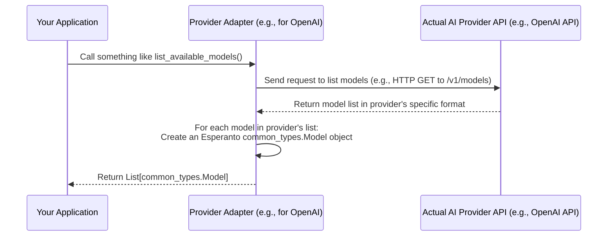

# Chapter 4: AI Model Metadata (`common_types.Model`)

In [Chapter 3: AIFactory](03_aifactory_.md), we discovered how `AIFactory` is like a helpful "AI tool shop" that quickly gets us ready-to-use AI model instances. We learned we can ask for a model like `"gpt-3.5-turbo"` from `"openai"`. But a question naturally arises: "How do I know what 'gpt-3.5-turbo' *is*? What are its capabilities? How much text can it handle? Are there other models, and how do they compare?"

Imagine you're shopping for a new phone. You wouldn't just pick one at random! You'd want to see its "spec sheet" – its screen size, battery life, camera quality, etc. – before deciding. This chapter is about exactly that: the "spec sheet" for AI models in Esperanto.

## The "Which Tool is Right for the Job?" Problem

When you walk into a huge hardware store (like the world of AI models), you see rows and rows of tools. If you need to drill a hole, you need to know more than just "I need a drill." Is it for wood, metal, or concrete? Do you need a small, precise drill bit or a large, powerful one?

Similarly, when choosing an AI model:
*   If you want an AI to write a long story, you need a model that can handle a lot of text (a large "context window").
*   If you need to classify short customer reviews, a smaller, faster model might be better.
*   You also need to know if a model is for generating text, understanding language, or maybe converting speech to text.

Without a clear "spec sheet" for each AI model, picking the right one can feel like guesswork.

**Our Goal:** What if every AI model accessible through Esperanto came with a standardized "ID card" or "technical specification sheet"? This would make it easy to understand what each model can do, who made it, and its key features, allowing you to choose the best one for your project.

This is precisely what Esperanto's `common_types.Model` provides!

## What is `common_types.Model`?

The `common_types.Model` (which we'll often just call `Model` for short) is Esperanto's standardized **"specification sheet" or "ID card"** for every AI model you can access. Think of it like the label on a food package that tells you the ingredients and nutritional information, or the spec sheet on a new laptop box.

This `Model` object holds key details about an AI model, such as:

*   `id`: The unique name or identifier of the model (e.g., `"gpt-3.5-turbo"`).
*   `owned_by`: The organization that created or hosts the model (e.g., `"openai"`).
*   `context_window`: For language models, this is very important! It tells you the maximum amount of text (input + output) the model can handle in one go.
*   `type`: The kind of AI model it is (e.g., `"language"` for text generation, `"embedding"` for creating text embeddings, `"speech_to_text"` for audio transcription).

By having this information in a standard format, Esperanto allows you (and your programs) to easily understand, compare, and select the most appropriate AI model from various providers for your specific task.

## How Would I Use This Model Information?

Let's say you want to find a language model from OpenAI that's good for writing articles, meaning it should have a decent `context_window`.

While `AIFactory` (from [Chapter 3: AIFactory](03_aifactory_.md)) helps you *get* an instance of a model once you know its name (like `"gpt-3.5-turbo"`), the `Model` metadata helps you *discover* which models are available and what their capabilities are.

Imagine you have a way to ask an AI provider (via Esperanto) to list all its available language models. The provider might return a list of these `Model` objects.

Here's what a `Model` object for "gpt-3.5-turbo" might look like if you could print its details:

```python
# This is a conceptual representation of a Model object
# You might get this from a function like:
# available_models = openai_provider.list_models()
# gpt3_5_turbo_spec = next(m for m in available_models if m.id == "gpt-3.5-turbo")

# What gpt3_5_turbo_spec might contain:
# id='gpt-3.5-turbo'
# owned_by='openai'
# context_window=16385  # (Example value, actual might vary)
# type='language'
```
This tells you:
*   Its ID is "gpt-3.5-turbo".
*   It's owned by "openai".
*   It can handle roughly 16,385 "tokens" of text (tokens are like words or parts of words).
*   It's a "language" model.

Now, let's look at how you'd access these fields in Python if you had a `Model` object named `model_spec`:

```python
# Assume 'model_spec' is a Model object
print(f"Model ID: {model_spec.id}")
print(f"Owned By: {model_spec.owned_by}")
print(f"Type: {model_spec.type}")

if model_spec.context_window:
    print(f"Context Window: {model_spec.context_window} tokens")
else:
    print("Context Window: Not applicable or not specified.")
```
If `model_spec` held the information for "gpt-3.5-turbo" as shown conceptually above, this code would output:
```
Model ID: gpt-3.5-turbo
Owned By: openai
Type: language
Context Window: 16385 tokens
```
With this information, you can compare different models. If another model had a `context_window` of only 4096, you'd know "gpt-3.5-turbo" can handle much more text. Once you've chosen a model based on its specs (e.g., you decide "gpt-3.5-turbo" is good), you'd then use its `id` with `AIFactory.create_language("openai", "gpt-3.5-turbo")` to get a working instance.

## Key Fields in a `Model` Spec Sheet

Let's dive a bit deeper into the main "fields" on our `Model` spec sheet:

1.  **`id` (string)**:
    *   **What it is:** The unique name or identifier for the model. This is often the exact string you'll use when asking `AIFactory` for a specific model.
    *   **Examples:** `"gpt-4"`, `"gpt-3.5-turbo"`, `"text-embedding-3-small"`, `"whisper-1"`.
    *   **Think of it as:** The model's product code or part number.

2.  **`owned_by` (string)**:
    *   **What it is:** The name of the company or organization that developed or provides the model.
    *   **Examples:** `"openai"`, `"google"`, `"anthropic"`, `"cohere"`.
    *   **Think of it as:** The manufacturer's brand name.

3.  **`context_window` (optional integer)**:
    *   **What it is:** This is super important for language models! It's the maximum amount of information (text) the model can "see" or "remember" at one time. This limit includes both your input (e.g., your question and any previous conversation) and the model's output (its answer). It's usually measured in "tokens" (roughly, words or parts of words).
    *   **Example:** If a model has a `context_window` of 4096 tokens, and your prompt is 3000 tokens long, the model can only generate an answer up to 1096 tokens long. If your prompt is 5000 tokens long, it's too much for this model to handle in one go!
    *   **Think of it as:** The size of the model's "short-term memory" or its "desk space" where it can lay out all the information it's working with.
    *   **Why `optional`?** Not all model types have a context window (e.g., an embedding model might not, or a speech-to-text model processes audio differently). If it's not applicable, this field might be `None` or absent.

4.  **`type` (string)**:
    *   **What it is:** Specifies the category or kind of AI task the model is designed for. Esperanto defines a few standard types.
    *   **Possible values:**
        *   `"language"`: For models that generate or understand text (like ChatGPT). These usually map to the [LanguageModel](01_ai_service_interfaces__languagemodel__embeddingmodel__etc___.md) interface.
        *   `"embedding"`: For models that convert text into numerical representations (embeddings). These map to the [EmbeddingModel](01_ai_service_interfaces__languagemodel__embeddingmodel__etc___.md) interface.
        *   `"speech_to_text"`: For models that transcribe audio into text. Maps to [SpeechToTextModel](01_ai_service_interfaces__languagemodel__embeddingmodel__etc___.md).
        *   `"text_to_speech"`: For models that convert text into spoken audio. Maps to [TextToSpeechModel](01_ai_service_interfaces__languagemodel__embeddingmodel__etc___.md).
    *   **Think of it as:** The category label in the hardware store – "Drills," "Saws," "Hammers."

## Where Does This Metadata Come From?

Esperanto itself doesn't magically know the specs for every AI model in the universe. This information usually comes from the AI providers themselves.

When Esperanto supports a new AI provider (like OpenAI or Google), the specific code for that provider (which we'll learn more about in [Chapter 5: Provider-Specific Implementations (e.g., OpenAILanguageModel)](05_provider_specific_implementations__e_g___openailanguagemodel__.md)) is responsible for a few things:
1.  Knowing how to "talk" to that provider's API.
2.  Translating your requests into the provider's format.
3.  Translating the provider's responses into Esperanto's [Standardized AI Responses (ChatCompletion, TranscriptionResponse, etc.)](02_standardized_ai_responses__chatcompletion__transcriptionresponse__etc___.md).
4.  **And often, providing a way to list available models and their specifications.**

Many AI providers have an API "endpoint" (a specific web address) that you can query to get a list of their models and details about them. The Esperanto provider-specific adapter would:
1.  Call this provider API endpoint.
2.  Receive the list of models in the provider's own format.
3.  Translate each model's information into Esperanto's standard `common_types.Model` structure.
4.  Return this list of standardized `Model` objects to you.

Here's a simplified diagram of how you might get a list of `Model` objects:


This way, no matter which provider you're checking, you get back `Model` objects that all look the same and have the same fields, making them easy to work with.

## A Peek at the Code: Defining the `Model` Spec Sheet

The `common_types.Model` structure is defined in Python using a library called Pydantic. Pydantic helps create data classes with type hints, ensuring the data is structured correctly.

You can find the definition in `src/esperanto/common_types/model.py`. Here's a slightly simplified version of what it looks like:

```python
# Simplified from src/esperanto/common_types/model.py
from typing import Literal, Optional
from pydantic import BaseModel, Field, ConfigDict

class Model(BaseModel):
    id: str = Field(description="The unique identifier of the model")
    owned_by: str = Field(description="The organization that owns the model")
    context_window: Optional[int] = Field(
        default=None,
        description="Max tokens for the model" # Simplified description
    )
    type: Literal["language", "embedding", "text_to_speech", "speech_to_text"] = Field(
        default="language",
        description="The type of model" # Simplified description
    )
    model_config = ConfigDict(frozen=True) # Makes Model objects immutable
```
Let's break this down:
*   `class Model(BaseModel):`: This declares our `Model` spec sheet, inheriting from Pydantic's `BaseModel`.
*   `id: str`:  Declares that `id` must be a string. `Field(...)` can add descriptions.
*   `owned_by: str`: `owned_by` must be a string.
*   `context_window: Optional[int]`: `context_window` must be an integer, but it's `Optional`, meaning it can also be `None` (if not applicable or not provided).
*   `type: Literal["language", ...]`: `type` must be one of the exact strings listed in `Literal`. This ensures the type is always one of the known categories.
*   `model_config = ConfigDict(frozen=True)`: This is a Pydantic setting that makes `Model` objects "frozen" or immutable. Once a `Model` spec sheet object is created, its values cannot be changed. This helps prevent accidental modifications.

This Pydantic definition acts as the blueprint for all AI model spec sheets in Esperanto, ensuring they are all consistent.

## Why is This Standardized "Spec Sheet" So Useful?

Having `common_types.Model` as a standard brings several benefits:

1.  **Informed Decisions:** You can look at a model's `context_window`, `type`, etc., to decide if it's suitable for your needs *before* you commit to using it with `AIFactory`.
2.  **Programmatic Comparison & Selection:** Your code can easily iterate through a list of `Model` objects, filter them by `type` or `context_window` size, and then choose the best one automatically.
3.  **Discoverability:** Your application can potentially list available models from a provider, showing users their options and specifications.
4.  **Consistency:** No matter which AI provider you're looking at (OpenAI, Google, Anthropic, etc.), their model specifications will be presented to you in the same, familiar `Model` structure through Esperanto. You learn one "spec sheet" format, and it applies everywhere.

## Conclusion

You've now learned about `common_types.Model`, Esperanto's standardized "specification sheet" for AI models. It's like the technical ID card that gives you crucial details like `id`, `owned_by`, `context_window`, and `type`.

*   This metadata helps you **understand** what each model is.
*   It allows you to **compare** different models.
*   It empowers you to **select** the most appropriate model for your task *before* you ask [AIFactory](03_aifactory_.md) to create an instance of it.

These `Model` spec sheets are often provided by the underlying, provider-specific implementations that Esperanto uses to connect to actual AI services. These implementations are the bridge between Esperanto's standard interfaces and the diverse world of AI providers.

Next up, we'll take a closer look at these bridges themselves!

Next up: [Chapter 5: Provider-Specific Implementations (e.g., OpenAILanguageModel)](05_provider_specific_implementations__e_g___openailanguagemodel__.md)

---

Generated by [AI Codebase Knowledge Builder](https://github.com/The-Pocket/Tutorial-Codebase-Knowledge)