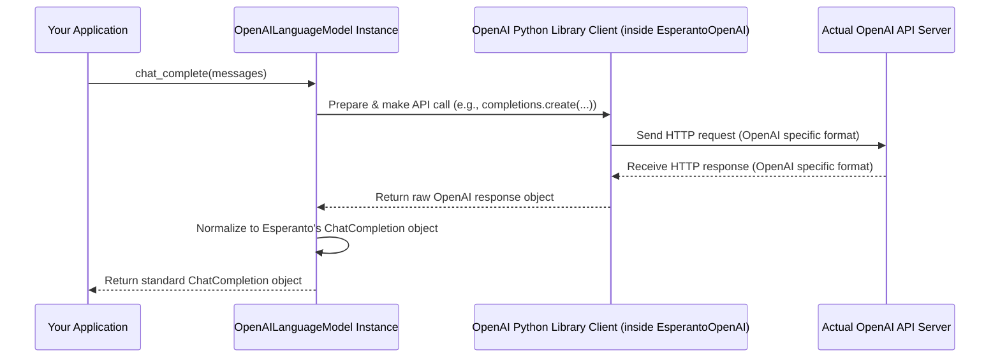

# Chapter 5: Provider-Specific Implementations (e.g., `OpenAILanguageModel`)

Welcome to the final chapter of our core concepts tour of Esperanto! In [Chapter 4: AI Model Metadata (common_types.Model)](04_ai_model_metadata__common_types_model__.md), we learned how Esperanto uses `common_types.Model` as a "spec sheet" to describe AI models. We know about the "universal remote" ([AI Service Interfaces (LanguageModel, EmbeddingModel, etc.)](01_ai_service_interfaces__languagemodel__embeddingmodel__etc___.md)), the "standardized display" ([Standardized AI Responses (ChatCompletion, TranscriptionResponse, etc.)](02_standardized_ai_responses__chatcompletion__transcriptionresponse__etc___.md)), and the "tool shop" to get these remotes ([AIFactory](03_aifactory_.md)).

But how does the universal remote *actually* control a specific brand of TV, like a Sony TV or a Samsung TV? There must be something inside the remote, or an adapter, that "speaks Sony" or "speaks Samsung." This chapter explores those "brand-specific adapters" within Esperanto.

## The "Lost in Translation" Problem

Imagine you have a fantastic universal remote control (Esperanto's interfaces). You press the "generate text" button. The remote knows *what* you want to do. But how does it tell the specific AI service – say, OpenAI's ChatGPT or Google's Gemini – to actually do it? Each of these services has its own language, its own rules for communication (its API).

If Esperanto just sent a generic "generate text!" command, the AI services wouldn't understand. It would be like speaking English to someone who only understands French.

**Our Goal:** We need specialized "translators" or "adapters" for each AI provider. These components would take your standard Esperanto request, translate it into the specific "dialect" of the chosen AI service, send it, receive the answer in that service's dialect, and then translate it back into Esperanto's standard format.

These specialized translators are what we call **Provider-Specific Implementations**.

## What are Provider-Specific Implementations?

Provider-Specific Implementations are the concrete Python classes in Esperanto that do the *actual work* of talking to a specific AI provider's API (like OpenAI, Google, Ollama, etc.). Each of these classes "knows" exactly how to communicate with its designated AI service.

Think of them like this:
*   If `LanguageModel` (from [Chapter 1](01_ai_service_interfaces__languagemodel__embeddingmodel__etc___.md)) is the **universal blueprint** for "any tool that can generate text,"
*   Then `OpenAILanguageModel` is the **specific tool built by OpenAI** that follows this blueprint. It knows how to connect to OpenAI's servers, send requests in OpenAI's format, and understand OpenAI's replies.
*   Similarly, `GoogleLanguageModel` would be **Google's specific tool** that also follows the `LanguageModel` blueprint but talks to Google's AI services.

These classes implement the methods defined in the AI Service Interfaces. For example, `OpenAILanguageModel` will have a `chat_complete()` method, just like the `LanguageModel` interface requires. But *inside* this `chat_complete()` method, `OpenAILanguageModel` will contain code that is specific to OpenAI.

**Key Roles of Provider-Specific Implementations:**

1.  **Implement Interfaces:** They provide the actual code for the methods defined in interfaces like `LanguageModel`, `EmbeddingModel`, etc.
2.  **API Communication:** They handle all the details of making requests to the specific AI provider's API (authentication, data formatting, network calls).
3.  **Request Translation:** They translate standard Esperanto requests (e.g., the `messages` list for `chat_complete()`) into the format expected by the provider.
4.  **Response Translation:** They translate the provider's specific response back into Esperanto's [Standardized AI Responses (ChatCompletion, TranscriptionResponse, etc.)](02_standardized_ai_responses__chatcompletion__transcriptionresponse__etc___.md) (e.g., creating a `ChatCompletion` object from an OpenAI API response).
5.  **Model Metadata (Often):** They can also be responsible for providing the list of [AI Model Metadata (common_types.Model)](04_ai_model_metadata__common_types_model__.md) for their specific provider, by querying the provider's API.

When you use `AIFactory.create_language(provider="openai", model_name="gpt-3.5-turbo")` (from [Chapter 3](03_aifactory_.md)), the factory is actually finding and giving you an instance of `OpenAILanguageModel` (or a similar class for a different provider).

## A Look at `OpenAILanguageModel`

Let's take `OpenAILanguageModel` as an example. This class is responsible for all interactions with OpenAI's language models. You can find its code in `src/esperanto/providers/llm/openai.py`.

**1. Inheritance:**
It inherits from `LanguageModel`, promising to provide all the "buttons" that a `LanguageModel` should have.

```python
# Simplified from src/esperanto/providers/llm/openai.py
from esperanto.providers.llm.base import LanguageModel
# ... other imports like OpenAI's own library ...

class OpenAILanguageModel(LanguageModel):
    # ...
```
This means an `OpenAILanguageModel` object can be used anywhere an Esperanto `LanguageModel` is expected.

**2. Initialization (`__init__` or `__post_init__`):**
When an `OpenAILanguageModel` is created (usually by `AIFactory`), it needs to set itself up to talk to OpenAI. This typically involves:
*   Getting your OpenAI API key (e.g., from environment variables or configuration).
*   Initializing an OpenAI client object (from OpenAI's own Python library).

```python
# Simplified concept from OpenAILanguageModel's initialization
import os
from openai import OpenAI # OpenAI's official library

# class OpenAILanguageModel(LanguageModel):
#     def __post_init__(self): # Or __init__
#         super().__post_init__() # Initialize base class stuff
#         self.api_key = self.api_key or os.getenv("OPENAI_API_KEY")
#         if not self.api_key:
#             raise ValueError("OpenAI API key not found")
#
#         # This 'self.client' is the actual tool to talk to OpenAI
#         self.client = OpenAI(api_key=self.api_key, base_url=self.base_url)
#         # ... (and an async_client for async operations)
```
This `self.client` is the gateway to OpenAI's services.

**3. Implementing `chat_complete()`:**
This is where the core logic for text generation with OpenAI resides.

```python
# Simplified concept of chat_complete in OpenAILanguageModel
# from esperanto.common_types import ChatCompletion, Message, Choice, Usage

# class OpenAILanguageModel(LanguageModel):
    # ... (init and other methods) ...

#     def chat_complete(self, messages: List[Dict[str, str]], stream: Optional[bool] = None):
#         # 1. Prepare request for OpenAI (messages might already be in good format)
#         openai_model_name = self.get_model_name() # e.g., "gpt-3.5-turbo"
#         api_kwargs = self._get_api_kwargs() # Gets temperature, max_tokens etc. for OpenAI

#         # 2. Call OpenAI's API using its client
#         #    (Conceptual, actual call uses self.client.chat.completions.create)
#         # raw_openai_response = self.client.chat.completions.create(
#         #     model=openai_model_name,
#         #     messages=messages,
#         #     stream=should_stream, # stream or self.streaming
#         #     **api_kwargs
#         # )
#         # For a non-streaming example:
#         raw_openai_response = make_actual_openai_call(openai_model_name, messages, api_kwargs) # Placeholder

#         # 3. Translate OpenAI's response to Esperanto's standard ChatCompletion
#         #    This is done by the _normalize_response method
#         # esperanto_response = self._normalize_response(raw_openai_response)
#         # return esperanto_response
#         pass # The actual implementation is more detailed
```
In the real `OpenAILanguageModel` (see `src/esperanto/providers/llm/openai.py`), the `chat_complete` method uses `self.client.chat.completions.create(...)` to make the call. It then calls a helper method `_normalize_response` to convert OpenAI's native response object into an Esperanto `ChatCompletion` object. If streaming is requested, it handles that by yielding `ChatCompletionChunk` objects.

This `_normalize_response` (and `_normalize_chunk` for streaming) method is crucial. It looks at the structure OpenAI sends back (which is specific to OpenAI) and carefully picks out the pieces of information (like the generated text, model ID, finish reason) to build a standard Esperanto `ChatCompletion` object. This ensures that no matter if you're using OpenAI, Google, or another provider through Esperanto, the `ChatCompletion` object you get back in your code always looks the same.

Similarly, `OpenAIEmbeddingModel` (in `src/esperanto/providers/embedding/openai.py`) implements the `embed()` method from the `EmbeddingModel` interface. Inside its `embed()` method, it uses OpenAI's specific API for creating embeddings (e.g., `self.client.embeddings.create(...)`) and then formats the result.

Other providers like Google (`GoogleLanguageModel` in `src/esperanto/providers/llm/google.py`) or Ollama (`OllamaLanguageModel` in `src/esperanto/providers/llm/ollama.py`) follow the exact same pattern:
*   Inherit from the appropriate Esperanto interface (e.g., `LanguageModel`).
*   Initialize their specific client (e.g., Google's `genai.Client` or `ollama.Client`).
*   Implement the interface methods (e.g., `chat_complete()`) by:
    *   Preparing the request for their specific API.
    *   Calling their API.
    *   Normalizing the provider's response into a standard Esperanto response object.

## How it Works: The Journey of a Request

Let's trace what happens when you use an `OpenAILanguageModel` (obtained via `AIFactory`):

1.  **Your Code:** You call `my_openai_model.chat_complete(messages=my_messages)`.
    *   `my_openai_model` is an instance of `OpenAILanguageModel`.
    *   `my_messages` is a list of message dictionaries in Esperanto's standard format.

2.  **`OpenAILanguageModel.chat_complete()` is Executed:**
    *   It takes your `my_messages`.
    *   It retrieves specific parameters for the OpenAI API call (like `temperature`, `max_tokens`) from its configuration.
    *   It uses its internal `self.client` (the official OpenAI Python library client) to make a network request to the actual OpenAI API endpoint (e.g., `https://api.openai.com/v1/chat/completions`). The request payload is formatted exactly as OpenAI expects.

3.  **OpenAI API Processes:** OpenAI's servers receive the request, process it with the specified model (e.g., "gpt-3.5-turbo"), and generate a response.

4.  **OpenAI API Responds:** OpenAI sends back a response. This response is in *OpenAI's specific JSON format*.

5.  **`OpenAILanguageModel` Translates Response:**
    *   The `OpenAILanguageModel`'s code receives this raw JSON response from OpenAI.
    *   Its `_normalize_response` method carefully extracts data from the OpenAI-specific fields (like `id`, `choices[0].message.content`, `model`, `usage`) and uses them to create an instance of Esperanto's standard `ChatCompletion` object (from [Chapter 2](02_standardized_ai_responses__chatcompletion__transcriptionresponse__etc___.md)).

6.  **Standard Response Returned:** The `chat_complete()` method returns this standardized `ChatCompletion` object to your code.

Here's a diagram illustrating this:



This "translation layer" is the magic that lets you write code once using Esperanto's interfaces and have it work with different AI backends.

## Providing Model "Spec Sheets"

As mentioned in [Chapter 4: AI Model Metadata (common_types.Model)](04_ai_model_metadata__common_types_model__.md), these provider-specific classes are often also responsible for listing the available models and their specifications.

For example, `OpenAILanguageModel` has a property called `models`:

```python
# Simplified from src/esperanto/providers/llm/openai.py
# from esperanto.common_types import Model

# class OpenAILanguageModel(LanguageModel):
    # ...
#     @property
#     def models(self) -> List[Model]:
#         """List all available models for this provider."""
#         raw_openai_models = self.client.models.list() # Calls OpenAI API
#         esperanto_models = []
#         for model_data in raw_openai_models:
#             if model_data.id.startswith("gpt-"): # Filter for language models
#                 esperanto_models.append(
#                     Model( # Create Esperanto's standard Model object
#                         id=model_data.id,
#                         owned_by=model_data.owned_by,
#                         context_window=getattr(model_data, 'context_window', None),
#                         type="language"
#                     )
#                 )
#         return esperanto_models
```
When you access `my_openai_model.models`, this code runs:
1.  It calls the OpenAI API (via `self.client.models.list()`) to get a list of all models OpenAI offers, in OpenAI's format.
2.  It then iterates through this raw list. For each model, it creates an Esperanto `common_types.Model` object, mapping OpenAI's field names and values to Esperanto's standard fields (`id`, `owned_by`, `context_window`, `type`).
3.  It returns a list of these standardized `Model` objects.

`GoogleLanguageModel` would have a similar `models` property that calls Google's API to list models and then translates them into Esperanto's `Model` format. This allows you to get a consistent "spec sheet" regardless of the provider.

## Conclusion: The Engines Under the Hood

You've now reached the end of our core concepts journey with Esperanto! In this chapter, you learned about **Provider-Specific Implementations** like `OpenAILanguageModel`, `GoogleLanguageModel`, and `OllamaLanguageModel`.

These are the hardworking "engines" or "translators" that:
*   **Implement** the common [AI Service Interfaces (LanguageModel, EmbeddingModel, etc.)](01_ai_service_interfaces__languagemodel__embeddingmodel__etc___.md).
*   **Communicate** directly with the APIs of specific AI providers (OpenAI, Google, etc.).
*   **Translate** your standard Esperanto requests into the provider's native language, and translate the provider's native responses back into [Standardized AI Responses (ChatCompletion, TranscriptionResponse, etc.)](02_standardized_ai_responses__chatcompletion__transcriptionresponse__etc___.md).
*   Are **instantiated and managed** by the [AIFactory](03_aifactory_.md).
*   Often provide the [AI Model Metadata (common_types.Model)](04_ai_model_metadata__common_types_model__.md) for their respective services.

Essentially, they are the crucial bridge that connects the clean, unified world of Esperanto to the diverse and varied landscape of different AI provider APIs. They make Esperanto's "write once, use many AIs" philosophy a reality.

With these five chapters, you now have a solid understanding of the fundamental building blocks of Esperanto. You know how to define common AI tasks, get standardized results, easily create and configure AI model instances, understand their capabilities, and how Esperanto talks to the actual AI services.

You're now well-equipped to start exploring the `esperanto` library further, try out the examples, and begin integrating powerful AI capabilities into your own projects with much greater ease and flexibility! Happy coding!

---

Generated by [AI Codebase Knowledge Builder](https://github.com/The-Pocket/Tutorial-Codebase-Knowledge)