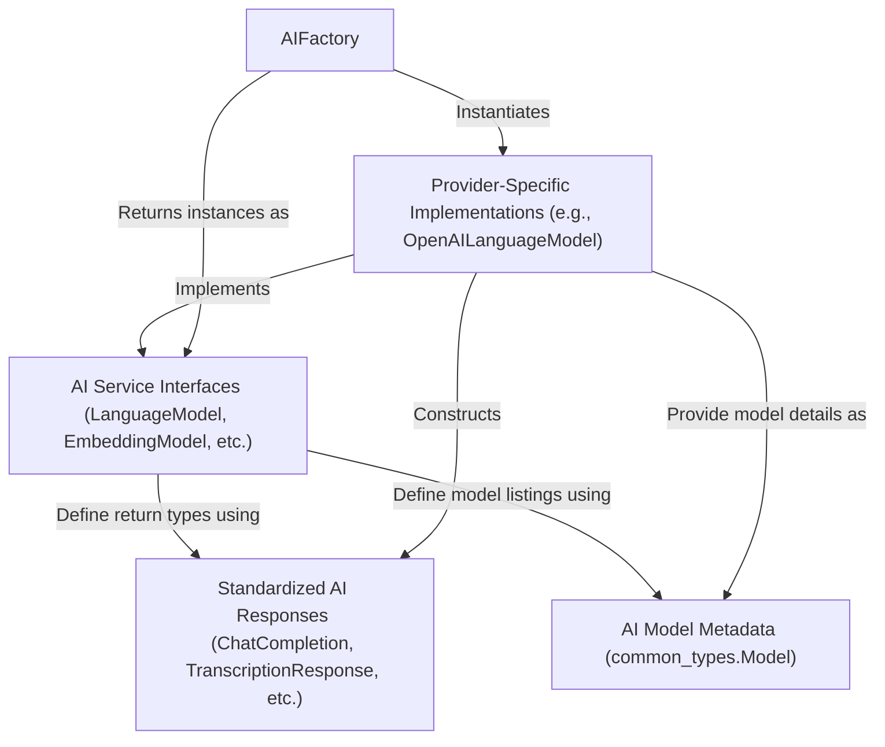

# Tutorial: esperanto

Esperanto provides a **unified way** to interact with various **AI services**, such as *language generation*, *text embedding*, and *speech-to-text*, from different providers like OpenAI, Google, and others.
It simplifies acquiring specific AI model instances through an `AIFactory`.
Regardless of the underlying AI provider, Esperanto ensures that responses (e.g., `ChatCompletion`, `TranscriptionResponse`) are delivered in a *standardized format*, and that all AI models are described using consistent `Model` metadata.

**Source Repository:** [https://github.com/lfnovo/esperanto](https://github.com/lfnovo/esperanto)

## Chapters

1. [AI Service Interfaces (LanguageModel, EmbeddingModel, etc.)
](01_ai_service_interfaces__languagemodel__embeddingmodel__etc___.md)
2. [Standardized AI Responses (ChatCompletion, TranscriptionResponse, etc.)
](02_standardized_ai_responses__chatcompletion__transcriptionresponse__etc___.md)
3. [AIFactory
](03_aifactory_.md)
4. [AI Model Metadata (common_types.Model)
](04_ai_model_metadata__common_types_model__.md)
5. [Provider-Specific Implementations (e.g., OpenAILanguageModel)
](05_provider_specific_implementations__e_g___openailanguagemodel__.md)

---

Generated by [AI Codebase Knowledge Builder](https://github.com/The-Pocket/Tutorial-Codebase-Knowledge)