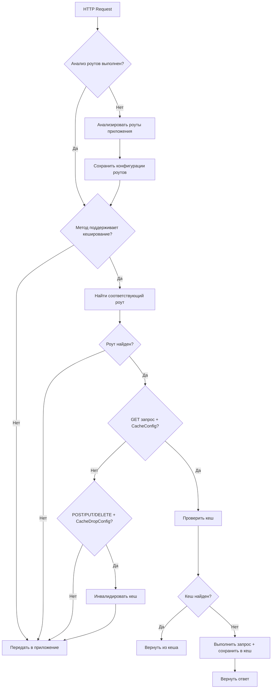

# FastCacheMiddleware

🚀 **Высокопроизводительный ASGI middleware для кеширования с резолюцией роутов**

## ✨ Основные особенности

FastCacheMiddleware использует **подход с резолюцией роутов** - анализирует роуты приложения на старте и извлекает кеш конфигурации из FastAPI dependencies.

### 🔧 Как это работает

1. **При старте приложения:**
   - Middleware анализирует все роуты и их dependencies
   - Извлекает `CacheConfig` и `CacheDropConfig` из dependencies
   - Создает внутренний индекс роутов с конфигурациями кеширования

2. **При обработке запроса:**
   - Проверяет HTTP метод (кешируем только GET, инвалидируем для POST/PUT/DELETE)
   - Находит соответствующий роут по пути и методу
   - Извлекает кеш конфигурацию из предварительно проанализированных dependencies
   - Выполняет кеширование или инвалидацию согласно конфигурации

### 💡 Преимущества

- **⚡ Высокая производительность** - предварительный анализ роутов
- **🎯 Простая интеграция** - стандартные FastAPI dependencies
- **🔧 Гибкая настройка** - кастомные функции ключей, TTL на уровне роутов
- **🛡️ Автоматическая инвалидация** - инвалидация кеша при модифицирующих запросах
- **📊 Минимальные накладные расходы** - эффективная работа с большим количеством роутов

## 📦 Установка

```bash
pip install fast-cache-middleware
```

## 🎯 Быстрый старт

```python
from fastapi import FastAPI, Depends
from fast_cache_middleware import FastCacheMiddleware, CacheConfig, CacheDropConfig

app = FastAPI()

# Добавляем middleware - он автоматически анализирует роуты
app.add_middleware(FastCacheMiddleware)

# Функции для создания кеш конфигураций
def cache_5min() -> CacheConfig:
    return CacheConfig(max_age=300)  # 5 минут

def cache_with_custom_key() -> CacheConfig:
    def custom_key_func(request):
        user_id = request.headers.get("user-id", "anonymous")
        return f"{request.url.path}:user:{user_id}"
    
    return CacheConfig(max_age=60, key_func=custom_key_func)

def invalidate_users() -> CacheDropConfig:
    return CacheDropConfig(paths=["/users/*", "/api/users/*"])

# Роуты с кешированием
@app.get("/users/{user_id}", dependencies=[Depends(cache_5min)])
async def get_user(user_id: int):
    """Этот endpoint кешируется на 5 минут."""
    # Имитируем загрузку из БД
    return {"user_id": user_id, "name": f"User {user_id}"}

@app.get("/profile", dependencies=[Depends(cache_with_custom_key)])
async def get_profile():
    """Кеширование с персонализированным ключом."""
    return {"profile": "user profile data"}

# Роуты с инвалидацией кеша
@app.post("/users/{user_id}", dependencies=[Depends(invalidate_users)])
async def update_user(user_id: int, data: dict):
    """POST запрос инвалидирует кеш для всех /users/* путей."""
    return {"user_id": user_id, "status": "updated"}
```

## 🔧 Конфигурация

### CacheConfig

Настройка кеширования для GET запросов:

```python
from fast_cache_middleware import CacheConfig

# Простое кеширование
def simple_cache() -> CacheConfig:
    return CacheConfig(max_age=300)  # 5 минут

# С кастомной функцией ключа
def personalized_cache() -> CacheConfig:
    def key_func(request):
        user_id = request.headers.get("user-id", "anonymous")
        path = request.url.path
        query = str(request.query_params)
        return f"{path}:{user_id}:{query}"
    
    return CacheConfig(
        max_age=600,  # 10 минут
        key_func=key_func
    )

@app.get("/api/data", dependencies=[Depends(personalized_cache)])
async def get_data():
    return {"data": "personalized response"}
```

### CacheDropConfig

Настройка инвалидации кеша для модифицирующих запросов:

```python
from fast_cache_middleware import CacheDropConfig

def invalidate_multiple_paths() -> CacheDropConfig:
    return CacheDropConfig(paths=[
        "/users/*",      # Все пути пользователей
        "/api/users/*",  # API пользователей
        "/cache/users/*" # Кеш пользователей
    ])

@app.post("/users/{user_id}")
@app.put("/users/{user_id}")
@app.delete("/users/{user_id}")
async def modify_user(user_id: int):
    """Любой из этих запросов инвалидирует кеш."""
    return {"message": "User modified"}
```

## 🏗️ Архитектура

### Компоненты системы

```
FastCacheMiddleware
├── RouteInfo           # Информация о роуте с кеш конфигурацией
├── Controller          # Логика кеширования и валидации
├── Storage             # Хранилища (InMemory, Redis, и др.)
├── Serializers         # Сериализация кешированных данных
└── Dependencies        # FastAPI dependencies для конфигурации
```

### Поток обработки запроса



## 🎛️ Хранилища

### InMemoryStorage (по умолчанию)

```python
from fast_cache_middleware import FastCacheMiddleware, InMemoryStorage

storage = InMemoryStorage(
    max_size=1000,           # Максимум записей
    cleanup_interval=3600    # Очистка каждый час
)
app.add_middleware(FastCacheMiddleware, storage=storage)
```

### Кастомное хранилище

```python
from fast_cache_middleware import BaseStorage

class RedisStorage(BaseStorage):
    def __init__(self, redis_url: str):
        import redis
        self.redis = redis.from_url(redis_url)
    
    async def store(self, key: str, response, request, metadata):
        # Реализация сохранения в Redis
        pass
    
    async def retrieve(self, key: str):
        # Реализация извлечения из Redis
        pass

app.add_middleware(FastCacheMiddleware, storage=RedisStorage("redis://localhost"))
```

## 🧪 Тестирование

```python
import pytest
from httpx import AsyncClient
from examples.basic import app

@pytest.mark.asyncio
async def test_caching():
    async with AsyncClient(app=app, base_url="http://test") as client:
        # Первый запрос - cache miss
        response1 = await client.get("/users/1")
        assert response1.status_code == 200
        
        # Второй запрос - cache hit (должен быть быстрее)
        response2 = await client.get("/users/1")
        assert response2.status_code == 200
        assert response1.json() == response2.json()

@pytest.mark.asyncio  
async def test_cache_invalidation():
    async with AsyncClient(app=app, base_url="http://test") as client:
        # Кешируем данные
        await client.get("/users/1")
        
        # Инвалидируем кеш
        await client.post("/users/1", json={})
        
        # Следующий GET должен выполнить новый запрос
        response = await client.get("/users/1")
        assert response.status_code == 200
```

## 📊 Производительность

### Бенчмарки

- **Анализ роутов**: ~5ms для 100 роутов при старте
- **Поиск роута**: ~0.1ms на запрос (O(n) по количеству кешируемых роутов)
- **Cache hit**: ~1ms на запрос
- **Cache miss**: время оригинального запроса + ~2ms на сохранение

### Оптимизация

```python
# Для приложений с большим количеством роутов
app.add_middleware(
    FastCacheMiddleware,
    storage=InMemoryStorage(max_size=10000),  # Увеличить размер кеша
    controller=Controller(default_ttl=3600)   # Увеличить TTL по умолчанию
)
```

## 🔒 Безопасность

### Изоляция кеша

```python
def user_specific_cache() -> CacheConfig:
    def secure_key_func(request):
        # Включаем токен пользователя в ключ
        token = request.headers.get("authorization", "").split(" ")[-1]
        return f"{request.url.path}:token:{token}"
    
    return CacheConfig(max_age=300, key_func=secure_key_func)

@app.get("/private/data", dependencies=[Depends(user_specific_cache)])
async def get_private_data():
    return {"sensitive": "data"}
```

### Валидация заголовков

Middleware автоматически учитывает стандартные HTTP заголовки кеширования:

- `Cache-Control: no-cache` - пропуск кеша
- `Cache-Control: no-store` - запрет кеширования
- `If-None-Match` - проверка ETag
- `If-Modified-Since` - проверка времени модификации

## 🛠️ Продвинутое использование

### Кастомный Controller

```python
from fast_cache_middleware import Controller

class CustomController(Controller):
    async def should_cache_request(self, request):
        # Кастомная логика - не кешируем админские запросы
        if request.headers.get("x-admin-request"):
            return False
        return await super().should_cache_request(request)
    
    async def generate_cache_key(self, request):
        # Добавляем версию API в ключ
        version = request.headers.get("api-version", "v1")
        base_key = await super().generate_cache_key(request)
        return f"{version}:{base_key}"

app.add_middleware(
    FastCacheMiddleware,
    controller=CustomController()
)
```

### Мониторинг

```python
@app.get("/admin/cache/stats")
async def cache_stats():
    # В production здесь будет реальная статистика из storage
    return {
        "total_routes": len(app.routes),
        "cached_routes": "статистика по кешируемым роутам",
        "cache_hit_rate": "процент попаданий в кеш",
        "storage_size": "размер хранилища"
    }
```

## 📝 Примеры

Больше примеров в папке `examples/`:

- **basic.py** - базовое использование с FastAPI
- **advanced.py** - продвинутые сценарии
- **custom_storage.py** - интеграция с Redis/Memcached
- **monitoring.py** - мониторинг и метрики

## 🤝 Участие в разработке

```bash
git clone https://github.com/your-username/fast-cache-middleware
cd fast-cache-middleware
pip install -e ".[dev]"
pytest
```

## 📄 Лицензия

MIT License - см. [LICENSE](LICENSE)

---

⭐ **Нравится проект? Поставьте звездочку!**

🐛 **Нашли баг?** [Создайте issue](https://github.com/your-username/fast-cache-middleware/issues)

💡 **Есть идея?** [Предложите feature](https://github.com/your-username/fast-cache-middleware/discussions)