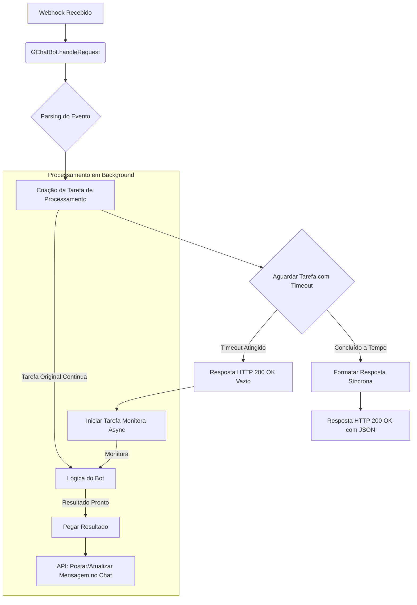

# Google Chat Bot Library (`gchatbot`)

Uma biblioteca Python moderna para simplificar a criação de bots para o Google Chat, utilizando **FastAPI** para alta performance e suporte nativo a operações assíncronas.

## Visão Geral

Esta biblioteca fornece uma classe base robusta (`GChatBot`) que gerencia as complexidades da API do Google Chat, permitindo que você se concentre na lógica do seu bot.

-   **Estrutura Moderna com FastAPI:** Aproveita a velocidade e o suporte `async` nativo do FastAPI.
-   **Processamento Híbrido Robusto:** Tenta responder em segundos para tarefas curtas. Para tarefas longas, ele muda para um modo assíncrono **seguro**, que não duplica o trabalho, garantindo consistência e uma ótima experiência do usuário.
-   **Arquitetura Modular:** Componentes como `EventParser`, `AsyncProcessor` e `ResponseFactory` são desacoplados, permitindo customizações avançadas.
-   **Extração de Eventos Simplificada:** Converte automaticamente os diversos formatos de payload do Google Chat em uma estrutura de dados (`ExtractedEventData`) limpa e previsível.

## Como Funciona: O Modelo Híbrido Robusto

A biblioteca implementa um padrão de processamento híbrido que é eficiente e, mais importante, seguro contra condições de corrida e duplicação de trabalho.

1.  **Requisição Recebida:** O `GChatBot` recebe um evento do Google Chat.
2.  **Tentativa Síncrona:** Ele inicia o processamento da sua lógica (`_process_slash_command` ou `_process_message`) e aguarda por um curto período de tempo (`sync_timeout`).
3.  **Caminho Feliz (Resposta Rápida):** Se a sua lógica terminar antes do timeout, a resposta é enviada diretamente na requisição original.
4.  **Caminho Assíncrono (Resposta Lenta):** Se o timeout for atingido:
    a. O bot responde **imediatamente** `200 OK` ao Google Chat, liberando a conexão.
    b. Uma tarefa "monitora" é iniciada em background. Essa tarefa **não reexecuta** sua lógica.
    c. A tarefa monitora **aguarda a conclusão da tarefa original**, que continua rodando.
    d. Assim que a tarefa original termina, a monitora pega o resultado e o envia como uma nova mensagem no chat (começando com "Processando..." e depois atualizando com a resposta final).

Este modelo garante que sua lógica de negócio **nunca seja executada mais de uma vez por evento**, prevenindo bugs de consistência de dados e consumo excessivo de recursos.

**Diagrama de Fluxo (GChatBot com FastAPI):**



## Instalação

A biblioteca é projetada para funcionar com FastAPI.

```bash
# Instale a biblioteca com as dependências do FastAPI
pip install "gchatbot[fastapi]"

# Dependências instaladas: fastapi, uvicorn, google-auth, google-api-python-client, google-apps-chat, protobuf
```

## Uso Recomendado: Exemplo com FastAPI

```python
# main.py
import os
import time
import asyncio
from fastapi import FastAPI, Request, Response
from gchatbot import GChatBot

# Certifique-se de ter um arquivo 'service.json' ou defina a variável de ambiente.
SERVICE_ACCOUNT_FILE = os.environ.get("SERVICE_ACCOUNT_FILE", "service.json")

class MeuBot(GChatBot):
    """
    Um bot de exemplo que demonstra a lógica de processamento híbrida e segura.
    """
    def __init__(self):
        super().__init__(
            botName="Assistente Moderno",
            serviceAccountFile=SERVICE_ACCOUNT_FILE,
            syncTimeout=4.0  # Responde em até 4s ou muda para modo assíncrono.
        )

    def _process_slash_command(self, command: str, arguments: str, extracted_data, event_data) -> str:
        """Processa comandos de barra."""
        user = extracted_data.get('userDisplayName', 'Usuário')
        if command == "lento":
            # Esta tarefa vai exceder o timeout e ser tratada de forma assíncrona.
            time.sleep(6)
            return f"⏱️ Tarefa lenta concluída para {user} após 6 segundos!"
        
        # Este comando é rápido e responderá de forma síncrona.
        return f"✅ Comando '/{command}' executado rapidamente para {user}."

    def _process_message(self, text: str, extracted_data, event_data) -> str:
        """Processa mensagens diretas ou menções."""
        if "demorado" in text.lower():
            time.sleep(7)
            return "Você pediu uma tarefa demorada, e ela foi concluída em 7 segundos."
        
        return f"Recebi sua mensagem: '{text}'."

# --- Configuração do FastAPI ---
app = FastAPI(title="Google Chat Bot")
bot = MeuBot()

@app.post("/")
async def handle_event(request: Request):
    """Ponto de entrada para todos os eventos do Google Chat."""
    return await bot.handleRequest(request)

@app.get("/")
def home():
    """Endpoint para verificação de saúde."""
    return {"status": "ativo", "bot_name": bot.botName}

# Para executar localmente: uvicorn main:app --reload
```

## Suporte Legado (Flask)

Para garantir a retrocompatibilidade, as classes baseadas em Flask (`GChatBotFlask` e `GChatBotOld`) ainda estão disponíveis, mas não são mais recomendadas para novos projetos. A versão `GChatBotFlask` já inclui a correção de concorrência da versão `0.2.4`.

<details>
<summary>Clique para ver o exemplo com Flask</summary>

```python
# app_flask.py
import os
import time
from flask import Flask, request
from gchatbot import GChatBotFlask  # Importe a versão para Flask

class MeuBotFlask(GChatBotFlask):
    def __init__(self):
        super().__init__(
            bot_name="Assistente Flask",
            service_account_file=os.environ.get("SERVICE_ACCOUNT_FILE", "service.json"),
            sync_timeout=3.0
        )
    
    def _process_slash_command(self, command: str, arguments: str, extracted_data: dict, event_data: dict) -> str:
        if command == 'lento':
            time.sleep(5)
            return "Tarefa lenta concluída no Flask!"
        return "Comando rápido executado no Flask."
    
    def _process_message(self, text: str, extracted_data: dict, event_data: dict) -> str:
        return f"Mensagem recebida no Flask: '{text}'"

# Configuração da aplicação Flask
app = Flask(__name__)
bot_flask = MeuBotFlask()

@app.route('/', methods=['POST'])
def webhook():
    """Endpoint que recebe eventos do Google Chat"""
    return bot_flask.handle_request(request)

@app.route('/', methods=['GET'])
def home():
    """Página inicial para verificar se o serviço está rodando"""
    return "Bot Flask está ativo!"

if __name__ == '__main__':
    port = int(os.environ.get('PORT', 8080))
    app.run(host='0.0.0.0', port=port, debug=True)
```
</details>

## Arquitetura e Detalhes Técnicos

A biblioteca foi refatorada para uma arquitetura modular, com cada componente tendo uma responsabilidade clara.

-   `main.py`: Contém a classe principal `GChatBot` e a lógica de orquestração.
-   `parser.py`: Responsável por analisar os payloads dos eventos.
-   `processor.py`: Gerencia o fluxo de resposta assíncrona.
-   `response.py`: Fábrica para criar as respostas em formato de card.
-   `types.py`: Define todas as estruturas de dados e tipos para clareza e robustez.

### Estrutura de Dados do Evento (`ExtractedEventData`)

O `EventParser` unifica os diferentes payloads do Google Chat em um dicionário `ExtractedEventData` previsível:

-   `rawText`, `processedText`, `command`, `arguments`, `userEmail`, `userDisplayName`, `spaceName`, `isDirectMessageEvent`, `messageName`, `isFallbackEvent`.

## Configuração do Google Chat

Para configurar seu bot no Google Chat:

1.  Acesse o [Google Cloud Console](https://console.cloud.google.com/).
2.  Crie/Configure um projeto.
3.  **Habilite a API do Google Chat**.
4.  Vá para a configuração da API do Chat:
    -   **Nome do App, Avatar, Descrição:** Preencha os detalhes.
    -   **Funcionalidade:** Habilite "Receber mensagens 1:1" e "Participar de espaços".
    -   **Configurações de Conexão:**
        -   Selecione "App URL".
        -   Insira a URL pública do seu endpoint (ex: de um serviço de nuvem ou `ngrok` para testes).

# Changelog

## 0.2.4 - 2024-05-17 - Refatoração para FastAPI e Correção Definitiva de Concorrência

### ✨ Novo (New)

-   **Implementação com FastAPI:** Introduzida uma nova classe `GChatBot` baseada em FastAPI como a implementação principal e recomendada. Ela oferece suporte nativo a `asyncio` para maior performance e um código mais limpo.
-   **Arquitetura Modular:** A biblioteca foi reestruturada em módulos com responsabilidades claras (`parser`, `processor`, `response`, `types`), tornando-a mais extensível e fácil de manter.
-   **Exportações Controladas:** O `__init__.py` foi atualizado para expor claramente a nova classe `GChatBot` e os componentes modulares, mantendo as classes legadas (`GChatBotFlask`, `GChatBotOld`) para retrocompatibilidade.

### 🛠️ Correção (Fixed)

-   **Correção Definitiva de Duplicação de Trabalho:**
    -   **Problema:** As implementações anteriores, embora corrigissem o bloqueio de requisições, introduziram um bug onde a lógica de negócio era executada duas vezes em caso de timeout (uma na tarefa original e outra na thread de resposta assíncrona).
    -   **Solução:** Implementado um padrão de "monitoramento". Agora, em caso de timeout, uma tarefa em background **aguarda a conclusão da tarefa original** em vez de reexecutá-la. Apenas o resultado da tarefa original é usado para responder ao usuário. Esta correção foi aplicada tanto à nova versão FastAPI quanto à versão legada `GChatBotFlask`.
    -   **Resultado:** O manuseio de timeouts agora é totalmente robusto, seguro e eficiente, eliminando o risco de duplicação de trabalho e garantindo a consistência dos dados.

---

## 0.2.3 - 2025-04-24 - Correções de Concorrência, Timeout e Tipo de Resposta

### 🛠️ Correção (Fixed)

1.  **Manuseio de Timeout e Concorrência:**
    *   **Problema:** O uso de `with ThreadPoolExecutor()` causava um bloqueio no handler HTTP, levando o Google Chat a reenviar o evento e causar respostas duplicadas.
    *   **Solução:** Substituído por gerenciamento manual do `ThreadPoolExecutor` para liberar o handler HTTP imediatamente.
    *   **Resultado:** Resposta HTTP 200 OK imediata em caso de timeout, sem bloqueios. *(Nota: Esta solução foi um passo intermediário e foi substituída pela correção definitiva na versão 0.2.4)*.

2.  **Prevenção de `TypeError` na Resposta:**
    *   **Solução:** Adicionada conversão automática para `str()` ao resultado dos métodos de processamento.
    *   **Resultado:** Garante que a resposta seja sempre uma string, aumentando a robustez.

---

## 0.2.2 - Versão base

| Componente            | Descrição                                                                                          |
|-----------------------|----------------------------------------------------------------------------------------------------|
| **GChatBot**          | Classe base com lógica híbrida síncrona/assíncrona, parsing de payloads e criação de cards.        |
| **handle_request**    | Gerencia timeout síncrono e fallback para processamento assíncrono via thread.                     |
| **_run_async_processing** | Envia card "Processando…" e atualiza com o resultado final.                                     |
| **MeuBotHibrido**     | Exemplo de comandos (/ajuda, /rapido, /lento, /skills) e respostas simuladas.                    |