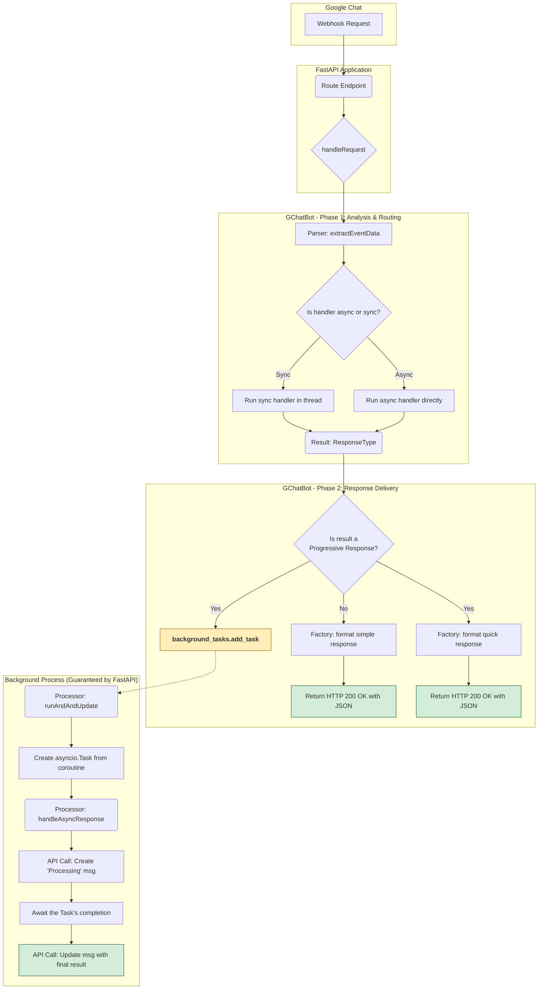

# Google Chat Bot Library (`gchatbot`)

A modern Python library for building Google Chat bots, leveraging **FastAPI** for high performance and native asynchronous support.

## Overview

This library provides a robust base class (`GChatBot`) that handles the complexities of the Google Chat API, allowing you to focus on your bot's logic.

-   **Serverless-Safe Architecture:** Designed from the ground up to work reliably in serverless environments like Google Cloud Run and AWS Lambda using FastAPI's `BackgroundTasks`.
-   **Hybrid Sync/Async Support:** Automatically detects whether your processing methods are `sync` or `async` and handles them correctly.
-   **Progressive Responses:** Provide immediate feedback to the user for long-running tasks and then update the message with the final result.
-   **Modular Architecture:** Decoupled components like `EventParser`, `AsyncProcessor`, and `ResponseFactory` allow for advanced customization.
-   **Simplified Event Parsing:** Automatically converts the various Google Chat event payloads into a clean, predictable `ExtractedEventData` structure.
-   **Fully Typed:** Complete type hints for a superior developer experience and robust code.

## How It Works: The Serverless-Safe Model

The library implements a processing model that is both efficient and safe for serverless environments, preventing premature termination of background jobs.

1.  **Request Received:** The FastAPI endpoint receives an event from the Google Chat API.
2.  **Delegate to Handler:** The request is passed to the `GChatBot.handleRequest` method, along with FastAPI's `backgroundTasks` object.
3.  **Parse and Route:** The event payload is parsed into a clean `ExtractedEventData` object. The library checks if the target handler (`_processMessage` or `_processSlashCommand`) is `async` or `sync`.
4.  **Execution:**
    *   `async` handlers are `await`ed directly.
    *   `sync` handlers are run in a separate thread (`asyncio.to_thread`) to avoid blocking the event loop.
5.  **Response Handling:**
    *   **Simple Response:** If the handler returns a string, it is sent back immediately as a synchronous JSON response.
    *   **Progressive Response:** If the handler returns a tuple `(quick_message, detailed_coroutine)`:
        a. The `quick_message` is sent back immediately as a synchronous JSON response.
        b. The `detailed_coroutine` is added to FastAPI's `backgroundTasks` via `background_tasks.add_task`. FastAPI guarantees the execution of this task, even after the response has been sent.

This model ensures that long-running background jobs are not terminated prematurely by the serverless environment's lifecycle.

### Flow Diagram



## Installation

```bash
# Install the library with FastAPI dependencies (Recommended)
pip install "gchatbot[fastapi]"
```

## Recommended Usage: FastAPI Example

```python
# example.py
import os
import asyncio
from typing import Any, Dict
from fastapi import FastAPI, Request, BackgroundTasks
from gchatbot import GChatBot, ExtractedEventData, EventPayload, ResponseType

# Ensure you have a 'service.json' file or set the environment variable.
SERVICE_ACCOUNT_FILE: str = os.environ.get("SERVICE_ACCOUNT_FILE", "service.json")

class BotExample(GChatBot):
    """
    Example bot demonstrating synchronous and asynchronous methods.
    """
    def __init__(self) -> None:
        super().__init__(
            botName="Example Bot",
            serviceAccountFile=SERVICE_ACCOUNT_FILE
        )

    async def _processSlashCommand(self, command: str, arguments: str, extractedData: ExtractedEventData, eventData: EventPayload) -> ResponseType:
        """
        Asynchronous method to process slash commands.
        """
        user: str = extractedData.get('userDisplayName', 'User')

        if command == "report":
            # Progressive response for a long-running async task
            quickResponse = f"📊 Understood, {user}. Generating your report, this may take a moment..."
            
            async def detailedResponse() -> str:
                await asyncio.sleep(8)  # Simulate long data processing
                return f"✅ Report for {user} is complete! You can view it here: [link]"
            
            return (quickResponse, detailedResponse())
        
        else:
            await asyncio.sleep(1)
            return f"✅ ASYNC command `/{command}` executed for {user}."

    def _processMessage(self, text: str, extractedData: ExtractedEventData, eventData: EventPayload) -> ResponseType:
        """
        Synchronous method to process regular messages.
        """
        user: str = extractedData.get('userDisplayName', 'User')
        
        return f"💬 SYNC message processed for {user}: '{text}'"

# --- FastAPI App Setup ---
app = FastAPI(title="Google Chat Bot Example")
bot = BotExample()

@app.post("/webhook")
async def handleEvent(request: Request, backgroundTasks: BackgroundTasks) -> Any:
    """Entry point for all Google Chat events."""
    return await bot.handleRequest(request, backgroundTasks)

@app.get("/")
def home() -> Dict[str, str]:
    """Health check endpoint."""
    return {"status": "active", "bot_name": bot.botName}

# To run locally: uvicorn example:app --reload --port 8080
```

## Changelog

### **Version 0.3.0 - Serverless Architecture Refactor**

This version introduces a major architectural refactor to ensure robust performance in serverless environments and establishes new code quality standards.

#### 💥 Breaking Changes

-   **Code Standard: `camelCase`:** All method parameters and `TypedDict` keys have been standardized to `camelCase` (e.g., `event_data` is now `eventData`, `background_tasks` is `backgroundTasks`). You must update your method signatures when upgrading.
-   **Code Standard: English Language:** All docstrings, comments, log messages, and default user-facing strings have been translated to English.

#### ✨ New Features & Enhancements

-   **Serverless-Safe Architecture:** The core `handleRequest` logic has been rebuilt to use FastAPI's `BackgroundTasks`. This guarantees that long-running processes (Progressive Responses) are not terminated prematurely in serverless environments like Google Cloud Run or AWS Lambda.
-   **Timeout Logic Removed:** The old `syncTimeout` logic has been removed in favor of the more robust `BackgroundTasks` model. The bot now responds immediately with a quick message and schedules the long task, which is a more reliable pattern.
-   **Codebase Standardization:** The entire library codebase now follows stricter standards for docstrings, typing, and naming conventions.

---
*(Older changelog entries below)*

## License

This project is licensed under the MIT License. See the [LICENSE](LICENSE) file for details.