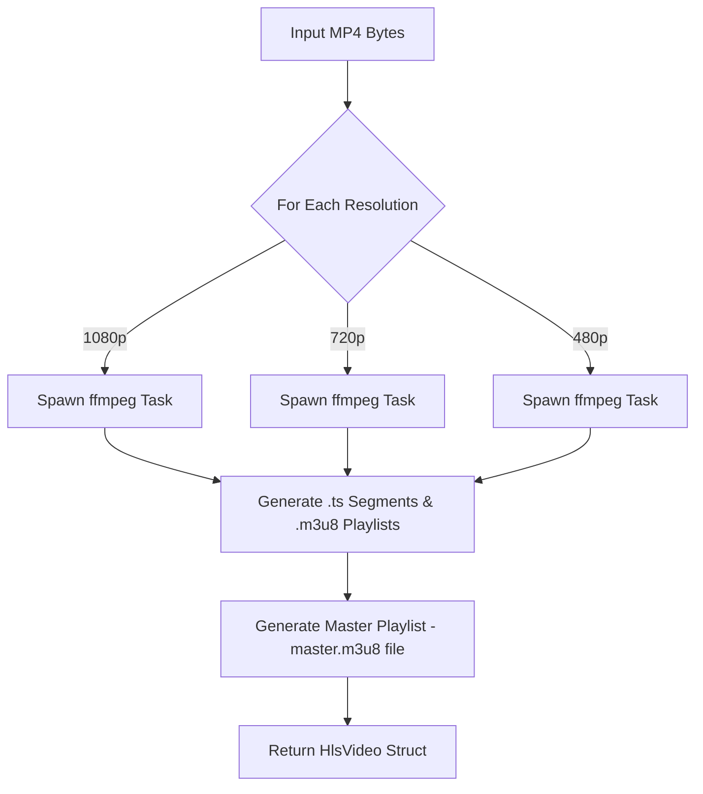

# HlsKit-Py

[](https://pypi.org/project/hlskit-py/)
[](./LICENSE)
[](https://github.com/astral-sh/ruff)

**HlsKit-Py** is the Python version of [hlskit-rs](https://github.com/like-engels/hlskit-rs), an asyncio-based video processing library for converting video bytes into HLS (HTTP Live Streaming) output. Built on top of `pydantic` and `asyncio`, it provides a fast, type-safe, and scalable interface for video transcoding tasks.

---

## 📦 Installation

```bash
pip install hlskit-py
```

---

## 🧬 Dependencies

HlsKit-Py uses the following core dependencies:

- `pydantic` — for data validation and settings modeling.
- `ruff` — for code linting and formatting.

---

## 🤪 Example

```python
import asyncio
from hlskit_py import HlsVideoProcessingSettings, HlsVideoProcessor

async def process_videos():
    input_path = "example/sample.mp4"
    with open(input_path, "rb") as video_binary:
        input_bytes = video_binary.read()

    results = await HlsVideoProcessor.process_video(
        input_bytes=input_bytes,
        output_profiles=[
            HlsVideoProcessingSettings(resolution=(1920, 1080), constant_rate_factor=28),
            HlsVideoProcessingSettings(resolution=(1280, 720), constant_rate_factor=28),
            HlsVideoProcessingSettings(resolution=(854, 480), constant_rate_factor=28),
        ],
    )

    # Do something with `results.output_profiles`
    print(results)

if __name__ == "__main__":
    asyncio.run(process_videos())
```

---

## 🌐 Web API + S3 Integration

```python
import boto3
import uuid
from fastapi import FastAPI, UploadFile, File
from hlskit_py import HlsVideoProcessor, HlsVideoProcessingSettings

app = FastAPI()
s3 = boto3.client("s3")
BUCKET_NAME = "your-s3-bucket"

@app.post("/upload")
async def upload_and_process_video(file: UploadFile = File(...)):
    input_bytes = await file.read()

    results = await HlsVideoProcessor.process_video(
        input_bytes=input_bytes,
        output_profiles=[
            HlsVideoProcessingSettings(resolution=(1920, 1080), constant_rate_factor=28),
            HlsVideoProcessingSettings(resolution=(1280, 720), constant_rate_factor=28),
            HlsVideoProcessingSettings(resolution=(854, 480), constant_rate_factor=28),
        ],
    )

    uploaded_files = []
    for profile in results.output_profiles:
        for relative_path, content in profile.output_files.items():
            key = f"{uuid.uuid4()}/{relative_path}"
            s3.upload_fileobj(content, BUCKET_NAME, key)
            uploaded_files.append(f"s3://{BUCKET_NAME}/{key}")

    return {"message": "Upload successful", "files": uploaded_files}
```

---

## 🧠 Processing Flow (Mermaid Diagram)



---

## 📁 Project Structure

```
hlskit-py/
├── src/hlskit_py/
│   ├── models/
│   │   ├── hls_video_processing_settings.py
│   │   └── hls_video.py
│   ├── services/
│   │   └── hls_video_processor.py
│   └── tools/
│       ├── ffmpeg_command_builder.py
│       └── m3u8_tools.py
├── example/
│   └── example.py
├── README.md
├── CONTRIBUTING.md
├── LICENSE
├── pyproject.toml
```

---

## 📌 Future Goals

- Implement GStreamer backend.
- Add GPU encoding (NVIDIA/AMD) support.

---

## 🤝 Contributing

See [CONTRIBUTING.md](./CONTRIBUTING.md) for contribution workflow, testing practices, coding style, and PR conventions.

---

## 🪪 License

HlsKit is licensed under LGPLv3. By modifying or distributing it (e.g., via forks or extensions), you agree to the HlsKit Contributor License Agreement (CLA), which ensures our ecosystem thrives.

The 'HlsKit' name and logo are trademarks of Engels Tercero. Use in forks or derivatives requires written permission.
