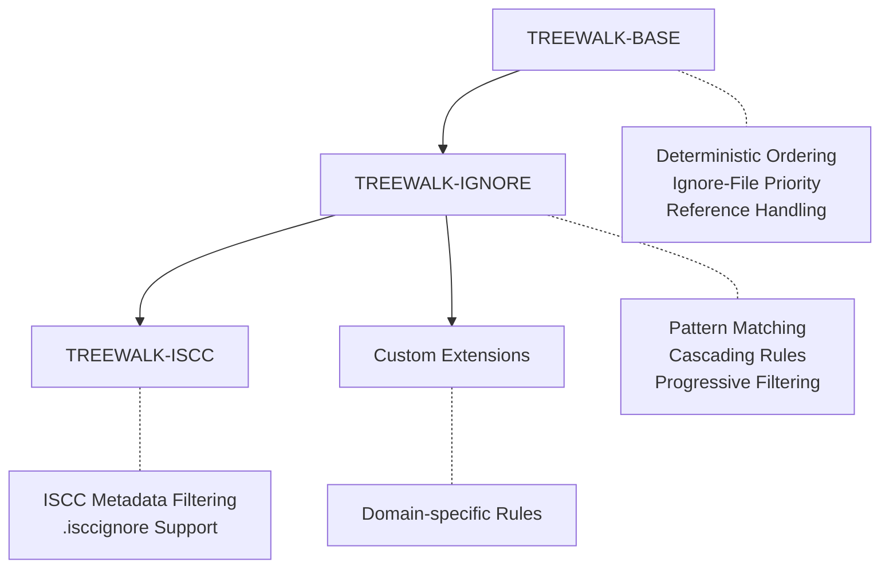

# TREEWALK

*Storage Agnostic Deterministic Incremental Tree Traversal*

**Deterministic algorithms for traversing hierarchical structures that produces consistent, reproducible
ordering across platforms and storage types.**

## Abstract

This specification defines a layered approach to deterministic tree traversal, consisting of a core algorithm
and two standard extensions. The TREEWALK-BASE algorithm provides consistent ordering for hierarchical storage
structures. The TREEWALK-IGNORE extension adds gitignore-style pattern filtering, while TREEWALK-ISCC provides
domain-specific filtering for ISCC metadata. Each layer builds upon the previous, ensuring consistent
cross-platform ordering while enabling progressive filtering capabilities. The specification applies to file
systems, archive formats (ZIP, EPUB, DOCX), cloud storage (S3, Azure Blob), and any system with directory-like
organization.

## Status

This specification is DRAFT as of 2025-06-19.

## 1. Introduction

### 1.1 Motivation

Content-based identifiers and integrity verification systems require deterministic file ordering to produce
consistent results across different environments. Traditional directory traversal methods yield entries in file
system-dependent order, making reproducible hashing impossible. This specification solves that problem through a
layered approach that separates core traversal logic from filtering concerns.

### 1.2 Scope

This specification defines three algorithms:

**TREEWALK-BASE**:

- Deterministic ordering of hierarchical entries
- Ignore file prioritization for early filtering opportunities
- Security considerations for reference handling

**TREEWALK-IGNORE Extension**:

- Gitignore-style pattern matching
- Cascading ignore rules from root to leaf directories
- Pattern accumulation and inheritance

**TREEWALK-ISCC Extension**:

- ISCC-specific pattern matching and filtering
- Built on top of TREEWALK-IGNORE functionality
- Domain-specific file exclusions

It does NOT cover:

- Content reading or hashing algorithms
- Storage-specific authentication or access control
- Entry metadata beyond names and types
- Implementation details for specific storage systems

### 1.3 Notation and Conventions

The key words "MUST", "MUST NOT", "REQUIRED", "SHALL", "SHALL NOT", "SHOULD", "SHOULD NOT", "RECOMMENDED",
"MAY", and "OPTIONAL" in this document are interpreted as described in [RFC 2119] and [RFC 8174].

## 2. Terminology

**Entry** : A named object within a hierarchical storage system (file, directory, archive member, S3 object).

**Container** : An entry that can contain other entries (directory, folder, ZIP archive, S3 prefix).

**Yield/Output** : When an entry is "yielded" or appears in the "output", it means the entry path is returned to
the caller. Note that containers are traversed but not yielded — only files within containers appear in output.

**NFC Normalization** : Unicode Normalization Form C - a canonical form ensuring consistent representation of
equivalent Unicode sequences.

**Ignore File** : An entry whose name starts with "." and ends with "ignore" (e.g., .gitignore, .isccignore)
containing patterns for entries to exclude.

**Reference** : A storage-specific link to another entry (symbolic link, archive member reference, S3 redirect).

## 3. Architecture Overview

The TREEWALK specification defines a layered architecture where each extension builds upon the previous:



Each layer maintains the core guarantees while adding specific functionality:

- **TREEWALK-BASE**: Provides deterministic ordering across all platforms
- **TREEWALK-IGNORE**: Adds configurable filtering with pattern inheritance
- **TREEWALK-ISCC**: Implements ISCC-specific requirements
- **Custom Extensions**: Enable domain-specific adaptations

## 4. Core Algorithm Specification

### 4.1 Entry Ordering

!!! tip "Quick Reference"

    Sort entries by NFC-normalized UTF-8 encoded names

All directory entries **MUST** be sorted using the following algorithm:

1. Apply Unicode NFC normalization to each entry name
2. Encode the normalized name as UTF-8
3. Sort entries by comparing the resulting byte sequences lexicographically

When multiple entries have identical names after NFC normalization, implementations **MUST** yield all such
entries sorted by lexicographically comparing their original, pre-normalization UTF-8 encoded byte sequences as
a tie-breaker. This ensures deterministic output even when storage systems allow multiple entries with
equivalent names.

!!! warning

    Some storage systems (e.g., case-insensitive filesystems) may prevent creation of entries with names that differ
    only in case or normalization. In such cases, only the accessible entry will be yielded.

#### Example

Given entries: ["café", "caffe", "Café"]

After NFC normalization and UTF-8 encoding, the sorted order is:

- "Café" (capital C sorts before lowercase)
- "café"
- "caffe"

#### Why deterministic duplicate handling?

When entries have identical normalized names, we yield all of them in a deterministic order based on their
original byte sequences to ensure consistent output across implementations. This approach:

- **Preserves information**: No entries are silently dropped
- **Maintains determinism**: The same storage state always produces the same output
- **Respects storage capabilities**: Systems that prevent duplicates naturally have none to yield
- **Enables verification**: Consumers can detect and handle duplicates as needed

### 4.2 TREEWALK-BASE Algorithm

The base algorithm **MUST** yield entries in depth-first order following these rules:

1. **Process each container**: For each directory/container in the traversal:

    - **Ignore files first** - Yield files matching pattern `.*ignore` (e.g., .gitignore, .npmignore) in sorted
        order
    - **Regular files second** - Yield all other files in sorted order
    - **Recurse into sub-containers** - Process subdirectories in sorted order

2. **Directory representation**: Containers (directories) themselves **MUST NOT** appear in the output. Only
    files within containers are yielded. The algorithm traverses into directories but does not yield them as
    entries.

!!! note

    This ordering ensures ignore files are discovered and yielded before the regular files they might filter,
    enabling extensions to process filtering rules early.

The base algorithm itself **MUST NOT** process ignore file contents or apply filtering - it only ensures
deterministic ordering with ignore file prioritization.

### 4.3 Reference Handling

The algorithm **MUST NOT** follow references when:

- Determining if an entry is a regular entry or container
- Recursing into sub-containers

References (symbolic links, redirects) MUST NOT appear in traversal output AND MUST NOT be followed.

## 5. TREEWALK-IGNORE Extension

### 5.1 Overview

The **TREEWALK-IGNORE** extension adds gitignore-style pattern filtering to the base algorithm. It maintains the
same deterministic ordering while progressively filtering entries based on accumulated patterns.

### 5.2 Pattern Processing

When using TREEWALK-IGNORE:

1. The implementation specifies which ignore file to process (e.g., `.gitignore` OR `.npmignore`)
2. Check for the specified ignore file in each directory
3. Parse patterns using gitignore-style syntax
4. Accumulate patterns from root to current directory
5. Apply patterns to filter files and control directory traversal

#### Directory Filtering

Since directories are not yielded as output entries, directory patterns control traversal:

- If a directory matches an ignore pattern, the algorithm **MUST NOT** recurse into it
- This prevents all files within that directory from appearing in the output
- Directory patterns **MUST** be checked with a trailing "/" to ensure proper matching

!!! warning

    A pattern like `temp/` prevents traversal into any directory named "temp", effectively excluding all files
    within it from the output

#### Pattern Matching Rules

- Pattern matching **MUST** be case-sensitive
- Only one ignore file type is processed per traversal (specified by the implementation)
- Later patterns have higher precedence than earlier patterns within the same file
- Child directory patterns have higher precedence than parent directory patterns
- Patterns from child directories override patterns from parent directories

### 5.3 Example with .gitignore

```
repo/
├── .gitignore (contains: *.log, temp/)
├── src/
│   ├── main.py
│   └── debug.log
└── temp/
    └── cache.dat

Yields only:
- repo/.gitignore
- repo/src/main.py
```

!!! note

    The ignore file itself is included in the output (unless excluded by a parent ignore file)

## 6. TREEWALK-ISCC Extension

### 6.1 Overview

The **TREEWALK-ISCC** extension provides ISCC-specific filtering on top of TREEWALK-IGNORE. It automatically
filters metadata files while respecting `.isccignore` patterns.

### 6.2 Automatic Exclusions

TREEWALK-ISCC **MUST** exclude:

- Files ending with `.iscc.json` (ISCC metadata files)
- Any patterns specified in `.isccignore` files

### 6.3 Implementation

TREEWALK-ISCC is implemented as:

1. Apply TREEWALK-IGNORE with `.isccignore` as the ignore file name
2. Additionally filter out files ending with `.iscc.json`

This layered approach ensures consistent behavior while adding domain-specific rules.

!!! note

    The automatic exclusion of `.iscc.json` files cannot be overridden by `.isccignore` patterns. These files are
    always excluded, even if `.isccignore` contains patterns that would otherwise include them.

## 7. Implementation Guidance

### 7.1 Storage System Adaptation

#### File Systems

- Use native directory listing APIs (e.g., `os.scandir()`)
- Filter symbolic links during initial scan
- Resolve paths to absolute form before traversal
- On Windows, handle drive roots (e.g., `C:\`) as valid starting points

#### Archive Formats (ZIP, EPUB, DOCX)

- Treat archive members as entries
- Use "/" as universal path separator
- Process nested archives as sub-containers
- Apply the same NFC normalization to member names

#### Cloud Storage (S3, Azure Blob)

- Use prefix-based queries for "directory" listing
- Treat key prefixes ending with "/" as containers
- Batch API calls for efficiency
- Skip zero-byte objects with keys ending in "/" (S3 directory markers)

### 7.2 Path Representation

- Use forward slash (/) as universal path separator
- Calculate relative paths from traversal root
- Apply NFC normalization before any path operations

### 7.3 Security Considerations

- **MUST** validate that all paths remain within the traversal root
- **MUST NOT** follow references to prevent traversal attacks
- **SHOULD** implement depth limits for deeply nested structures
- **SHOULD** enforce size limits when processing archives

## 8. Extensibility

### 8.1 Custom Extensions

Implementations **MAY** create additional extensions following the layered pattern:

1. Build on top of existing layers (Base → Ignore → Domain-specific)
2. Maintain deterministic ordering guarantees
3. Document extension-specific behavior clearly

### 8.2 Custom Ignore Files

TREEWALK-IGNORE implementations **MAY** support different ignore file names by allowing the caller to specify
which ignore file to process:

- `.gitignore` - Git-style ignores
- `.npmignore` - NPM-style ignores
- `.isccignore` - ISCC-specific ignores
- `.customignore` - Domain-specific ignores

!!! note

    Each traversal processes only one type of ignore file as specified by the implementation or caller

## 9. Test Vectors

Implementations **MUST** produce identical ordering for these test cases:

### 9.1 TREEWALK-BASE Tests

#### Test Case 1: Unicode Normalization

**Structure:**

```yaml
  - path: Café.txt       # NFC form (U+00E9)
  - path: Café.txt      # NFD form (U+0065 U+0301)
  - path: café.txt       # NFC form (U+00E9)
  - path: caffe.txt
```

**Expected (TREEWALK-BASE):**

```yaml
  - test_dir/Café.txt      # NFD form (comes first due to byte ordering)
  - test_dir/Café.txt       # NFC form
  - test_dir/caffe.txt
  - test_dir/café.txt
```

!!! note

    On case-insensitive filesystems, only one of "Café.txt" or "café.txt" may be created, resulting in fewer entries
    in the output.

#### Test Case 2: Duplicate Normalized Names

**Structure:**

```yaml
# These normalize to the same NFC form
  - path: é.txt        # U+00E9 (precomposed)
  - path: é.txt       # U+0065 U+0301 (decomposed)
```

**Expected (TREEWALK-BASE):**

```yaml
# Both entries yielded if storage allows both, preserving their original forms
  - test_dir/é.txt      # NFD form (comes first due to byte ordering)
  - test_dir/é.txt       # NFC form
```

!!! note

    Storage systems typically prevent creation of both forms, so usually only one entry will exist and be yielded.
    The key guarantee is that whatever entries exist will be yielded deterministically.

#### Test Case 3: Ignore File Priority

**Structure:**

```yaml
  - path: .gitignore
  - path: aaa.txt
  - path: zzz.txt
```

**Expected (TREEWALK-BASE):**

```yaml
  - test_dir/.gitignore
  - test_dir/aaa.txt
  - test_dir/zzz.txt
```

### 9.2 TREEWALK-IGNORE Tests

#### Test Case 4: Pattern Filtering

**Structure:**

```yaml
  - path: .gitignore
    content: '*.log'
  - path: app.py
  - path: debug.log
  - path: error.log
```

**Expected (TREEWALK-IGNORE with .gitignore):**

```yaml
  - test_dir/.gitignore
  - test_dir/app.py
```

### 9.3 TREEWALK-ISCC Tests

#### Test Case 5: ISCC Metadata Filtering

**Structure:**

```yaml
  - path: .isccignore
    content: temp/
  - path: data.txt
  - path: data.txt.iscc.json
  - path: temp
    type: dir
  - path: temp/cache.dat
```

**Expected (TREEWALK-ISCC):**

```yaml
  - test_dir/.isccignore
  - test_dir/data.txt
```

!!! note

    The `temp/` pattern prevents traversal into the temp directory, so `temp/cache.dat` is excluded. The file
    `data.txt.iscc.json` is automatically filtered by the ISCC extension.

## 10. References

### Normative

- Unicode Standard Annex #15: Unicode Normalization Forms
- RFC 3629: UTF-8, a transformation format of ISO 10646

### Informative

- gitignore(5) - Git ignore patterns specification
- ISO 24138:2024 - International Standard Content Code
- ZIP File Format Specification
- Amazon S3 API Reference
