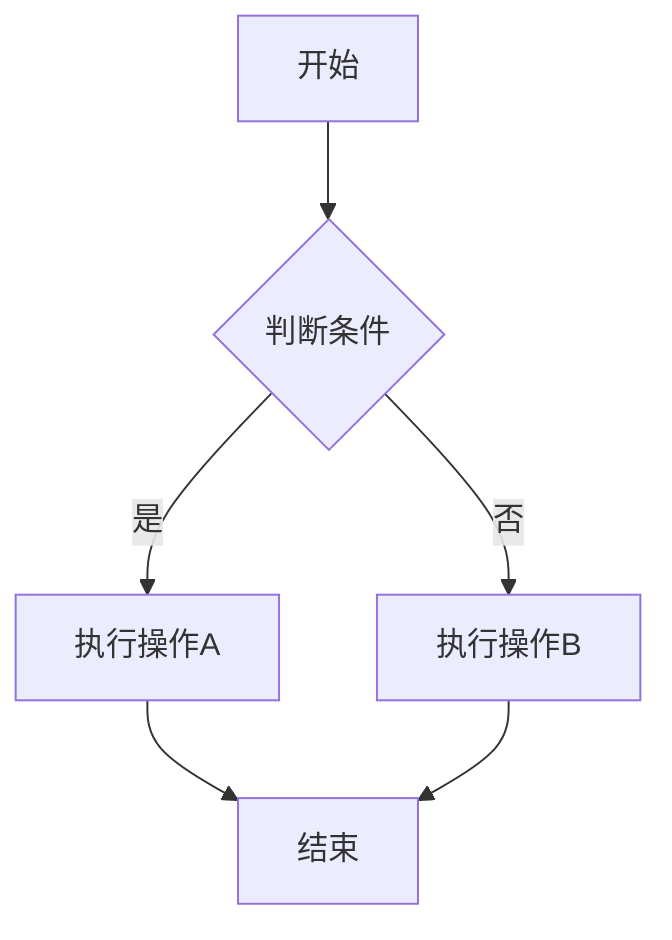

# v0.8-2025-01-19

## 重大更新

- **🎉 新功能**: 添加了Mermaid图表支持
  - 支持流程图、序列图、状态图、类图等多种图表类型
  - 自动加载Mermaid.js库进行图表渲染
  - 兼容现有的Markdown语法

- **🔧 Python 3现代化**:
  - 完全迁移到Python 3（不再支持Python 2）
  - 更新依赖到现代版本（markdown>=3.0, pygments>=2.0）
  - 改进Unicode和编码处理
  - 修复了新版markdown库的API兼容性问题

- **📈 改进**:
  - 简化了图片Base64转换功能（暂时禁用，由于API变更）
  - 更好的错误处理和编码支持
  - 现代化的文件I/O操作

- **🛠 技术细节**:
  - 添加 `markdown-mermaidjs` 扩展支持
  - 移除了对Python 2的兼容性代码
  - 更新了所有脚本的shebang为python3
  - 改进了字符串和字节处理

## 使用方法

### Mermaid图表语法

```markdown


# v0.7-2019-01-07

## fix

- Fix Markdown desired version, thanks @fabiomontefuscolo 


# v0.5-2017-12-13

## Added

- add `to64` option to enable convert local image url to base64.

# v0.1-2017-01-28

## Added

- Support disable Markdown Extension from `meta` section;
- Add more doc
- Add screenshot

# v0.0.1.1-2017-01-26

init