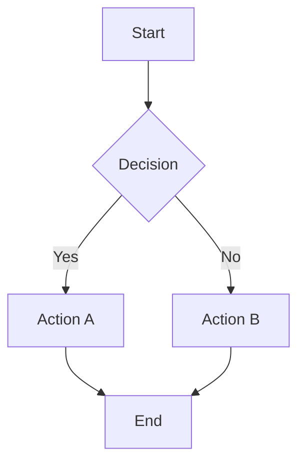
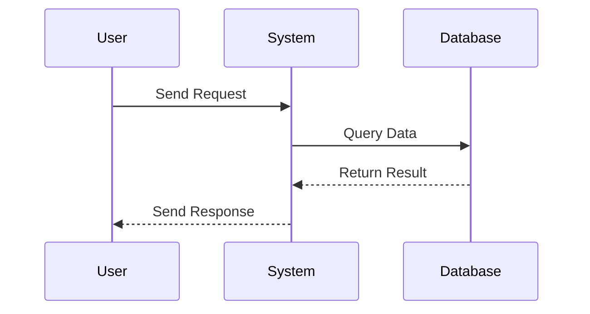
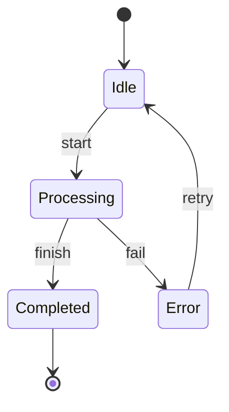
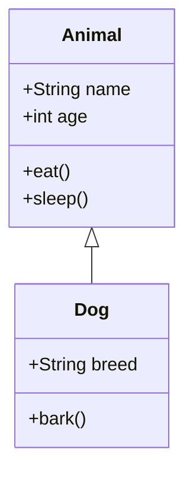
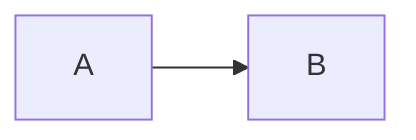

# MdTree

Convert markdown to html with TOC(table of contents) tree and **Mermaid diagram support**. [https://github.com/ltto/mdtree](https://github.com/ltto/mdtree)

## 🎉 New in v0.8: Mermaid Diagram Support!

MdTree now supports **Mermaid diagrams** out of the box! Create beautiful flowcharts, sequence diagrams, state diagrams, and more directly in your Markdown files.

# Screenshot


# Requirements

- **Python 3.7+** (Python 2 is no longer supported)
- Modern dependencies (automatically installed)

# Install

```bash
pip install -U mdtree
```

# Usage

## In Python
```python
from mdtree import MdTree
with open(path_of_md_file) as f:
    md_str = f.read()

mt = MdTree()
html = mt.convert(md_str)
fpath = mt.save_file("/tmp/mdtree.html")

mt = MdTree()
html = mt.convert_file("/tmp/gitit_bigger_readme.md")
```

## In Shell

```bash
mdtree /path/of/markdown/file.md > /tmp/mdtree.html
```

# Features

## ✨ Mermaid Diagram Support

Create beautiful diagrams using Mermaid syntax:

### Flowchart
```markdown


### Sequence Diagram
```markdown


### State Diagram
```markdown


### Class Diagram
```markdown


## 📋 Table of Contents (TOC)

Automatically generates a beautiful sidebar with table of contents based on your document headers.

## 🎨 Customizable Styling

Add custom CSS and JavaScript to enhance your documents.

# Options

- `to64` : convert local image URL to base64. add `--to64` to shell argument or add `to64` option to meta area.

# Meta Configuration

mdtree allows you to add more things to the html file:

- css
- js  
- title
- custom extensions

```markdown
---
title: Document with Mermaid Diagrams
js:
    https://example.com/custom.js
css:
    https://example.com/custom.css
---

# Your Content Here


```

# Markdown Extensions

By default, these extensions are enabled:

```python
_md_extensions = [
    "markdown.extensions.meta",
    "markdown.extensions.attr_list", 
    "markdown.extensions.tables",
    "markdown.extensions.toc",
    "markdown.extensions.fenced_code",
    "markdown.extensions.codehilite",
    "markdown_mermaidjs",  # 🎉 NEW: Mermaid diagram support
]
```

You can customize them in the `meta` section:

```markdown
---
title: Custom Extensions Example  
js:
    https://cdn.jsdelivr.net/npm/mermaid@11/dist/mermaid.esm.min.mjs
css:
    https://example.com/custom.css
exts:
    markdown.extensions.wikilinks
    -markdown.extensions.codehilite
---
```

As you know, `markdown.extensions.wikilinks` will be added, and `-markdown.extensions.codehilite` which starts with `-` will be removed.

The name of the extensions should be the same as [https://python-markdown.github.io/extensions/](https://python-markdown.github.io/extensions/)

# Supported Mermaid Diagram Types

- 📊 **Flowcharts & Graphs** - `graph TD`, `graph LR`, `flowchart`
- 🔄 **Sequence Diagrams** - `sequenceDiagram`  
- 🏛️ **State Diagrams** - `stateDiagram-v2`
- 📐 **Class Diagrams** - `classDiagram`
- 🗓️ **Gantt Charts** - `gantt`
- 🥧 **Pie Charts** - `pie`
- 🧠 **Mindmaps** - `mindmap`
- 📈 **Git Graphs** - `gitgraph`
- And many more supported by Mermaid.js!

# Migration from v0.7

If you're upgrading from v0.7:

1. **Python 3 Required**: Ensure you're using Python 3.7 or higher
2. **New Dependencies**: Run `pip install -U mdtree` to get updated dependencies
3. **Mermaid Support**: Your existing documents work as before, plus you can now add Mermaid diagrams!
4. **Base64 Images**: The `--to64` feature is temporarily disabled due to API changes but will be restored in a future version

# Credits
- [Markdown](https://github.com/waylan/Python-Markdown) - A Python implementation of John Gruber's Markdown
- [markdown-mermaidjs](https://github.com/Lee-W/markdown-mermaid) - Mermaid diagram support for Python-Markdown
- [Mermaid.js](https://mermaid.js.org/) - Generation of diagrams and flowcharts from text
