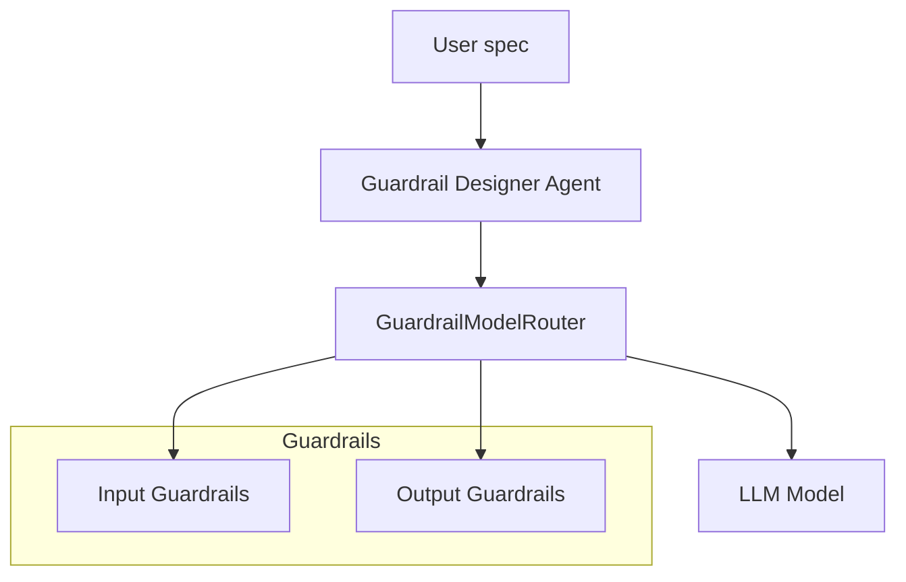

# Guardrail Designer Agent Guide

This guide explains the Guardrail Designer Agent included in **Meta Agent**. The agent generates validation logic that protects both inputs and outputs of OpenAI Agents.

## 1. Architecture

The Guardrail Designer Agent sits between the Meta Agent orchestration layer and the underlying LLM model. It uses a `GuardrailModelRouter` to route prompts through user–defined guardrails before the model is invoked.



## 2. Guardrail Logic

Guardrails are declared using `GuardrailRule` objects and grouped in a `GuardrailConfig`. Rules rely on regular expressions and a configurable action such as **deny**, **redact** or **flag**. The helper `build_regex_guardrails` converts a configuration into async callables that can be attached to the router.

## 3. Usage Example

```python
from meta_agent.agents.guardrail_designer_agent import GuardrailDesignerAgent
from meta_agent.generators.regex_patterns import build_default_regex_config, build_regex_guardrails
from meta_agent.services.guardrail_router import GuardrailModelRouter

# Create guardrails from the default patterns and add a custom one
config = build_default_regex_config({"custom": r"foo"})
guards = build_regex_guardrails(config)

router = GuardrailModelRouter({"gpt": DummyAdapter()}, default_model="gpt")
for guard in guards:
    router.add_input_guardrail(guard)

agent = GuardrailDesignerAgent(model_router=router)
result = await agent.run({"prompt": "hello"})
```

## 4. Configuration

Use `build_default_regex_config()` to obtain a starting set of rules for e‑mail addresses, phone numbers and other sensitive patterns. Additional patterns can be supplied via the `additional_patterns` parameter.

## 5. Extending the Guardrail System

* Implement new `ModelAdapter` classes for other LLM services.
* Register custom input or output guardrails with the router.
* Combine guardrails with policy checks for advanced enforcement.

## 6. Troubleshooting

If guardrails raise unexpected errors, verify that the regex patterns compile correctly and that the router's model name matches a registered adapter. Detailed examples of the SDK can be found in `docs/openai_agents_sdk_docs.md`.
