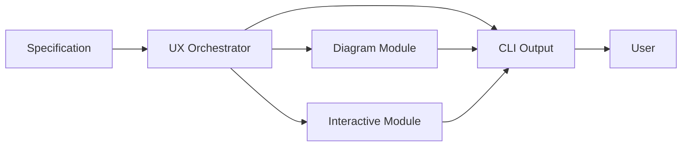

# Diagram, CLI Output, and Interactive Modules Architecture

## 1. Overview

This design separates user experience features into three dedicated modules. Diagram generation, terminal output, and interactive prompts remain independent so they can evolve without tightly coupling concerns. Each module exposes a minimal interface to make integration and testing straightforward.

## 2. Modules

### Diagram Module
- Generates Mermaid diagrams describing agent architecture.
- Accepts an agent specification or internal representation.
- Exposes `generate(spec: dict) -> str` returning Mermaid syntax.
- Handles customization such as node styles and colors.

### CLI Output Module
- Centralises all formatted terminal output.
- Provides helpers for info, warning, error, and progress messages.
- Adds optional colour support and verbosity levels.

### Interactive Module
- Manages user prompts for refining specifications.
- Supports menus and free‑form questions.
- Exposes `ask(prompt: str) -> str` for synchronous usage.

### UX Orchestrator
- Coordinates the above modules.
- Ensures diagrams and progress updates reach the user consistently.

## 3. Data Flow Diagram

## 4. Dependency Management

Each module lives under `src/meta_agent/ux/` to keep UX concerns isolated. They
should only depend on lightweight utilities and avoid coupling to the core
planning engine. This keeps testing simple and allows future replacement with
alternative implementations, such as a graphical UI.
