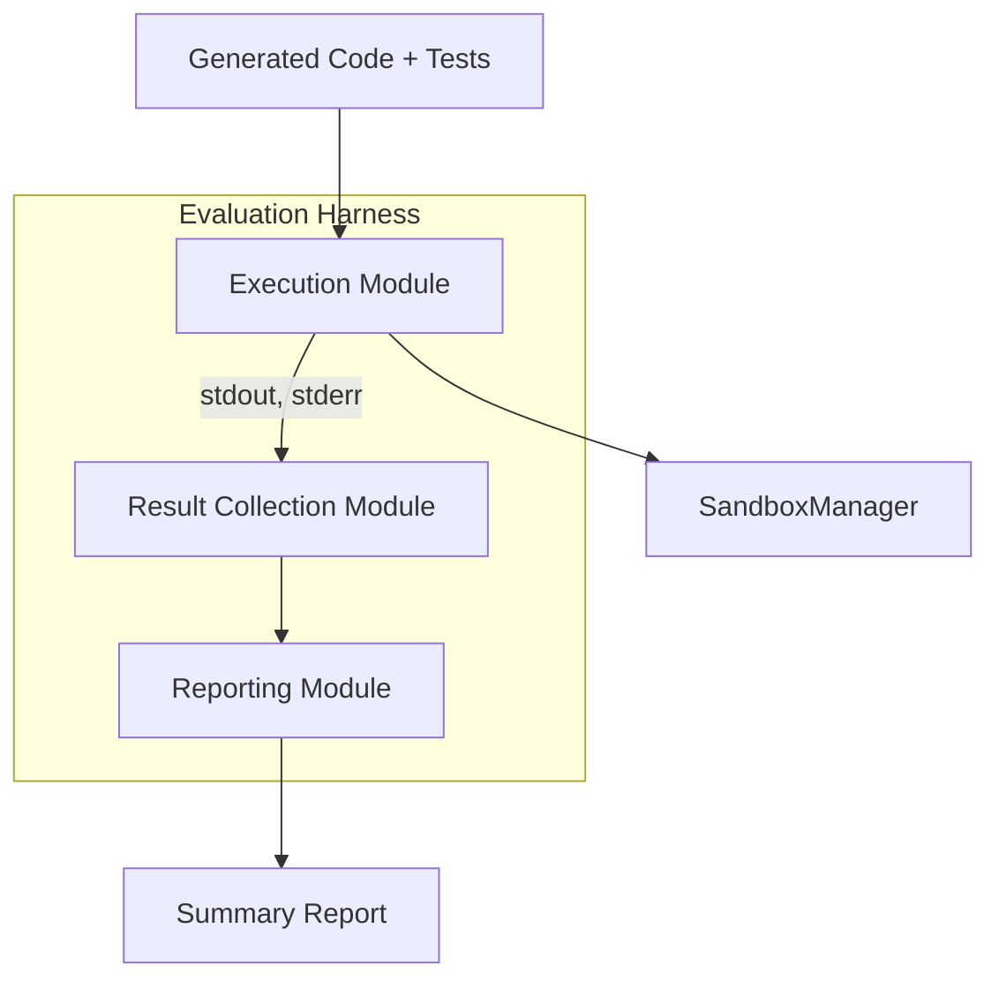

# Evaluation Harness Architecture

## 1. Overview

The evaluation harness verifies that generated agents compile and their unit
tests run successfully inside a restricted sandbox. It is split into three
modules so that execution, result collection and reporting remain decoupled.

## 2. Modules

### Execution Module
- Runs pytest inside a Docker based sandbox via `SandboxManager`.
- Enforces timeouts and resource limits.
- Exposes `run_tests(path: Path) -> ExecutionResult`.

### Result Collection Module
- Gathers exit codes, stdout and stderr output.
- Optionally collects coverage statistics and runtime metadata.
- Provides a structured `ExecutionResult` dataclass.

### Reporting Module
- Formats results for CLI display or machine‑readable JSON/HTML.
- Summarises pass/fail status and links to logs for debugging.

### Harness Orchestrator
- Coordinates the above modules and exposes a single `evaluate()` API.

## 3. Diagram

