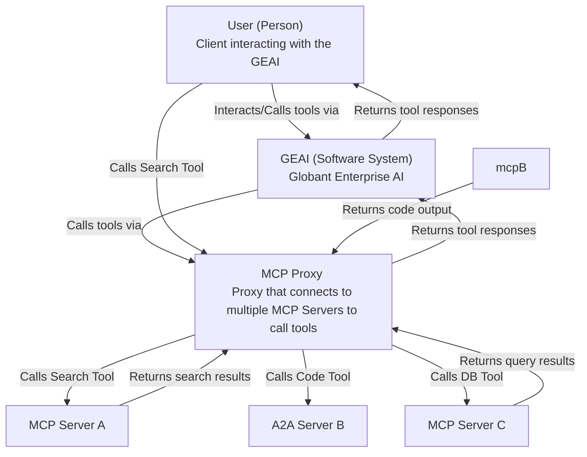

# GEAI Proxy Documentation

## Overview

The GEAI Proxy is a Python-based tool that acts as an intermediary between the GEAI API and various tool servers. It manages the registration, execution, and result handling of tool operations through a proxy service.

## Installation

## Third-party Components

This project includes code from [`a2a-python`](https://github.com/google/a2a-python) by Google LLC, used under the Apache License, Version 2.0.

Only the vendored component located in `pygeai/vendor/a2a/` is subject to the Apache License.  
The rest of this project is licensed under the MIT License (see `LICENSE` file for details).


```bash
pip install pygeai
```

## Configuration

The GEAI Proxy requires two distinct types of configuration:

### 1. MCP Servers Configuration

This section declares the Model Context Protocol (MCP) servers that this proxy will link with GEAI. The configuration follows the Claude Desktop standard format and supports multiple servers in one file.

#### Configuration File Format

```json
{
  "mcpServers": {
    "serverName1": {
      "command": "command-to-launch-server",
      "args": ["arg1", "arg2", ...]
    },
    "serverName2": {
      "command": "command-to-launch-server",
      "args": ["arg1", "arg2", ...]
    }
  }
}
```

#### Example Configurations

1. **Puppeteer Server** (for web automation):
```json
{
  "mcpServers": {
    "puppeteer": {
      "command": "npx",
      "args": ["-y", "@modelcontextprotocol/server-puppeteer"]
    }
  }
}
```

2. **Filesystem Server** (for file operations):
```json
{
  "mcpServers": {
    "filesystem": {
      "command": "npx",
      "args": [
        "-y",
        "@modelcontextprotocol/server-filesystem",
        "~/mcp-shared-folder"
      ]
    }
  }
}
```

2. **Location Services Server** (Using http+sse protocol):
```json
{
  "mcpServers": {
    "location-services": {
      "uri": "https://location.public-services.com/",
      "headers": [
        "X-API-KEY", "<my api key"
      ]
    }
  }
}
```

3. **Multiple Servers Combined**:
```json
{
  "mcpServers": {
    "puppeteer": {
      "command": "npx",
      "args": ["-y", "@modelcontextprotocol/server-puppeteer"]
    },
    "filesystem": {
      "command": "npx",
      "args": [
        "-y",
        "@modelcontextprotocol/server-filesystem",
        "~/mcp-shared-folder"
      ]
    },
    "custom-server": {
      "command": "python",
      "args": ["path/to/your/custom_mcp_server.py"]
    }
  }
}
```

### 1. A2A Servers Configuration

This section declares the Agent to Agent Protocol (A2A) servers that this proxy will link with GEAI. The configuration follows the standard format and supports multiple servers in one file.

#### Configuration File Format

```json
{
  "a2aServers": {
    "hello-world": {
      "url": "http://localhost:9999",
      "headers":{
        "Authorization": "Bearer fh84ff...."
      }
    }
  }
}
```

A sample configuration file is provided at:
```
pygeai/proxy/sample-mcp-config.json
```

### 2. Proxy Authentication Configuration

This section establishes the connection between the proxy and GEAI and manages user aliases. You can configure it automatically on first run or manually reconfigure an existing alias.

#### Automatic Configuration (First Run)
```bash
geai-proxy sample-mcp-config.json --alias myalias
```

#### Manual Configuration (Reconfiguration)
```bash
geai-proxy --configure --alias myalias
```

During interactive setup, the CLI will prompt you for each required setting:

```bash
# Configuring GEAI proxy settings...
Generated new proxy ID: 37bae96b-bc99-4110-bb61-b912b28f9e32
-> Insert proxy ID (UUID) (Current: 37bae96b-bc99-4110-bb61-b912b28f9e32, Leave empty to keep):
-> Insert proxy API key:
-> Insert proxy base URL:
-> Insert proxy name:
-> Insert proxy description:
```

## Proxy Configuration Parameters

During interactive setup, the following parameters are requested:

- **proxy ID (UUID)**  
  A unique identifier for this proxy instance. If left empty, the automatically generated UUID will be used.

- **proxy API key**  
  The API key used to authenticate the proxy with the GEAI backend.  
  This must be an API token generated in GEAI for a specific project.

- **proxy base URL**  
  The base URL of the GEAI installation this proxy will connect to.  
  For example: `https://api.beta.saia.ai`

- **proxy name**  
  A human-readable name assigned to this instance of `geai-proxy`.  
  This name is stored under the configured alias.

- **proxy description**  
  An optional description to help identify this proxy instance, especially when using multiple proxies under different aliases.

## Usage

### Starting the Proxy

To start the proxy server with a specific configuration and alias:

```bash
geai-proxy sample-mcp-config.json --alias myalias
```

### Command Line Arguments

| Argument | Description | Required |
|----------|-------------|----------|
| `config_file` | Path to the MCP servers configuration file (JSON format) | Yes |
| `--alias` | Alias for the proxy settings | No |
| `--configure` | Command to reconfigure proxy authentication | No |

## Command Line Usage

```bash
geai-proxy sample-mcp-config.json --alias beta
``` 

## Architecture

