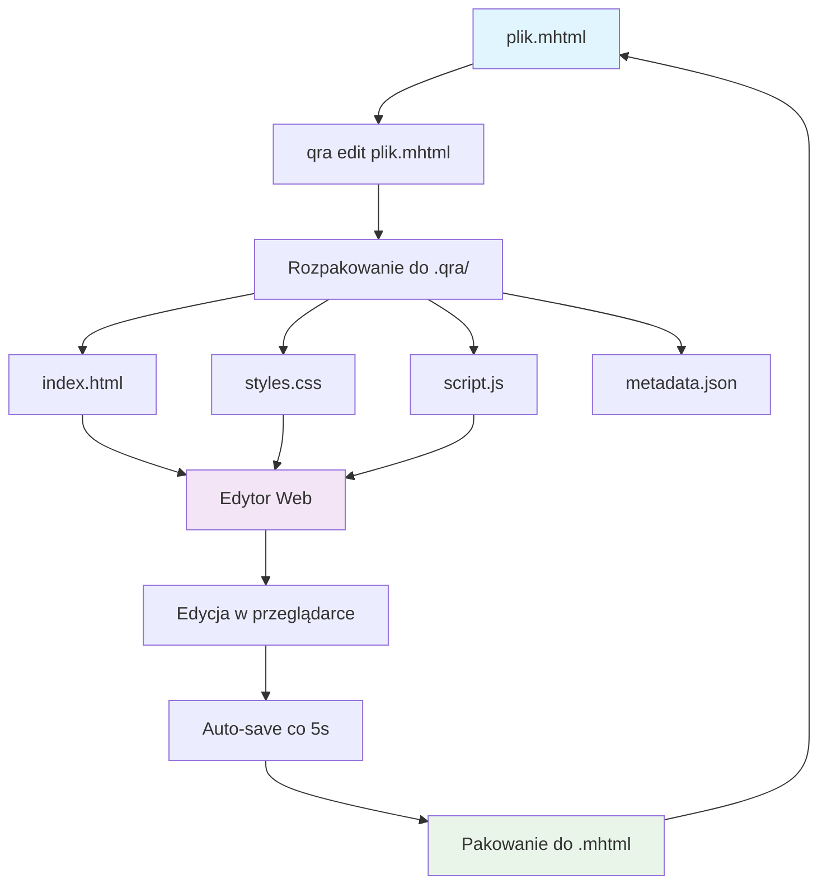
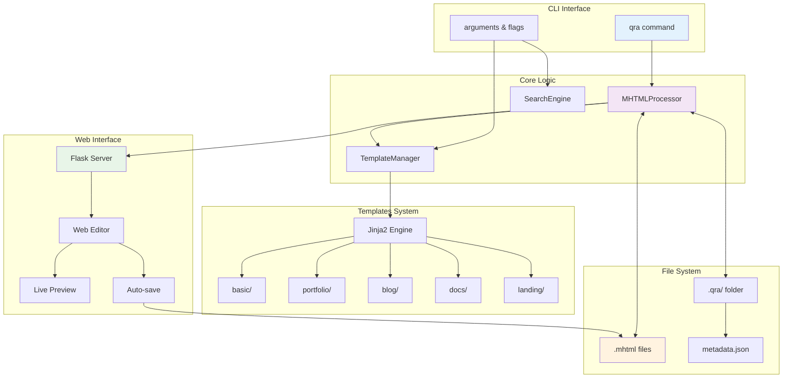
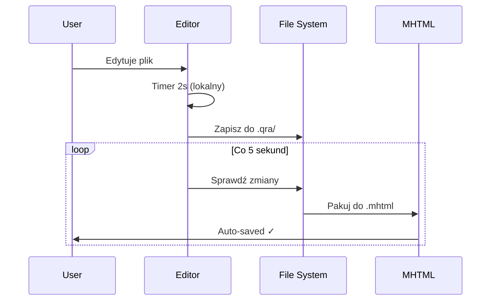

# QRA - MHTML Editor and Processor

QRA to zaawansowany edytor plików MHTML z podglądem na żywo, automatycznym zapisywaniem i możliwością konwersji między formatami. Używa systemu templates opartego na Jinja2 i rozpakuje MHTML do edytowalnych komponentów.

```
    ┌─────────────────────────────────────────────────────────────┐
    │                        QRA WORKFLOW                         │
    └─────────────────────────────────────────────────────────────┘
                                   
    portfolio.mhtml  ──┐                   ┌── Edytor Web
                       │                   │   ┌─────────────┐
    invoice.mhtml   ───┼── qra edit ───────┼───│ index.html  │
                       │                   │   │ styles.css  │ 
    docs.mhtml      ───┘                   │   │ script.js   │
                                           │   └─────────────┘
                                           │         │
                                           └── .qra/ folder
                                                     │
                                              Auto-save co 5s
                                                     │
                                                     ▼
                                           Pakowanie z powrotem
                                               do .mhtml
```

## Zasada działania

QRA działa w cyklu **Rozpakuj → Edytuj → Spakuj**:



## Instalacja

```bash
# Zainstaluj QRA
poetry install

# Lub z pip (po publikacji)
pip install qra

# Sprawdź instalację
qra --help
```

## Szybki start

```bash
# 1. Utwórz i edytuj nowy plik
qra edit moja-strona.mhtml

# 2. Wybierz template przy tworzeniu
qra edit portfolio.mhtml --template portfolio

# 3. Konwertuj Markdown do MHTML
qra html README.md

# 4. Wyszukaj pliki
qra search "invoice"+"2024" -L 2 -v
```

## Komendy

### 🎨 Edycja plików MHTML

```bash
# Otwórz edytor (automatycznie tworzy plik jeśli nie istnieje)
qra edit filename.mhtml

# Wybierz template przy tworzeniu
qra edit portfolio.mhtml --template portfolio
qra edit blog.mhtml --template blog
qra edit docs.mhtml --template docs
qra edit landing.mhtml --template landing

# Dostosuj serwer
qra edit file.mhtml --port 8080 --host 0.0.0.0
```

**Dostępne templates:**
```
basic     → Prosty dokument z sekcjami
portfolio → Strona portfolio z projektami  
blog      → Blog z artykułami i sidebar
docs      → Dokumentacja z nawigacją boczną
landing   → Landing page z cenami i CTA
```

### 📁 Struktura po uruchomieniu

```
projekt/
├── portfolio.mhtml          # Oryginalny plik
├── .qra/                    # Auto-generowane
│   ├── index.html          # ← Edytuj HTML
│   ├── styles.css          # ← Edytuj style
│   ├── script.js           # ← Edytuj JavaScript
│   ├── image.jpg           # ← Obrazy i zasoby
│   └── metadata.json       # ← Metadane MIME
└── README.md
```

### 🔄 Konwersje formatów

```bash
# Markdown → MHTML (z profesjonalnym CSS)
qra html documentation.md                # → documentation.mhtml
qra html README.md portfolio.mhtml       # Własna nazwa

# MHTML → Markdown (podstawowa konwersja)
qra md portfolio.mhtml                   # → portfolio.md
qra md index.mhtml docs.md              # Własna nazwa
```

### 🔍 Wyszukiwanie zaawansowane

```bash
# Podstawowe wyszukiwanie
qra search "invoice"+"paypal"

# Kontrola głębokości (-L, --level)
qra search "config" -L 0                # Tylko bieżący katalog
qra search "docs" -L 5                  # 5 poziomów w głąb

# Rozszerzenie zasięgu (-S, --scope)  
qra search "backup" -S 2                # 2 poziomy wyżej
qra search "logs" -S 1 -L 3             # 1 wyżej, 3 w głąb

# Verbose mode
qra search "api"+"endpoint" -v          # Szczegółowe informacje

# Własna ścieżka
qra search "config" --path /etc -L 1
```

#### Przykład wyszukiwania z poziomami:

```
/home/user/projects/           ← scope 1 
├── myapp/                     ← Twoja pozycja (scope 0)
│   ├── src/                   ← level 1
│   │   └── components/        ← level 2
│   ├── docs/                  ← level 1  
│   └── config.mhtml          ← level 1
└── backup/                    ← scope 1
    └── old/                   ← scope 1 + level 1
        └── archive.mhtml      ← scope 1 + level 2
```

### 🆕 Tworzenie plików

```bash
# Utwórz pusty plik MHTML
qra create invoice.mhtml
qra mhtml create project.mhtml  # Alternatywnie
```

## Interface edytora

```
┌─────────────────────────────────────────────────────────────────┐
│                         QRA Editor                              │
├─────────────────┬───────────────────────────┬───────────────────┤
│   📁 Pliki      │      🖋️  Edytor          │    👁️ Podgląd    │
│                 │                           │                   │
│ • index.html    │  <!DOCTYPE html>          │   ┌─────────────┐ │
│ • styles.css    │  <html>                   │   │             │ │
│ • script.js     │    <head>                 │   │   Live      │ │
│                 │      <title>...</title>   │   │  Preview    │ │
│ ✅ Auto-save    │    </head>                │   │             │ │
│ 🔄 5s timer     │    <body>                 │   │ ◄────────── │ │
│                 │      <h1>Hello</h1>       │   │             │ │
│ [Nowy plik]     │    </body>                │   └─────────────┘ │
│ [Zapisz all]    │  </html>                  │                   │
└─────────────────┴───────────────────────────┴───────────────────┘
```

### Funkcje edytora:
- **Lista plików**: Wszystkie komponenty z `.qra/`
- **Kolorowanie składni**: HTML, CSS, JS, JSON, XML
- **Podgląd na żywo**: Automatyczne odświeżanie iframe
- **Auto-save**: 
  - Lokalne: 2s po ostatniej zmianie
  - Globalne: Co 5s do pliku MHTML
- **Skróty klawiszowe**: 
  - `Ctrl+S` - Zapisz bieżący plik
  - `Ctrl+N` - Dodaj nowy plik

## Workflow przykłady

### 📊 Tworzenie portfolio

```bash
# 1. Utwórz portfolio
qra edit portfolio.mhtml --template portfolio

# 2. Edytuj w przeglądarce
#    - Zmień dane osobowe w HTML
#    - Dostosuj kolory w CSS  
#    - Dodaj projekty w HTML
#    - Dodaj animacje w JS

# 3. Dodaj nowe pliki
#    - projects.json (dane projektów)
#    - gallery.css (style galerii)

# 4. Auto-save zapisuje wszystko co 5s
```

### 📝 Blog z artykułami

```bash
# 1. Utwórz blog
qra edit blog.mhtml --template blog

# 2. Napisz artykuł w Markdown
echo "# Nowy artykuł\nTreść..." > article.md

# 3. Konwertuj do MHTML
qra html article.md article.mhtml

# 4. Skopiuj treść do głównego bloga
qra edit blog.mhtml
# Wklej treść z article.mhtml
```

### 📚 Dokumentacja projektu

```bash
# 1. Konwertuj README
qra html README.md docs.mhtml

# 2. Przełącz na template docs
qra edit docs.mhtml --template docs

# 3. Dodaj strukturę nawigacji
#    - API reference
#    - Przykłady użycia
#    - FAQ

# 4. Dodaj style dla kodu
#    - Syntax highlighting
#    - Copy buttons
```

### 🔍 Zarządzanie projektami

```bash
# Znajdź wszystkie faktury z 2024
qra search "invoice"+"2024" -L 2 -v

# Znajdź konfiguracje w całym systemie 
qra search "config"+"database" -S 3 -L 1

# Szukaj API dokumentacji w projektach
cd ~/projects
qra search "api"+"endpoint" -L 3 --verbose
```

## Architektura rozwiązania



## System templates

QRA używa Jinja2 do dynamicznych templates:

### Struktura template:

```
qra/templates/portfolio/
├── index.html          # Jinja2 template z {{ variables }}
├── styles.css          # CSS style
├── script.js           # JavaScript functionality
└── config.json         # Opcjonalna konfiguracja
```

### Przykład Jinja2 template:

```html
<!DOCTYPE html>
<html lang="pl">
<head>
    <title>{{ title | default('Portfolio') }}</title>
    <meta name="author" content="{{ author | default('Jan Kowalski') }}">
</head>
<body>
    <h1>Witaj, jestem {{ name | default('Developerem') }}</h1>
    
        
            <div class="project">{{ project.name }}</div>
        
    
</body>
</html>
```

## Zaawansowane funkcje

### Auto-save mechanizm



### Wyszukiwanie z kontekstem

```bash
$ qra search "api"+"authentication" -v

Wyszukiwanie słów kluczowych: api, authentication
Ścieżka wyszukiwania: /home/user/projects  
Głębokość: 3 poziomów
--------------------------------------------------
Znaleziono 12 plików MHTML do przeszukania
✓ Dopasowania w: docs/api.mhtml (głębokość: 1)
✓ Dopasowania w: backend/auth.mhtml (głębokość: 2)

📄 docs/api.mhtml
   Pełna ścieżka: /home/user/projects/docs/api.mhtml
   Głębokość: 1, Rozmiar: 45.2 KB, Dopasowań: 8
    1. The API requires authentication via JWT tokens
    2. POST /auth/login endpoint handles user authentication  
    3. All API endpoints except /health require authentication
    4. Authentication failures return 401 status codes
    5. API keys provide alternative authentication method
```

## Rozwiązywanie problemów

### Częste problemy:

#### 1. Plik nie otwiera się
```bash
# Sprawdź czy plik istnieje
ls -la *.mhtml

# QRA automatycznie utworzy plik
qra edit newfile.mhtml --template basic
```

#### 2. Błędy auto-save
```bash
# Sprawdź uprawnienia
ls -la .qra/

# Uruchom ponownie z verbose
qra edit file.mhtml --verbose
```

#### 3. Problemy z podglądem
```bash
# Sprawdź czy istnieje HTML
ls .qra/*.html

# Otwórz w nowym porcie
qra edit file.mhtml --port 8080
```

#### 4. Templates nie działają
```bash
# Sprawdź dostępne templates
python -c "from qra.templates import TemplateManager; print(TemplateManager().list_available_templates())"

# Użyj basic jako fallback
qra edit file.mhtml --template basic
```

### Diagnostyka:

```bash
# Sprawdź struktur QRA
find qra/ -name "*.py" -o -name "*.html" -o -name "*.css"

# Test wyszukiwania
qra search "test" -v --path . -L 1

# Sprawdź czy wszystko działa
qra edit test.mhtml --template basic
```

## Współtworzenie

### Dodawanie nowych templates:

1. **Utwórz katalog**: `qra/templates/mytemplate/`
2. **Dodaj pliki**:
   - `index.html` (z Jinja2)
   - `styles.css` 
   - `script.js`
3. **Test**: `qra edit test.mhtml --template mytemplate`

### Rozszerzanie funkcjonalności:

```bash
# Sklonuj repozytorium
git clone <repo-url>
cd qra

# Zainstaluj w trybie dev
poetry install --with dev

# Uruchom testy
pytest tests/

# Dodaj nowe funkcje
# Wyślij Pull Request
```


# QRA - Obsługa plików EML

QRA teraz obsługuje **pliki EML** (email) oprócz MHTML! 

## 🎯 Dodane funkcje:

### 1. **Obsługa plików .eml**
```bash
# Edytuj email
qra edit invoice.eml --template basic

# Wyszukaj w emailach
qra search "payment"+"invoice" -L 2 -v

# Automatycznie rozpoznaje typ pliku
qra edit message.eml    # ← Wykryje jako EML
qra edit webpage.mhtml  # ← Wykryje jako MHTML
```

### 2. **CodeMirror z kolorowaniem składni**
- ✅ **HTML** - kolorowanie tagów, atrybutów
- ✅ **CSS** - właściwości, selektory, kolory
- ✅ **JavaScript** - słowa kluczowe, funkcje
- ✅ **JSON** - obiekty, tablice, wartości
- ✅ **XML** - struktury, atrybuty
- ✅ **Markdown** - nagłówki, linki, formatowanie
- ✅ **Python** - składnia, słowa kluczowe
- ✅ **SQL** - zapytania, komendy
- ✅ **YAML** - struktury, wcięcia
- ✅ **PHP** - kod, zmienne

### 3. **Struktura EML po rozpakowaniu**
```
email.eml → .qra/
├── email_body.html      # Wersja HTML emaila
├── email_text.txt       # Wersja tekstowa
├── email_headers.md     # Nagłówki (From, To, Subject)
├── attachment1.pdf      # Załączniki
├── attachment2.jpg
└── metadata.json        # Metadane MIME
```

### 4. **Specjalne funkcje dla EML**
- **Nagłówki email**: From, To, Subject, Date
- **Treść wieloformatowa**: HTML + tekst
- **Załączniki**: Automatyczne wyodrębnienie
- **Metadata**: Zachowanie informacji MIME

## 📧 Przykłady użycia EML:

### Edycja emaila marketingowego:
```bash
qra edit newsletter.eml --template basic
# Edytuj HTML email
# Dodaj style CSS
# Przetestuj w podglądzie
```

### Analiza phishingu:
```bash
qra edit suspicious.eml
# Sprawdź nagłówki w email_headers.md
# Analizuj HTML w email_body.html
# Zbadaj załączniki
```

### Archiwizacja korespondencji:
```bash
qra search "contract"+"signature" --path ./emails/ -L 1 -v
# Znajdź wszystkie emaile z umowami
# Przeanalizuj treść i załączniki
```

## 🎨 Interface z kolorowaniem:

```
┌───────────────────────────────────────────────────────────────────┐
│                     QRA Editor - EML                              │
├─────────────────────┬─────────────────────────┬───────────────────┤
│   📧 Pliki          │      🖋️  CodeMirror     │    👁️ Podgląd     │
│                     │                         │                   │
│ • email_body.html   │  <!DOCTYPE html>        │   ┌─────────────┐ │
│ • email_text.txt    │  <html>                 │   │   Email     │ │
│ • email_headers.md  │    <head>               │   │  Preview    │ │
│ • attachment.pdf    │      <style>            │   │             │ │
│                     │        body {           │   │ Subject:... │ │
│ [HTML] Auto-save    │          color: #333;   │   │ From: ...   │ │
│ 🔄 5s timer         │        }                │   │             │ │
│                     │      </style>           │   └─────────────┘ │
└─────────────────────┴─────────────────────────┴───────────────────┘
```

## 🔧 Zalety CodeMirror:

### Dla programistów:
- **Numerowanie linii**
- **Dopasowywanie nawiasów**
- **Auto-domykanie tagów**
- **Składanie kodu**
- **Podświetlenie aktywnej linii**

### Dla treści:
- **Syntax highlighting** według typu pliku
- **Motyw Monokai** (ciemny)
- **Automatyczne wcięcia**
- **Zawijanie linii**

## 🚀 Testowanie:

```bash
# 1. Utwórz testowy email
qra edit test.eml --template basic

# 2. Sprawdź strukturę
ls -la .qra/

# 3. Edytuj pliki w CodeMirror
# - email_body.html → kolorowanie HTML
# - email_headers.md → kolorowanie Markdown
# - Dodaj style.css → kolorowanie CSS

# 4. Zobacz podgląd HTML emaila
```

Teraz QRA to kompletne narzędzie do **MHTML i EML** z profesjonalnym edytorem kodu!


## Licencja

Apache Software License - używaj dowolnie w projektach osobistych i komercyjnych.

---

**QRA** - *Quick Resource Archiver* 🚀