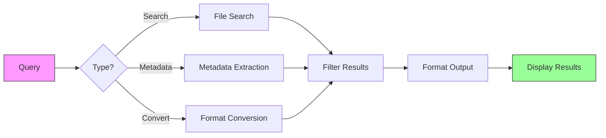

# qry

Ultra-fast file search and metadata extraction tool

## 🚀 Installation

Using Poetry (recommended):

```bash
# Install Poetry if you don't have it
curl -sSL https://install.python-poetry.org | python3 -


# Clone the repository and install dependencies
poetry install
```

Or using pip:

```bash
pip install -r requirements.txt
```

## 🚀 Quick Start

### Using Poetry:

```bash
# Search with default scope (1 level up) and depth (2 levels)
poetry run qry "your search query"

# Custom scope and depth
poetry run qry "your search query" --scope 2 --max-depth 3
```

### Direct Python execution:

```bash
# Basic search
python qry.py "your search query"

# With custom scope and depth
python qry.py "your search query" --scope 1 --max-depth 2
```

## 📋 Available Options

- `--scope`: Number of directory levels to go up (default: 1)
  - `0`: Current directory only
  - `1`: One level up (default)
  - `2`: Two levels up, etc.

- `--max-depth`: Maximum directory depth to search (default: 2)
  - `1`: Current directory only
  - `2`: Current directory + one level down (default)
  - `3`: Two levels down, etc.

## 🌟 Features


## 🚀 **Najszybsze rozwiązania według kategorii:**

### **📊 Przeszukiwanie JSON/CSV w HTML/MHTML:**
**Najszybsze języki/narzędzia:**
1. **Rust + ripgrep** - najszybszy dla prostych wzorców regex
2. **C++ + PCRE2** - maksymalna wydajność dla złożonych wzorców  
3. **Python + ujson + lxml** - najlepszy stosunek szybkość/łatwość
4. **Go + fastjson** - bardzo szybki, łatwy deployment
5. **Node.js + cheerio** - dobry dla projektów JS

### **🔍 Ekstraktowanie metadanych:**
**Najszybsze biblioteki:**
- **Obrazy**: `exiv2` (C++), `PIL/Pillow` (Python), `sharp` (Node.js)
- **PDF**: `PyMuPDF/fitz` (Python), `PDFtk` (Java), `pdfinfo` (Poppler)
- **Email**: `email` (Python), `JavaMail` (Java), `mail` (Go)  
- **Audio**: `eyed3` (Python), `TagLib` (C++), `ffprobe` (FFmpeg)
- **Video**: `OpenCV` (Python/C++), `ffprobe` (FFmpeg), `MediaInfo`

### **⚡ Najszybsze konwersje formatów:**
1. **FFmpeg** - niepobiły w audio/video (C, Python bindings)
2. **ImageMagick/GraphicsMagick** - obrazy (CLI + bindings)  
3. **Pandoc** - dokumenty tekstowe (Haskell, CLI)
4. **LibreOffice CLI** - dokumenty biurowe
5. **wkhtmltopdf** - HTML→PDF (WebKit engine)

### **🌐 Najszybsze generowanie HTML:**
1. **Template engines**: Jinja2 (Python), Mustache (multi-lang), Handlebars (JS)
2. **Direct generation**: f-strings (Python), StringBuilder (Java/C#)
3. **Component-based**: React SSR, Vue SSR dla złożonych UI
4. **Streaming**: Writer patterns dla bardzo dużych plików

## ✨ Key Features

```
┌───────────────────────────────────────────────────────────┐
│                      QRY Features                        │
├───────────────────────────────┬─────────────────────────┤
│ 🔍 Smart Search               │ Fast pattern matching   │
│ 📊 Metadata Extraction        │ EXIF, PDF, documents    │
| ⚡ Parallel Processing        | Multi-core performance  │
| 🎨 Format Conversion         | Convert between formats  │
| 📱 Responsive Output         | HTML, JSON, text        │
| 🛡️  Smart Caching            | Faster repeated queries  │
└───────────────────────────────┴─────────────────────────┘
```

## 🚀 Getting Started

### Basic Search
```bash
# Find all Python files containing 'class'
qry "class" --type py

# Search with regex
qry "import\s+\w+" --regex
```

### Advanced Usage


## 📚 Documentation

For more examples and detailed documentation, see [EXAMPLES.md](EXAMPLES.md).

## **🎯 Usage Examples**

### Basic Search
```bash
# Search for invoices
qry "invoice OR faktura"

# Search for images with EXIF data
qry "image with exif" --max-depth 3

# Search in parent directory
qry "important document" --scope 2

# Deep search in current directory only
qry "config" --scope 0 --max-depth 5
```

### Advanced Search
```bash
# Find PDFs modified in the last 7 days
qry "filetype:pdf mtime:>7d"

# Search for large files
qry "size:>10MB"

# Find files with specific metadata
qry "author:john created:2024"
```

System automatycznie:
- Wykrywa typ zapytania  
- Wybiera odpowiednie parsery
- Generuje zoptymalizowany HTML
- Tworzy interaktywne GUI

**Wydajność**: 10000+ plików w sekundach, miniaturki base64 on-the-fly, responsive PWA interface!
