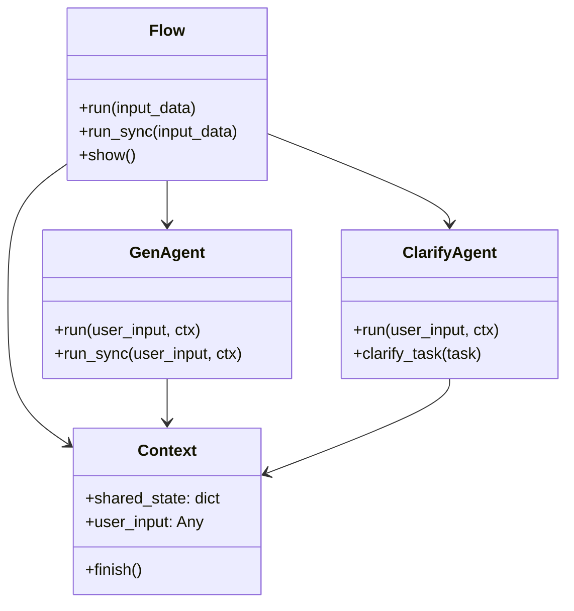

# API Reference

This page provides detailed API reference for the Refinire package's main components.

## Classes and Functions Overview

| Name                     | Type     | Description                                                 |
|--------------------------|----------|-------------------------------------------------------------|
| get_llm                  | Function | Get LLM instance from model name and provider              |
| create_simple_gen_agent  | Function | Create a simple generation agent                            |
| create_evaluated_gen_agent| Function| Create a generation agent with evaluation capabilities     |
| Flow                     | Class    | Central workflow management class                           |
| GenAgent                 | Class    | Agent class with generation and evaluation capabilities     |
| ClarifyAgent             | Class    | Interactive task clarification agent                        |
| Context                  | Class    | Context for sharing state between steps                     |
| ConsoleTracingProcessor  | Class    | Console colored trace output processor                      |
| enable_console_tracing   | Function | Enable console tracing functionality                        |
| disable_tracing          | Function | Disable all tracing functionality                           |
| AgentPipeline            | Class    | **[Deprecated]** Integrated pipeline for generation, evaluation, tools, and guardrails |

---

## Unified LLM Interface

### get_llm

Factory function for handling multiple LLM providers with a unified interface.

```python
from refinire import get_llm

# OpenAI
llm = get_llm("gpt-4o-mini")

# Anthropic Claude
llm = get_llm("claude-3-sonnet")

# Google Gemini
llm = get_llm("gemini-pro")

# Ollama (Local)
llm = get_llm("llama3.1:8b")
```

#### Parameters

| Name       | Type               | Required/Optional | Default | Description                                   |
|------------|--------------------|-------------------|---------|-----------------------------------------------|
| model      | str                | Required          | -       | LLM model name to use                         |
| provider   | str                | Optional          | None    | Model provider name (auto-inferred if None)  |
| temperature| float              | Optional          | 0.3     | Sampling temperature (0.0-2.0)               |
| api_key    | str                | Optional          | None    | Provider API key                              |
| base_url   | str                | Optional          | None    | Provider API base URL                         |
| thinking   | bool               | Optional          | False   | Claude model thinking mode                    |
| tracing    | bool               | Optional          | False   | Enable Agents SDK tracing                     |

#### Returns
- **LLM Instance**: LLM object for the specified provider

#### Supported Models

**OpenAI**
- gpt-4o, gpt-4o-mini
- gpt-4-turbo, gpt-4
- gpt-3.5-turbo

**Anthropic Claude**
- claude-3-5-sonnet-20241022
- claude-3-sonnet, claude-3-haiku
- claude-3-opus

**Google Gemini**
- gemini-pro, gemini-pro-vision
- gemini-1.5-pro, gemini-1.5-flash

**Ollama**
- llama3.1:8b, llama3.1:70b
- mistral:7b
- codellama:7b

---

## Agent Creation Functions

### create_simple_gen_agent

Creates a simple generation agent.

```python
from refinire import create_simple_gen_agent

agent = create_simple_gen_agent(
    name="assistant",
    instructions="You are a helpful assistant.",
    model="gpt-4o-mini"
)
```

#### Parameters

| Name         | Type  | Required/Optional | Default | Description                    |
|--------------|-------|-------------------|---------|--------------------------------|
| name         | str   | Required          | -       | Agent name                     |
| instructions | str   | Required          | -       | System prompt                  |
| model        | str   | Required          | -       | Model name to use              |
| tools        | list  | Optional          | None    | List of available tools        |

### create_evaluated_gen_agent

Creates a generation agent with evaluation capabilities.

```python
from refinire import create_evaluated_gen_agent

agent = create_evaluated_gen_agent(
    name="quality_assistant",
    generation_instructions="Generate helpful responses.",
    evaluation_instructions="Evaluate accuracy and usefulness.",
    threshold=80.0,
    model="gpt-4o-mini"
)
```

#### Parameters

| Name                      | Type  | Required/Optional | Default | Description                    |
|---------------------------|-------|-------------------|---------|--------------------------------|
| name                      | str   | Required          | -       | Agent name                     |
| generation_instructions   | str   | Required          | -       | Generation system prompt       |
| evaluation_instructions   | str   | Required          | -       | Evaluation system prompt       |
| threshold                 | float | Required          | -       | Quality threshold (0-100)      |
| model                     | str   | Required          | -       | Model name to use              |
| tools                     | list  | Optional          | None    | List of available tools        |

---

## Flow/Step Architecture

### Flow

Central workflow management class. Create complex processing flows by combining multiple steps.

```python
from refinire import Flow, FunctionStep
import asyncio

# Simple Flow
flow = Flow(steps=gen_agent)

# Multi-step Flow
flow = Flow([
    ("step1", FunctionStep("step1", func1)),
    ("step2", FunctionStep("step2", func2))
])

# Execute
result = asyncio.run(flow.run(input_data="input data"))
```

#### Main Methods

| Method Name | Parameters           | Return Value  | Description                    |
|-------------|---------------------|---------------|--------------------------------|
| run         | input_data: Any     | Context       | Execute workflow asynchronously|
| run_sync    | input_data: Any     | Context       | Execute workflow synchronously |
| show        | -                   | None          | Visualize workflow structure   |

### Context

Context class for sharing state between steps.

```python
from refinire import Context

ctx = Context()
ctx.shared_state["key"] = "value"
ctx.finish()  # End workflow
```

#### Main Attributes and Methods

| Name           | Type         | Description                    |
|----------------|--------------|--------------------------------|
| shared_state   | dict         | State shared between steps     |
| user_input     | Any          | User input data                |
| finish()       | Method       | Signal workflow completion     |

---

## Agent Classes

### GenAgent

Agent class with generation and evaluation capabilities. Can be used as a step within Flow.

```python
from refinire.agents import GenAgent

agent = GenAgent(
    name="generator",
    generation_instructions="Generate text.",
    evaluation_instructions="Evaluate quality.",
    model="gpt-4o-mini",
    threshold=75.0
)
```

#### Main Methods

| Method Name | Parameters                      | Return Value  | Description                    |
|-------------|---------------------------------|---------------|--------------------------------|
| run         | user_input: str, ctx: Context   | Context       | Execute agent asynchronously   |
| run_sync    | user_input: str, ctx: Context   | Context       | Execute agent synchronously    |

### ClarifyAgent

Interactive task clarification agent. Asks questions to clarify unclear requests.

```python
from refinire.agents import ClarifyAgent

agent = ClarifyAgent(
    name="clarifier",
    instructions="Clarify user requirements.",
    model="gpt-4o-mini"
)
```

---

## Tracing Functionality

### enable_console_tracing

Enable colored console tracing.

```python
from refinire import enable_console_tracing

enable_console_tracing()
```

### disable_tracing

Disable all tracing functionality.

```python
from refinire import disable_tracing

disable_tracing()
```

### ConsoleTracingProcessor

Class for custom trace processing.

```python
from refinire.tracing import ConsoleTracingProcessor

processor = ConsoleTracingProcessor(
    output_stream="console",
    simple_mode=True
)
```

---

## Deprecated APIs

### AgentPipeline (Deprecated)

⚠️ **Important**: `AgentPipeline` will be removed in v0.1.0. Use `GenAgent + Flow` for new code.

```python
# Deprecated - Do not use in new code
from refinire import AgentPipeline

pipeline = AgentPipeline(
    name="example",
    generation_instructions="Generate text.",
    evaluation_instructions="Evaluate quality.",
    model="gpt-4o-mini",
    threshold=80
)
```

---

## Architecture Diagram



## Usage Examples

### Basic Usage Pattern

```python
from refinire import create_simple_gen_agent, Flow, Context
import asyncio

# 1. Create agent
agent = create_simple_gen_agent(
    name="assistant",
    instructions="Respond as a helpful assistant.",
    model="gpt-4o-mini"
)

# 2. Create flow
flow = Flow(steps=agent)

# 3. Execute
async def main():
    result = await flow.run(input_data="Hello")
    print(result.shared_state["assistant_result"])

asyncio.run(main())
```

### Complex Workflow Example

```python
from refinire import Flow, FunctionStep, create_evaluated_gen_agent
import asyncio

def preprocess(user_input: str, ctx: Context) -> Context:
    ctx.shared_state["processed_input"] = user_input.strip().lower()
    return ctx

agent = create_evaluated_gen_agent(
    name="analyzer",
    generation_instructions="Analyze the input.",
    evaluation_instructions="Evaluate analysis accuracy.",
    threshold=80.0,
    model="gpt-4o-mini"
)

def postprocess(user_input: str, ctx: Context) -> Context:
    result = ctx.shared_state.get("analyzer_result", "")
    ctx.shared_state["final_result"] = f"Final result: {result}"
    ctx.finish()
    return ctx

flow = Flow([
    ("preprocess", FunctionStep("preprocess", preprocess)),
    ("analyze", agent),
    ("postprocess", FunctionStep("postprocess", postprocess))
])

async def main():
    result = await flow.run(input_data="  Analyze this text  ")
    print(result.shared_state["final_result"])

asyncio.run(main())
```

