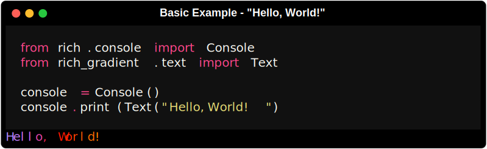
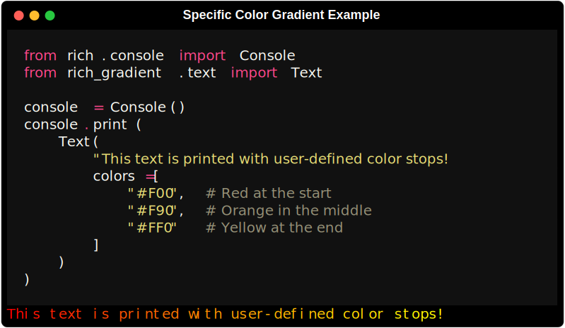
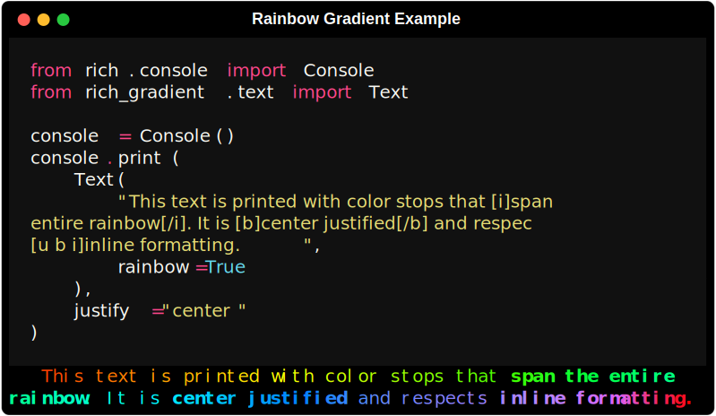
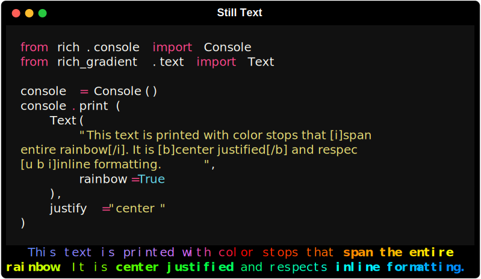

# 

<div class="badges">
    <a href="https://github.com/astral-sh/uv"></a>
    <a href="https://GitHub.com/maxludden/maxgradient"></a>
    <a href="https://GitHub.com/maxludden/rich-gradient"></a>
    <a href="https://GitHub.com/maxludden/rich-gradient"></a>
</div>
<div id="spacer"></div>


This library is a wrapper of the great [rich](https://GitHub.com/textualize/rich) library that extends [rich.text.Text](https://github.com/Textualize/rich/blob/master/rich/text.py) to allow for the easy generation gradient text from either user entered colors or randomly if no colors are entered.

Borrowing from [rich-color-ext](https://github.com/maxludden/rich-color-ext) rich_gradient extends the rich standard colors to include:

- 3 or 6 digit hex code (e.g. `#f00` or `#ff0000`)
- RGB color codes (e.g. `rgb(255, 0, 0)`)
- RGB tuples   (e.g. `(255, 0, 0)`)
- CSS3 Color Names (e.g. `rebeccapurple`)

## Installation

### uv (Recommended)

```bash
uv add rich-gradient
```

### Pip

```bash
pip install rich-gradient
```

## Usage

### Basic Text Example

To print a simple gradient import the `Text` class from in the `rich_gradient` library:



If you pass `rich_gradient.text.Text` a string, it will print the string to the console in a random gradient. Rich-gradient's `Text` class inherits from `rich.text.Text`. In addition to all of it's parent's parameters, `rich_gradient.text.Text` also accepts:

-  `colors`: (`List[ColorType]`) - A list of strings that can be parsed by `rich.color.Color`.
<blockquote style="padding:50px,margin:20em;">
  <strong style="padding:10px;">📝 Note</strong><br><code>rich_color_ext</code> extends rich to be able to parse:
  <ul>
        <li><strong>CSS color names:</strong>
          <ul>
              <li><span style="color:rebeccapurple;">rebeccapurple</span></li>
              <li><span style="color:salmon;">salmon</span></li>
              <li><span style="color:aliceblue">aliceblue</span></li>
          </ul>
    </li><li><strong>3-Digit Hex Color Codes:</strong>
        <ul>
            <li><span style="color:#abc">#abc</span></li>
            <li><span style="color:#FDC">#FDC</span></li>
            <li><span style="color:#A1f">#A1f
        </ul>
    </li>
  </ul>
</blockquote>

-  `hues`: (`int`) - The number of color stops a gradient should use
-  `rainbow`: (`bool`) - Whether to create a gradient that spans the entire spectrum. Defaults to `False`
-  `markup`: (`bool`) - Whether to respect the inputs existing styles. Defaults  to `True`

---

### Gradient with Specific Colors

To have more control over the gradient that is printed, you can pass the `colors` parameter a list of colors. Colors can be parsed from:
-  CSS colors names,
-  3 or 6 digit hex codes,
-  `rich.color.Color` instances or names,
-  any string or style that `rich.color.Color` can parse.



---

### Rainbow Gradient Example

If four colors isn't enough, you can use the 'rainbow' parameter to generate a rainbow gradient that spans the entire spectrum of colors randomly.


<p style="text-align:right;margin-top: 0px;padding-top:0px;">*The rainbow gradient is generated randomly each time the code is run.</p>

---

### Still inherits from `rich.text.Text`

Since `rich_gradient.text.Text` is a subclass of `rich.text.Text`, you can still use all the same methods and parameters as you would.




## Gradient

If just text is boring, `rich_gradient.gradient.Gradient` allows you to 
