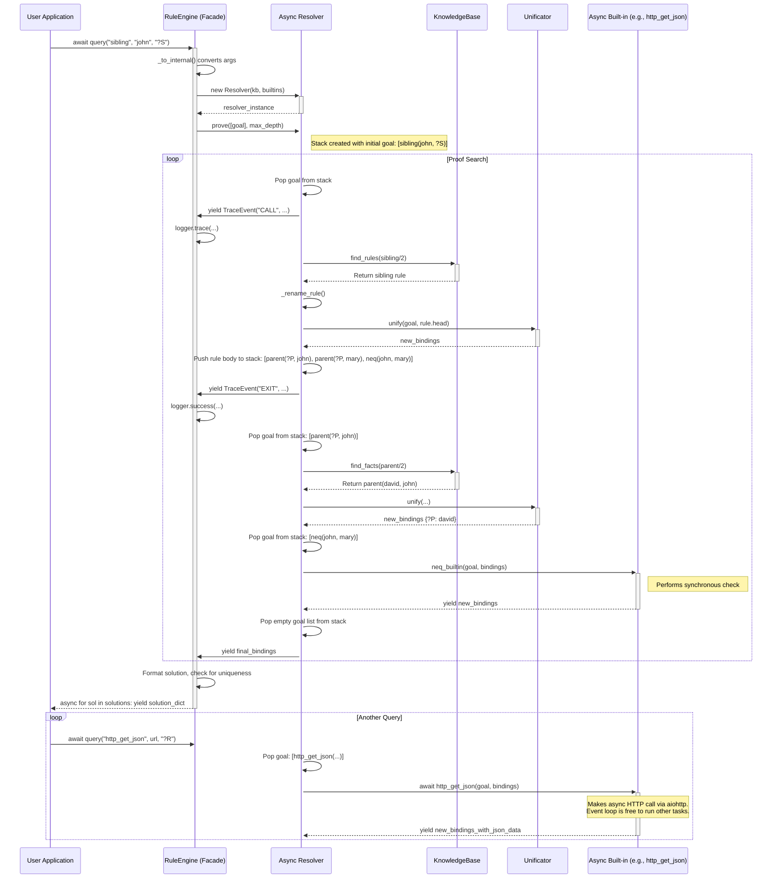

# Siamese Prototype v2.0: Production-Ready Async Rule Engine

siamese-prototypeis a high-performance, asynchronous backward-chaining rule engine in Python. It is designed for production environments where logic-based decisions may need to interact with external, non-blocking I/O resources like web APIs or databases.



## Key Features

-   😎**Fully Asynchronous**: Built on `asyncio` to handle I/O-bound tasks without blocking.
-   👀**Structured Logging**: Integrated with `loguru` for powerful and configurable tracing and debugging.
-   ⚙️**External Configuration**: Load facts and rules from human-readable YAML files.
-   🪜**Extensible Async Built-ins**: Easily write custom Python `async` functions to extend the engine's logic (e.g., for database access, API calls).
-   🚀**Robust and Thread-Safe**: The query resolution process is stateless, allowing for safe concurrent querying from multiple async tasks.
-   🧰**Control & Safety**: Prevents infinite loops with configurable search depth and limits the number of solutions.

## Installation

To install the library and its dependencies from the project root, run:
```bash
uv sync
```

## Quick Start

1.  **Define your knowledge in a YAML file (`knowledge.yaml`):**

    ```yaml
    facts:
      - [parent, david, john]
      - [parent, john, mary]

    rules:
      - head: [grandparent, '?GP', '?GC']
        body:
          - [parent, '?GP', '?P']
          - [parent, '?P', '?GC']
    ```

2.  **Write your async Python script:**

    ```python
    import asyncio
    from siamese import RuleEngine

    async def main():
        # Initialize the engine
        engine = RuleEngine()

        # Load knowledge from the file
        engine.load_from_file("knowledge.yaml")
        print("Knowledge base loaded.")

        # Asynchronously query the engine
        print("Query: Who is David's grandchild?")
        solutions = await engine.query("grandparent", "david", "?GC")
        
        async for sol in solutions:
            print(f"  - Solution: {sol}")

    if __name__ == "__main__":
        asyncio.run(main())
    ```

## Advanced Features

### Async Built-ins

The engine supports custom async built-in functions for external I/O operations:

```python
async def my_custom_builtin(goal, bindings):
    # Perform async operations like database queries or API calls
    result = await some_async_operation()
    if result:
        new_bindings = bindings.copy()
        new_bindings[goal.args[0]] = result
        yield new_bindings

# Register your custom built-in
engine = RuleEngine(builtins={"my_builtin": my_custom_builtin})
```

### Structured Logging

Configure detailed tracing of the engine's reasoning process:

```python
engine.configure_logging(level="TRACE")  # For detailed tracing
engine.configure_logging(level="INFO")   # For production use
```

### External Knowledge Bases

Load complex knowledge bases from YAML files:

```yaml
facts:
  - [person, alice]
  - [person, bob]
  - [parent, alice, bob]

rules:
  - head: [ancestor, '?A', '?D']
    body:
      - [parent, '?A', '?D']
  - head: [ancestor, '?A', '?D']
    body:
      - [parent, '?A', '?P']
      - [ancestor, '?P', '?D']
```

## License

MIT License - see LICENSE file for details. 