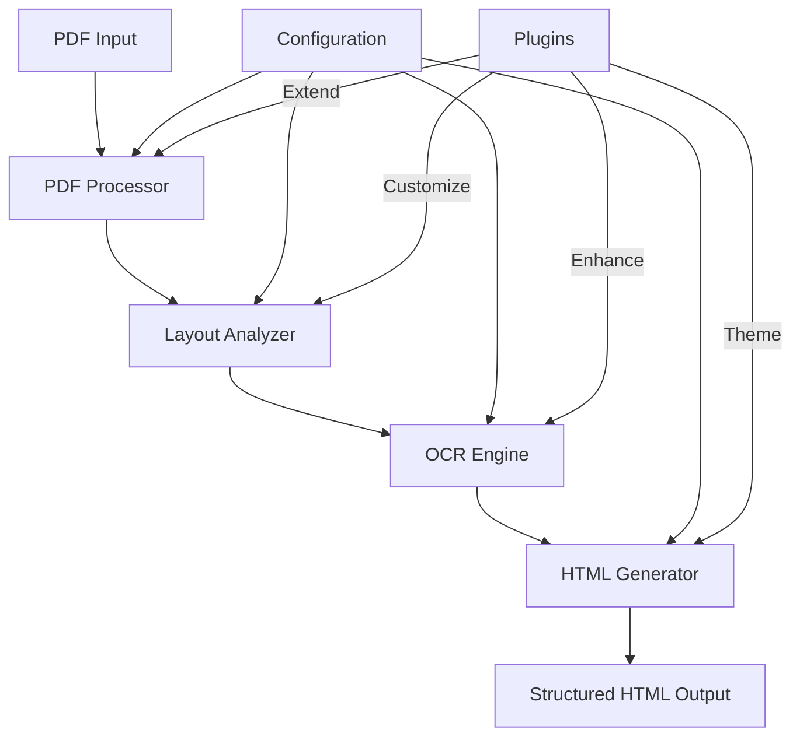
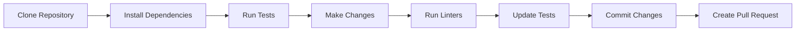

```
        _   _ _____ __  __ _     
 __   _| | | |_   _|  \/  | |    
 \ \ / / |_| | | | | |\/| | |    
  \ V /|  _  | | | | |  | | |___ 
   \_/ |_| |_| |_| |_|  |_|_____|                                                                                           
Visual HTML Generator - Convert PDFs to structured HTML with OCR
```

A modular system for converting PDF documents to structured HTML with advanced OCR and layout analysis capabilities.

## 📋 Table of Contents
- [✨ Features](#-features)
- [🚀 Quick Start](#-quick-start)
- [🏗️ Architecture](#️-architecture)
- [🔧 Installation](#-installation)
- [💻 Usage](#-usage)
- [📚 Documentation](#-documentation)
- [🤝 Contributing](#-contributing)
- [📄 License](#-license)

## ✨ Features

### Core Capabilities
- 🖨️ PDF to image conversion with preprocessing (denoise, deskew, enhance)
- 🔍 Advanced document layout analysis and segmentation
- 🌐 Multi-language OCR support (Polish, English, German, more)
- 🏷️ Automatic document type detection
- 🖥️ Modern, responsive HTML output

### Advanced Features
- 🔄 Batch processing for multiple documents
- 📊 Metadata extraction and preservation
- 🧩 Modular architecture for easy extension
- 🚀 High-performance processing with parallelization
- 📱 Mobile-responsive output templates
- 🔍 Searchable text output with confidence scoring

### Integration
- 🐳 Docker support for easy deployment
- 🧪 Comprehensive test suite
- 📦 Well-documented Python API
- 🔌 Plugin system for custom processors

## 🚀 Quick Start

### Prerequisites

- Python 3.8+
- Tesseract OCR
- Poppler utilities (`poppler-utils`)
- Git (for development)

### System Setup (Ubuntu/Debian)

```bash
# Install system dependencies
sudo apt-get update
sudo apt-get install -y \
    tesseract-ocr \
    tesseract-ocr-pol \
    tesseract-ocr-eng \
    tesseract-ocr-deu \
    poppler-utils \
    python3-pip \
    python3-venv
```

## 🏗️ Architecture

### High-Level Overview



### Component Interaction

```
+----------------+     +-----------------+     +---------------+
|                |     |                 |     |               |
|   PDF Input    |---->|  PDF Processor  |---->| Page Images   |
|                |     |                 |     |               |
+----------------+     +-----------------+     +-------.-------+
                                                    |
                                                    v
+----------------+     +-----------------+     +-------+-------+
|                |     |                 |     |               |
|  HTML Output   |<----|  HTML Generator |<----|  OCR Results  |
|                |     |                 |     |               |
+----------------+     +-----------------+     +-------.-------+
                                                    ^
                                                    |
+----------------+     +-----------------+     +-------+-------+
|                |     |                 |     |               |
| Configuration  |---->| Layout Analyzer |---->| Page Layout   |
|                |     |                 |     |               |
+----------------+     +-----------------+     +---------------+
```

## 🔧 Installation

### Using Poetry (Recommended)

```bash
# 1. Clone the repository
git clone https://github.com/fin-officer/vhtml.git
cd vhtml

# 2. Install Python dependencies
poetry install

# 3. Install system dependencies (if not already installed)
make install-deps

# 4. Verify installation
make validate
```

### Using Docker

```bash
# Build the Docker image
docker build -t vhtml .

# Run the container
docker run -v $(pwd)/invoices:/app/invoices -v $(pwd)/output:/app/output vhtml \
    python -m vhtml.main /app/invoices/sample.pdf -o /app/output
```

## 🧪 Validate Installation

To verify that all dependencies are correctly installed:

```bash
# Run validation script
make validate

# Or directly
python scripts/validate_installation.py

# Expected output:
# ✓ Python version: 3.8+
# ✓ Tesseract found: v5.0.0
# ✓ Poppler utils installed
# ✓ All Python dependencies satisfied
# ✓ Test document processed successfully
```

## 💻 Usage

### Command Line Interface

```bash
# Process a single PDF file
poetry run python -m vhtml.main /path/to/document.pdf -o output_directory

# Process a directory of PDF files (batch mode)
poetry run python -m vhtml.main /path/to/pdf_directory -b -o output_directory

# Process and open in browser
poetry run python -m vhtml.main /path/to/document.pdf -v

# Specify output format (html/mhtml)
poetry run python -m vhtml.main document.pdf --format mhtml

# Use specific OCR language
poetry run python -m vhtml.main document.pdf --lang pol+eng
```

### Python API

```python
from vhtml import DocumentAnalyzer

# Initialize with custom settings
analyzer = DocumentAnalyzer(
    languages=['pol', 'eng'],  # OCR languages
    output_format='html',      # 'html' or 'mhtml'
    debug_mode=False          # Enable debug output
)

# Process a single document
result = analyzer.process("document.pdf", "output_dir")
print(f"Generated: {result.output_path}")
print(f"Metadata: {result.metadata}")

# Batch processing
results = analyzer.process_batch("input_dir", "output_dir")
for result in results:
    print(f"Processed: {result.input_path} -> {result.output_path}")
```

### Example: Extract Text from PDF

```python
from vhtml import PDFProcessor, OCREngine

# Load and preprocess PDF
processor = PDFProcessor()
pages = processor.process("document.pdf")

# Perform OCR
ocr = OCREngine(languages=['eng'])
for page_num, page_image in enumerate(pages):
    text = ocr.extract_text(page_image)
    print(f"Page {page_num + 1}:\n{text}\n{'='*50}")
```

## 📚 Documentation

### Core Components

- [PDF Processor](docs/pdf_processor.md) - Handles PDF to image conversion
- [Layout Analyzer](docs/layout_analyzer.md) - Analyzes document structure
- [OCR Engine](docs/ocr_engine.md) - Performs text recognition
- [HTML Generator](docs/html_generator.md) - Creates structured HTML output

### Guides

- [Creating Custom Templates](docs/custom_templates.md)
- [Adding New Languages](docs/adding_languages.md)
- [Performance Tuning](docs/performance.md)
- [API Reference](docs/api_reference.md)

## 🔄 Development Workflow



### Common Tasks

```bash
# Run tests
make test

# Format code
make format

# Run linters
make lint

# Generate documentation
make docs

# Build package
make build
```

## 🤝 Contributing

1. Fork the repository
2. Create a feature branch (`git checkout -b feature/amazing-feature`)
3. Commit your changes (`git commit -m 'Add some amazing feature'`)
4. Push to the branch (`git push origin feature/amazing-feature`)
5. Open a Pull Request

## 📄 License

This project is licensed under the Apache 2.0 License - see the [LICENSE](LICENSE) file for details.

## 🙏 Acknowledgments

- Tesseract OCR for text recognition
- Poppler for PDF processing
- All contributors who helped improve this project

---

<div align="center">
  Made with ❤️ by the vHTML Team
</div>

## Examples

### Generate Standalone HTML

Generate a standalone HTML file with all images, JS, and JSON embedded:

```bash
poetry run python examples/pdf2html.py
```

- Input: Folder with HTML, images, JS, and JSON (e.g., output/mhtml_example/Invoice-30392B3C-0001)
- Output: Standalone HTML (e.g., output/html_example/Invoice-30392B3C-0001_standalone.html)

### Generate MHTML (Web Archive)

Generate a fully self-contained MHTML file for browser archiving:

```bash
poetry run python examples/pdf2mhtml.py
```

- Input: PDF(s) in invoices/ (or other test files)
- Output: MHTML file (e.g., output/mhtml_example/Invoice-30392B3C-0001.mhtml)

---

- See `examples/html.py` and `examples/mhtml.py` for usage patterns and batch processing.
- Both scripts demonstrate how to use the vHTML API for document conversion and archiving.

## Core Components

- **PDFProcessor**: Handles PDF to image conversion and preprocessing
- **LayoutAnalyzer**: Analyzes document layout and segments content blocks
- **OCREngine**: Performs OCR with language detection and confidence scoring
- **HTMLGenerator**: Generates HTML with embedded images and styling
- **DocumentAnalyzer**: Integrates all components into a complete workflow

## Project Structure

```
vhtml/
├── vhtml/
│   ├── core/
│   │   ├── pdf_processor.py
│   │   ├── layout_analyzer.py
│   │   ├── ocr_engine.py
│   │   └── html_generator.py
│   └── main.py
├── scripts/
│   ├── validate_installation.py
│   └── test_integration.py
├── docs/
│   ├── ARCHITECTURE.md
│   ├── IMPLEMENTATION.md
│   └── PROJECT_STRUCTURE.md
├── Makefile
├── pyproject.toml
└── README.md
```

## Development

```bash
# Setup development environment
make setup

# Run tests
make test

# Format code
make format

# Lint code
make lint

# Build package
make build
```

## Documentation

For more detailed information, see the documentation files:

- [Architecture](docs/ARCHITECTURE.md)
- [Implementation](docs/IMPLEMENTATION.md)
- [Project Structure](docs/PROJECT_STRUCTURE.md)

## License

This project is licensed under the Apache 2.0 License - see the LICENSE file for details.
